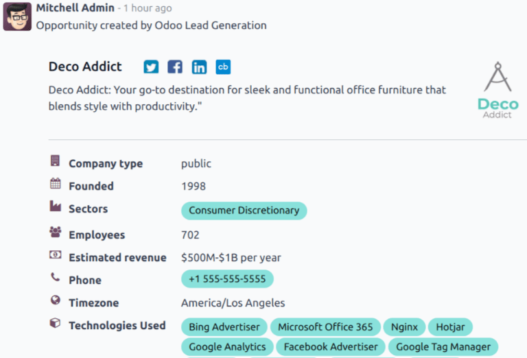

===========
Lead mining
===========

.. |IAP| replace:: :abbr:`IAP (In-App Purchase)`
.. |CC| replace:: :guilabel:`Companies and their Contacts`

*Lead mining* is a feature that allows *CRM* users to generate new leads directly into their Odoo
database. To ensure lead qualification, lead mining output is determined by a variety of filtering
criteria, such as the country, the company size, and the industry.

Configuration
=============

To get started, go to :menuselection:`CRM app --> Configuration --> Settings`, and tick the
:guilabel:`Lead Mining` checkbox to activate the feature. Then, click :guilabel:`Save`.

.. image:: lead_mining/activate-lead-mining.png
   :align: center
   :alt: Activate lead mining in Odoo CRM settings.

Generate leads
==============

After the *Lead Mining* setting is activated, a new button called *Generate Leads* is available to
use in the upper-left corner of the *CRM* *Pipeline* (:menuselection:`CRM app --> Sales --> My
Pipeline`).

Lead mining requests are also available through :menuselection:`CRM app --> Configuration --> Lead
Mining Requests`, or through :menuselection:`CRM app --> Leads --> Leads`, where the
:guilabel:`Generate Leads` button is also available.

.. image:: lead_mining/generate-leads-button.png
   :align: center
   :alt: The Generate Leads button to use the lead mining feature.

Click the :guilabel:`Generate Leads` button, and a pop-up window appears, offering a variety of
criteria by which to generate leads.

.. image:: lead_mining/generate-leads-popup.png
   :align: center
   :alt: The pop-up window with the selection criteria in order to generate leads in Odoo.

Choose to generate leads for :guilabel:`Companies` to get company information only, or choose
|CC| to get company information and individual employee contact information.

.. note::
   When targeting |CC|, additional options are available to filter contacts based on
   :guilabel:`Role` or :guilabel:`Seniority`.

Additional filtering options include the following:

- :guilabel:`Countries`: filter leads based on the country (or countries) they are located in.
- :guilabel:`States`: further filter leads based on the state in which they are located, if
  applicable.
- :guilabel:`Industries`: filter leads based on the specific industry they work in.
- :guilabel:`Filter on Size`: tick this checkbox to specify the number of employees at the company.
  This generates a field labeled :guilabel:`Size`. Fill in the blanks to create a range for the
  desired company size.
- :guilabel:`Sales Team`: choose which Sales Team the leads will be assigned to.
- :guilabel:`Salesperson`: choose which member of the Sales Team the leads will be assigned to.
- :guilabel:`Default Tags`: choose which tags are applied directly to the leads once found.

.. important::
   Make sure to be aware of the latest EU regulations when receiving contact information. Get more
   information about the General Data Protection Regulation on `Odoo GDPR <http://odoo.com/gdpr>`_.

View leads
----------

After leads are generated, they are assigned to the designated salesperson and team. To view
additional information regarding the lead, select one from the list, and click to open it.

In the chatter thread for the lead, additional information is provided. This can include the number
of employees, the technology used by the company, the timezone, and direct contact information.

.. note::
   If :guilabel:`Leads` are **not** enabled for the database, then leads are generated as
   *opportunities*, and added to the pipeline for the designated salesperson.

   To enable the :guilabel:`Leads` feature, navigate to :menuselection:`CRM app --> Configuration
   --> Settings`, and tick the :guilabel:`Leads` checkbox. Then, click :guilabel:`Save`.

Pricing
=======

Lead mining is an *In-App Purchase* feature, and each generated lead costs one :ref:`credit
<in_app_purchase/credits>`.

.. important::
   Generating |CC| costs one additional credit for each contact generated. See here for complete
   pricing information: `Lead Generation by Odoo IAP
   <https://iap.odoo.com/iap/in-app-services/167?>`_.

To buy credits, navigate to :menuselection:`CRM app --> Configuration --> Settings`. In the
:guilabel:`Lead Generation` section, under the :guilabel:`Lead Mining` feature, click :guilabel:`Buy
Credits`.

Credits may also be purchased by navigating to the :menuselection:`Settings app`. In the
:guilabel:`Contacts` section, under the :guilabel:`Odoo IAP` feature, click :guilabel:`View My
Services`.

.. image:: lead_mining/view-my-services-setting.png
   :align: center
   :alt: Buy credits in the Odoo IAP settings.

.. note::
   Enterprise Odoo users with a valid subscription get free credits to test |IAP| features before
   purchasing more credits for the database. This includes demo/training databases, educational
   databases, and one-app-free databases.

.. seealso::
   :doc:`/applications/essentials/in_app_purchase`
