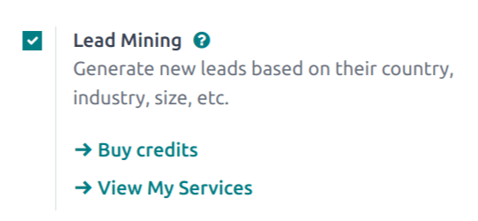
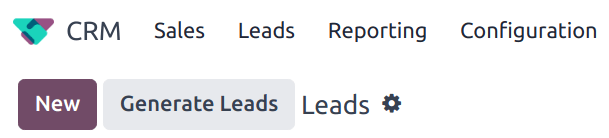
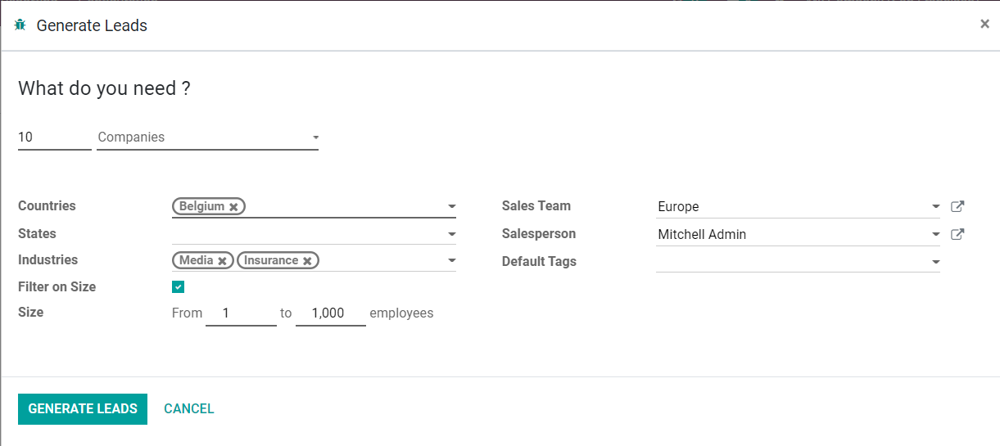
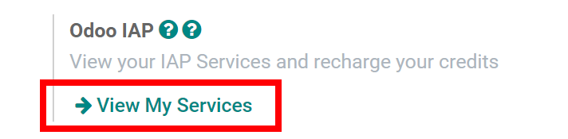

===========
Lead mining
===========

Lead mining is a feature that allows CRM users to generate new leads directly into their Odoo
database. To ensure lead qualification, lead mining output is determined by a variety of filtering
criteria, such as the country, the company size, and the industry.

Configuration
=============

To get started, go to :menuselection:`CRM --> Configuration --> Settings` and activate
:guilabel:`Lead Mining`.

Generate leads
==============

After the :guilabel:`Lead Mining` setting is activated, a new button called :guilabel:`Generate
Leads` is available to use in the :guilabel:`CRM` pipeline. Lead mining requests are also available
through :menuselection:`CRM --> Configuration --> Lead Mining Requests`, or through
:menuselection:`CRM --> Leads --> Leads` where the :guilabel:`Generate Leads` button is also
available.

Click on the :guilabel:`Generate Leads` button, and a window will appear offering a variety of
criteria by which to generate leads.

Choose to generate leads for :guilabel:`Companies` to get company information only, or choose
:guilabel:`Companies and their Contacts` to get company information as well as individual employee
contact information. When targeting :guilabel:`Companies and their Contacts`, there is an option to
filter contacts based on :guilabel:`Role` or :guilabel:`Seniority`.

Additional filtering options include:

- :guilabel:`Size`: filter leads based on the number of employees at the company
- :guilabel:`Countries`: filter leads based on the country (or countries) they are located in
- :guilabel:`States`: further filter leads based on the state they are located in, if applicable
- :guilabel:`Industries`: filter leads based on the specific industry they work in
- :guilabel:`Sales Team`: choose which Sales Team the leads will be assigned to
- :guilabel:`Salesperson`: choose which person(s) on the Sales Team the leads will be assigned to
- :guilabel:`Default Tags`: choose which tags are applied directly to the leads once found

.. note::
   Make sure to be aware of the latest EU regulations when receiving contact information. Get more
   information about the General Data Protection Regulation on `Odoo GDPR <http://odoo.com/gdpr>`_.

Pricing
=======

Lead mining is an *In-App Purchase* feature and each generated lead costs one credit.

Choosing to generate :guilabel:`Companies and their Contacts` costs one additional credit for each
contact generated.

.. note::
   See here for full pricing information: `Lead Generation by Odoo IAP <https://iap.odoo.com/iap/
   in-app-services/167?>`_.

To buy credits, navigate to :menuselection:`CRM --> Configuration --> Settings`. In the
:guilabel:`Lead Generation` section, under the :guilabel:`Lead Mining` feature, click on
:guilabel:`Buy Credits`.

.. image:: lead_mining/buy-lead-mining-credits-setting.png
   :align: center
   :alt: Buy credits from the lead mining settings.

Credits may also be purchased by navigating to the :menuselection:`Settings --> General Settings`.
In the :guilabel:`In-App Purchases` section, under the :guilabel:`Odoo IAP` feature, click on
:guilabel:`View My Services`.

.. tip::

   Users of Odoo Online (SaaS) Enterprise automatically have free trial credits in their database to
   test any IAP features.

.. seealso::
   * :doc:`../../../general/in_app_purchase`
