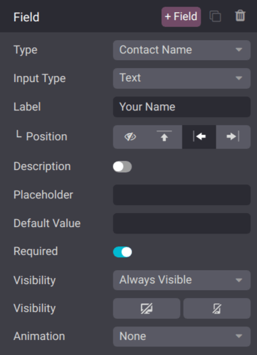

===========================================
Create opportunities from web contact forms
===========================================

Adding a contact form to a website makes it easy to convert visitors into leads and opportunities.
After a visitor submits their information, an opportunity can be created automatically, and assigned
to a designated sales team and salesperson.

.. _crm/customize-contact-form:

Customize contact forms
=======================

By default, the *Contact Us* page on an Odoo website displays a preconfigured contact form. This
form can be customized, as needed, to suit the needs of a specific sales team.

Navigate to :menuselection:`Website app --> Contact Us`, then click :guilabel:`Edit` in the
top-right of the screen to open the web editor. Click on the form building block in the body of the
webpage to open the form configuration settings on the right sidebar. The following options are
available to customize the contact form from the :guilabel:`From` section of the right sidebar:

.. image:: opportunities_form/form-customization.png
   :align: center
   :alt: The form configuration settings on an Odoo website.

- :guilabel:`Action`: the default action for a contact form is :guilabel:`Send an Email`. Select
  :guilabel:`Create an Opportunity` from the drop-down list to capture the information in the *CRM*
  app.
- :guilabel:`Sales Team`: choose a sales team from the drop-down menu that the opportunities from
  this form should be assigned to. This field **only** appears if the :guilabel:`Action` field is
  set to :guilabel:`Create an Opportunity`.
- :guilabel:`Salesperson`: if the opportunities should be assigned to a specific salesperson, select
  them from the drop-down menu. If no selection is made in this field, the opportunities are
  assigned based on the team's existing rules.
- :guilabel:`Marked Fields`: use this field to alter how the form handles marked fields. The default
  option is to treat marked fields as :guilabel:`Required`, which is the recommended setting.
- :guilabel:`Mark Text`: choose how :guilabel:`Marked Fields` should be identified. The default
  character is an asterisk (`*`).
- :guilabel:`Labels Width`: use this field to alter the pixel width of the labels, if desired.
- :guilabel:`On Success`: select how the webpage reacts after a customer successfully submits a
  form. :guilabel:`Nothing` keeps the customer on the same screen, with the addition of a
  confirmation message that the form was submitted successfully. :guilabel:`Redirect` sends the
  customer to a new webpage, based on the address provided in the :guilabel:`URL` field below.
  :guilabel:`Show Message` replaces the form with a preconfigured message that informs the customer
  someone should respond to them as soon as possible.
- :guilabel:`URL`: if :guilabel:`Redirect` is selected in the :guilabel:`On Success` field, enter
  the URL for the webpage, where customers should be directed after successfully submitting a form.
- :guilabel:`Visibility`: use the drop-down menu to add any visibility conditions for this field, if
  desired.

.. important::
   If *leads* are activated in *CRM* settings, selecting :guilabel:`Create an Opportunity` generates
   a lead instead. To activate leads, navigate to :menuselection:`CRM app --> Configuration -->
   Settings`, and tick the :guilabel:`Leads` checkbox. Then, click :guilabel:`Save`.

Customize contact form fields
-----------------------------

In addition to the settings for the form, the settings for each field can be customized, as well.
With the web editor menu still open, click into a field to open the :guilabel:`Field` configuration
settings section on the sidebar. The following options are available to customize a field:

- :guilabel:`Type`: choose a custom field option or an existing field type.
- :guilabel:`Input Type`: determine the type of information customers should input. Available
  options are :guilabel:`Text`, :guilabel:`Email`, :guilabel:`Telephone`, or :guilabel:`Url`. The
  selection made in this field limits the format that customers can use when entering information.
- :guilabel:`Label`: enter the name for the field.
- :guilabel:`Position`: choose the way the label is aligned with the rest of the form. The label can
  be hidden, above the field, to the left of the field, or right adjusted and closer to the field.
- :guilabel:`Description`: slide the toggle to add a description for the field, which can provide
  additional instructions to customers. Click under the field on the form to add the description.
- :guilabel:`Placeholder`: enter an example to help users know how to input information where
  formatting is important, such as a phone number or email address.
- :guilabel:`Default Value`: enter a value to include in the form, by default, if the customer does
  not provide information in the field. *It is not recommended to include a default value for
  required fields*.
- :guilabel:`Required`: slide the toggle to mark this field as required if it **must** be filled in
  for every submission.
- :guilabel:`Visibility`: select when this field should be visible. Use the button on the left to
  choose whether to show or hide this field on a desktop users. Use the button on the right to
  choose whether to show or hide this field to mobile users.
- :guilabel:`Animation`: select if this field should have any animation.

View opportunities
==================

After a customer submits a contact form, and an opportunity is created, it is assigned based on the
:ref:`form settings <crm/customize-contact-form>`. To view opportunities, navigate to
:menuselection:`CRM app --> Sales --> My Pipeline`.

.. note::
   If leads are activated on the database, contact form submissions are generated as leads, not
   opportunities. To activate leads, navigate to :menuselection:`CRM app --> Configuration -->
   Settings`, and tick the :guilabel:`Leads` checkbox. Then, click :guilabel:`Save`.

   Navigate to :menuselection:`CRM app --> Leads` to view the newly-created leads.

On the :guilabel:`My Pipeline` dashboard, click on an opportunity card in the Kanban view to open
the opportunity record. The information submitted by the customer is visible on the opportunity
record.

.. note::
   As the contact form fields are customizable, the fields on the opportunity record, where the form
   information is stored, varies accordingly.

   If the preconfigured contact form is used, the *Subject* field is added to the :guilabel:`Title`
   field, and the content in the :guilabel:`Notes` field, which is labeled as :guilabel:`Your
   Question`, is added to the :guilabel:`Internal Notes` tab.

.. seealso::
   - :doc:`../pipeline/manage_sales_teams`
   - :doc:`convert`
   - :doc:`../track_leads/lead_scoring`
   - :ref:`Website forms <dynamic_content/form>`
