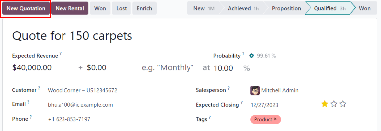
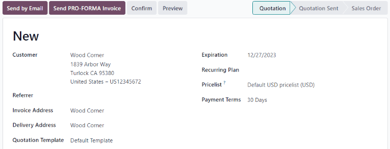

==========================
Create and send quotations
==========================

Once a qualified lead has been converted into an opportunity, the next step is to create and deliver
a quotation. This process can be easily handled through Odoo's *CRM* application.

Create a new quotation
======================

To create a new quotation, open the :menuselection:`CRM app`, revealing the :guilabel:`Pipeline`
page on the main *CRM* dashboard.

From here, click on any opportunity to open it. Review the existing information and update any
fields, if necessary.

.. note::
   If a quotation has already been created for this opportunity, it can be found by clicking on the
   :guilabel:`Quotations` smart button at the top of the top of the form. The number of existing
   quotations is listed on the smart button, as well.

At the top-left of the form, click the :guilabel:`New Quotation` button.

.. important::
   The :guilabel:`Customer` field is **not** required on the opportunity form.

   However, customer information must be added or linked before a quotation can be sent. If the
   :guilabel:`Customer` field is left blank on the opportunity, clicking the :guilabel:`New
   Quotation` button opens a pop-up window with the following options:

   - :guilabel:`Create a new customer`: creates a new customer record, using any available
     information provided on the opportunity form.
   - :guilabel:`Link to an existing customer`: opens a drop-down field with existing customer names.
     Select a name to link this new quotation to an existing customer record.
   - :guilabel:`Do not link to a customer`: the quotation will **not** be linked to a customer, and
     no changes are made to the customer information.

Once this button is clicked, a new quotation form appears. Confirm the information in the top half
of the form, and update any missing or incorrect fields:

- :guilabel:`Customer`: the company or contact for whom this quotation was created.
- :guilabel:`Referrer`: if this customer was referred by another customer or contact, select it from
  the drop-down menu in this field.
- :guilabel:`Invoice Address`: physical address where the invoice should be sent.
- :guilabel:`Delivery Address`: physical address where any products should be delivered.
- :guilabel:`Quotation Template`: if applicable, select a pre-configured :doc:`quotation template
  </applications/sales/sales/send_quotations/quote_template>` from this field.
- :guilabel:`Expiration`: date when this quotation is no longer valid.
- :guilabel:`Quotation Date`: creation date of draft/sent orders, confirmation date of confirmed
  orders. Note that this field is only visible if :doc:`Developer mode (debug mode)
  </applications/general/developer_mode>` is active.
- :guilabel:`Recurring Plan`: if this quotation is for a recurring product or subscription, select
  the recurring plan configuration to be used.
- :guilabel:`Pricelist`: select a pricelist to be applied to this order.
- :guilabel:`Payment Terms`: select any applicable payment terms for this quotation.

.. tip::
   The :guilabel:`Expiration` field automatically populates based on the creation date of the
   quotation, and the default validity time frame.

   To update the default validity time frame, navigate to :menuselection:`Sales app -->
   Configuration --> Settings --> Quotations & Orders` and update the :guilabel:`Default Quotation
   Validity` field. To disable automatic expiration, enter `0` in this field.

   When the desired changes are complete, click :guilabel:`Save`.

   When using a quotation template, the expiration date is based off of the :guilabel:`Quotation
   Validity` field on the template. To alter the validity date computation on a template, go to
   :menuselection:`Sales app --> Configuration --> Sales Orders --> Quotation Templates`.

   Then, click on a template to open it, and update the number in the :guilabel:`Quotation Validity`
   field.

Order lines
-----------

After updating the customer, payment, and deadline information on the new quotation, the
:guilabel:`Order Lines` tab can be updated with the appropriate product information.

To do that, click :guilabel:`Add a product` in the :guilabel:`Order Lines` tab.

Next, type the name of an item into the :guilabel:`Product` field to search through the product
catalog. Then, select a product from the drop-down menu, or create a new one by selecting
:guilabel:`Create` or :guilabel:`Create and Edit`.

After selecting a product, update the :guilabel:`Quantity`, if necessary. Confirm the information in
the remaining fields.

To remove a line from the quotation, click the :guilabel:`🗑️ (trash can)` icon.

Repeat the steps above until the quotation is complete.

Preview and send quotation
==========================

To see a preview of the quotation as the customer will see it, click the :guilabel:`Preview` button.
Doing so opens a preview in the :guilabel:`Customer Portal`.

After reviewing the customer preview, click :guilabel:`Return to edit mode` to return to the
quotation form in the backend.

When the quotation is ready to deliver to the customer, click the :guilabel:`Send by Email` button.

Doing so opens a pop-up window with a pre-configured email message. Information from the quotation,
including the contact information, total cost, and quotation title are be imported from the
quotation.

A PDF of the quotation is added as an attachment to the email.

.. note::
   A pre-loaded template is used to create the email message. To alter the template, click the
   internal link to the right of the :guilabel:`Load template` field, located at the bottom of the
   email pop-up window.

   To select a new template, select an option from the :guilabel:`Load template` drop-down menu.

Proceed to make any necessary changes to the email, then click :guilabel:`Send`. A copy of the
message is added to the *Chatter* of the of the record.

After a quotation is sent, the originating opportunity's :guilabel:`Quotations` smart button updates
with a new count. This quotation, and all other quotations can be accessed through this smart
button at the top of the opportunity in the *CRM* app.

Any quotations attached to the opportunity that are confirmed, and have therefore been converted to
sales orders, will be deducted from the number listed on the :guilabel:`Quotations` smart button.
Instead, the value of the sales order will appear in the :guilabel:`Orders` smart button located in
the same control panel.

Mark an opportunity won or lost
===============================

In order to keep the pipeline up to date and accurate, opportunities need to be identified as *won*
or *lost* once a customer has responded to a quotation.

To mark an opportunity as *won* or *lost*, return to the opportunity using the breadcrumbs at the
top-left of the quotation form. Or navigate to :menuselection:`CRM app --> Sales --> My Pipeline`
and click on the correct opportunity to open it.

At the top-left of the form, click on either the :guilabel:`Won` or :guilabel:`Lost` button.

If the opportunity is marked *won*, a green :guilabel:`Won` banner is added to the record, and it is
moved to the :guilabel:`Won` stage.

Marking an opportunity as *lost*, via the :guilabel:`Lost` button opens a :guilabel:`Mark Lost`
pop-up window, where a :guilabel:`Lost Reason` can be entered.

From the :guilabel:`Lost Reason` drop-down field, choose an existing lost reason. If no applicable
reason is available, create a new one by entering it into the :guilabel:`Lost Reason` field, and
clicking :guilabel:`Create`.

.. tip::
   It's best practice to try and use pre-configured :guilabel:`Lost Reason` values as much as
   possible or to limit the creation of new values only to sales team leads. Using consistent values
   for this parameter will make pipeline analysis easier and more accurate when filtering for the
   :guilabel:`Lost Reason` parameter.

   To set up new values for this field, navigate to :menuselection:`CRM --> Configuration --> Lost
   Reasons`, and click both :guilabel:`New`and :guilabel:`Save` for each new entry added to the
   list.

Additional notes and comments can be added in the :guilabel:`Closing Note` field.

When all the desired information has been entered in the :guilabel:`Mark Lost` pop-up window, click
:guilabel:`Mark as Lost`.

Upon clicking :guilabel:`Mark as Lost`, the pop-up window disappears, and Odoo returns to the
opportunity form, where a new red :guilabel:`Lost` banner is now present in the upper-right corner
of the opportunity.

Once an opportunity is marked as *lost*, it is no longer considered active, and it is removed from
the pipeline.

In order to view a *lost* opportunity from the pipeline, click the :guilabel:`down arrow icon` to
the right of the search bar, and select either :guilabel:`Lost` or :guilabel:`Archived` from the
drop-down menu that appears.

.. important::
   While opportunities that have been marked as *lost* are considered *Archived*, be advised that,
   in order for an opportunity to be included as *lost* in reporting, it **must** be specifically
   marked as *lost*, not *Archived*.
