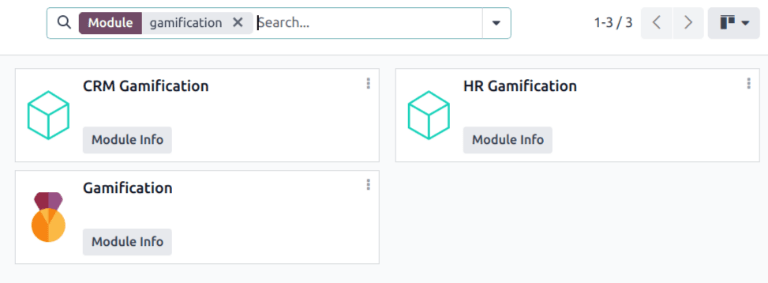
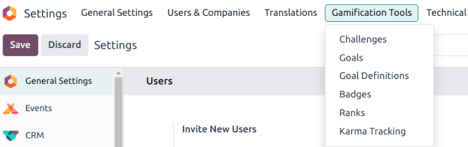
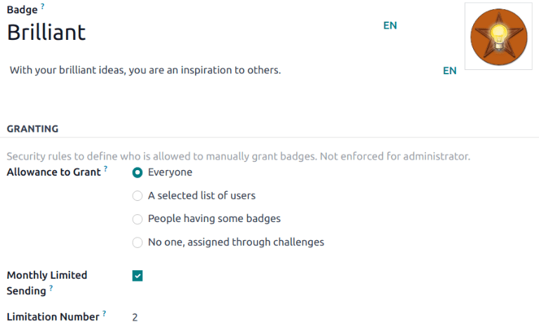
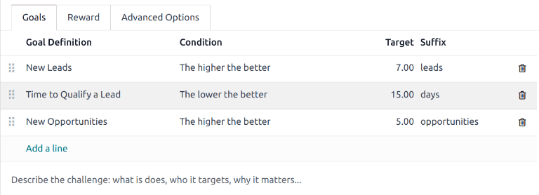

================
CRM Gamification
================

In Odoo's *CRM* app, *gamification tools* provide the opportunity to evaluate and motivate users
through customizable challenges, goals, and rewards. Goals are created to target actions within the
*CRM* app, and can be tracked and rewarded automatically to participating sales teams.

Configuration
=============

To install the *CRM Gamification* module, navigate to the :menuselection:`Apps` application. Click
into the :guilabel:`Search...` bar at the top of the page and remove the :guilabel:`Apps` filter.
Type `CRM Gamification` to search.

On the :guilabel:`CRM Gamification` module, click :guilabel:`Install`. This module features goals
and challenges related to the *CRM* and *Sales* applications.

.. note::
   If **both** the *CRM* and *Sales* apps are installed, the *CRM Gamification* module is
   automatically installed on the database.

To access the *Gamification Tools* menu, first enable :ref:`developer-mode`.

Next, navigate to :menuselection:`Settings app --> Gamification Tools`.

.. _crm/create-rewards:

Create badges
=============

*Badges* are awarded to users when they have completed a challenge. Different badges can be awarded
based on the type of task completed, and can be issued to more than one user, depending on the time
they accomplish the goal.

To view the existing badges, or create a new one, navigate to :menuselection:`Settings -->
Gamification Tools --> Badges`.

.. image:: gamification/badges.png
   :align: center
   :alt: View of the badges page in Odoo.

.. note::
   Some badges can be awarded outside of challenges, as well. Select the Kanban card for the desired
   badge, then click :guilabel:`Grant`. This opens a :guilabel:`Grant Badge` pop-up window. Select
   a user from the :guilabel:`Who would you like to reward?` field.

   Add any additional information regarding why the user is receiving the reward in the field below,
   then click :guilabel:`Grant Badge`.

To create a new badge, click :guilabel:`New` at the top-left of the page to open a blank form.
Enter a name for the :guilabel:`Badge`, followed by a description.

The :guilabel:`Allowance to Grant` field determines when a badge can be granted, and by whom:

- :guilabel:`Everyone`: this badge can be manually granted by any user.
- :guilabel:`A selected list of users`: this badge can only be granted by a select group of users.
  If this option is selected, it generates a new field, :guilabel:`Authorized Users`. Choose the
  appropriate users from this drop-down list.
- :guilabel:`People having some badges`: this badge can only be granted by users who have already
  been awarded a specific badge. If this option is selected it generates a new field,
  :guilabel:`Required Badges`. Use this drop-down list to select the badge(s) a user must have
  before they can award this badge to others.
- :guilabel:`No one, assigned through challenges`: this badge cannot be manually granted, it can
  only be awarded through challenges.

To limit the number of badges a user can send, tick the :guilabel:`Monthly Limited Spending`
checkbox. This sets a limit on the number of times a user can grant this badge. In the
:guilabel:`Limitation Number` field, enter the maximum number of times this badge can be sent per
month, per person.

.. _crm/create-challenge:

Create a challenge
==================

To create a challenge, navigate to to :menuselection:`Settings --> Gamification Tools -->
Challenges`. Click :guilabel:`New` in the top-left corner to open a blank challenge form.

At the top of the form, enter a :guilabel:`Challenge Name`.

Create assignment rules
-----------------------

To assign the challenge to specific users, one or more assignment rules must be utilized.

Click into the first field under :guilabel:`Assign Challenge to`, and select a parameter from the
drop-down list to define the rule. Then, click into the next field to define the rule's operator. If
necessary, click into the third field to further define the parameter.

.. tip::
   To include all users with permissions in the *Sales* app, create a rule with the following
   parameters:

   - :guilabel:`Groups`
   - :guilabel:`is in`
   - `Sales/User: Own Documents Only`

   .. image:: gamification/assignation-rule.png
     :align: center
     :alt: View of the assignation rules section of a Challenge form.

In the :guilabel:`Periodicity` field, select a time frame for goals to be automatically assessed.

Add goals
---------

Challenges can be based on a single goal, or can include multiple goals with different targets. To
add a goal to the challenge, click :guilabel:`Add a line` on the :guilabel:`Goals` tab.

In the :guilabel:`Goal Definition` field, choose a goal from the drop-down list. The
:guilabel:`Condition` field automatically updates to reflect the condition set on the goal
definition.

.. tip::
   The *CRM Gamification* module contains preconfigured goals geared towards salesteams:

   - :guilabel:`New Leads`
   - :guilabel:`Time to Qualify a Lead`
   - :guilabel:`Days to Close a Deal`
   - :guilabel:`New Opportunities`
   - :guilabel:`New Sales Orders`

Enter a :guilabel:`Target` for the goal based on the :guilabel:`Suffix`.

Repeat these steps for each additional goal.

Add rewards
-----------

Next, click the :guilabel:`Reward` tab. Choose the :ref:`badges <crm/create-rewards>` to be awarded
:guilabel:`For 1st User` and :guilabel:`For Every Succeeding User` by selecting them from the
drop-down lists.

.. note::
   Badges are granted when a challenge is finished. This is either at the end of a running period,
   at the end date of a challenge, or when the challenge is manually closed.

After setup is complete, click the :guilabel:`Start Challenge` button at the top-left of the page to
begin the challenge.
