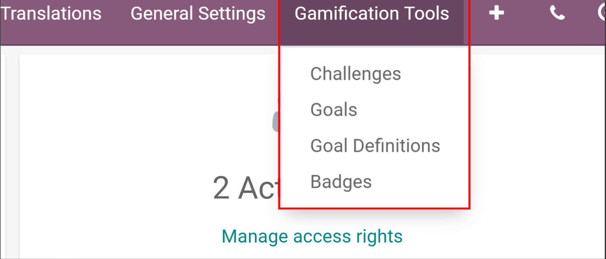
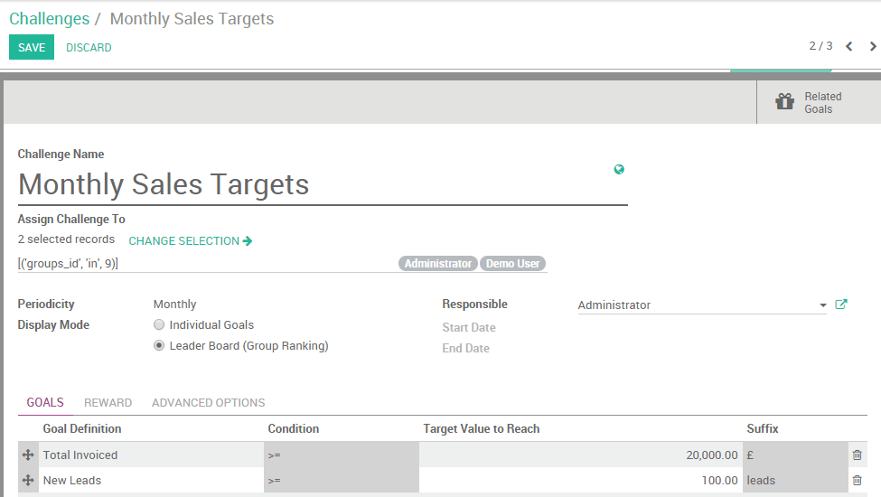
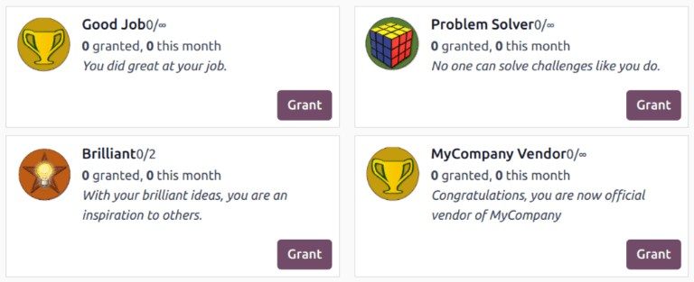

==========================================
How to motivate and reward my salespeople?
==========================================

Challenging your employees to reach specific targets with goals and rewards is an excellent way to
reinforce good habits and improve your salespeople productivity. The Gamification module gives you
simple and creative ways to motivate and evaluate your employees with real-time recognition and
badges inspired by game mechanics.

Configuration
=============

Install the *Gamification* module, or the *CRM gamification* one, which adds some useful data
(goals and challenges) that can be used on *CRM/Sale*.

.. image:: gamification/gamification_module_install.png
   :align: center
   :alt: View of the gamification module being installed in Odoo

Create a challenge
==================

Now, create your first challenge by going to :menuselection:`Settings --> Gamification Tools
--> Challenges`.

.. note::
   As the gamification tool is a one-time technical setup, you need to activate the technical
   features in order to access the configuration. To do so, go to *Settings* and *Activate the
   developer mode*.

A challenge is a mission that you send to your sales team. It can include one or several goals, set
for a specific period of time. Configure your challenge as follows:

#. Assign the salespeople to be challenged;
#. Assign a responsible;
#. Set up the periodicity along with the start and the end date;
#. Select your goals;
#. Set up your rewards (badges).

.. note::
   Badges are granted when a challenge is finished. This is either at the end of a running period
   (eg: end of the month for a monthly challenge), at the end date of a challenge (if no periodicity
   is set), or when the challenge is manually closed.

In the example below, 2 employees are being challenged with a *Monthly Sales Target*. The challenge
is based on 2 goals: the total amount invoiced and number of new leads generated. At the end of the
month, the winner will be granted with a badge.

Set up goals
------------

| The users can be evaluated using goals and numerical objectives to reach.
| **Goals** are assigned through *challenges* that evaluate (see image above) and compare members of
  a team throughout time.
| You can create a new goal on the fly from a *Challenge* by clicking on *Add new item*, under
  *Goals*. Select the business object according to your company's needs. Examples: number of new
  leads, time to qualify a lead, total amount invoiced in a specific week, month or any other time
  frame based on your management preferences, etc.

.. image:: gamification/goal_definitions.png
   :align: center
   :alt: View of the goal definition form and a goal definition being created for Odoo Sales

.. note::
   Goals may include your database setup as well (e.g. set your company data and a timezone,
   create new users, etc.).

Set up rewards
--------------

For non-numerical achievements, **Badges** can be granted to users. From a simple thank you to an
exceptional achievement, a badge is an easy way to express gratitude to a user for their good work.
To create and grant badges to your employees based on their performance, go to
:menuselection:`Settings --> Gamification Tools --> Badges`.

