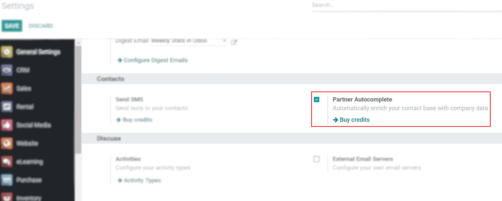
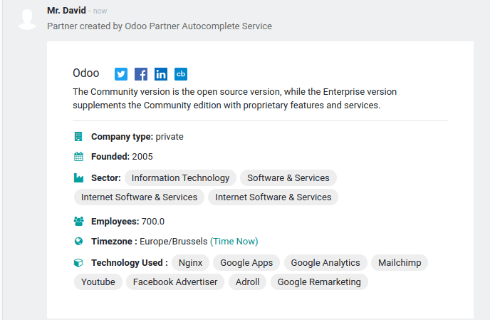

===================================================
Enrich your contacts base with Partner Autocomplete
===================================================

Partner Autocomplete helps you to enrich your contacts database with corporate data. Select one of
the companies suggested in the dropdown, and quickly get all the information you need.

Configuration
=============

Go to :menuselection:`Settings --> Contacts` and activate the *Partner Autocomplete* feature.

Enrich your contacts with corporate data
========================================

| From any module, once you start to create a new contact typing the name of it, the system
  will suggest a potential match. If you select it, the contact will be populated with corporate
  data.
| For example, after typing *Odoo*, you will get the following information:

.. image:: partner_autocomplete/odoo_autocomplete.png
   :align: center
   :alt: Creating a new contact in Odoo

.. tip:: Partner Autocomplete also works if you enter a VAT number instead of a company name.

Pricing
=======

| *Partner Autocomplete* is an *In-App Purchase (IAP)* service, which requires prepaid credits to be
  used. Each request will consume one credit.
| To buy credits, go to :menuselection:`Settings --> Contacts --> Partner Autocomplete or Odoo IAP -->
  View My Services` and select a package.

.. note::
   - If you run out of credits, the only information that will be populated when clicking on
     the suggested company will be the website link and the logo.
   - If you are on Odoo Online and you have the Enterprise version, you benefit from free trial
     credits to test the feature.
   - Learn about our *Privacy Policy* `here <https://iap.odoo.com/privacy#header_2>`_.
