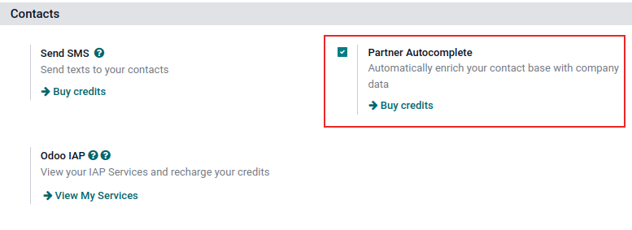
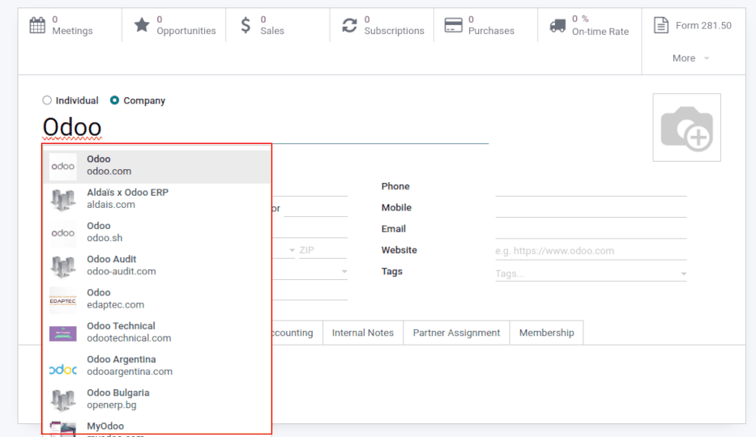
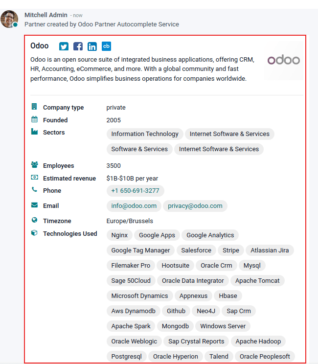

=========================================
Enrich contacts with partner autocomplete
=========================================

*Partner autocomplete* enriches the contacts database with corporate data. In any module, enter the
new company name into the :guilabel:`Customer` field (`partner_id` technical field), and select one
of the companies suggested in the drop-down menu. Instantly get valuable company information full of
hard-to-find data for a desired company.

.. important::
   A company **cannot** already be manually entered in the *Contacts* application prior to enriching
   it with data.

The information provided by partner autocomplete can include general information about the business
(including full business name and logo), social media accounts, :guilabel:`Company type`,
:guilabel:`Founded` information, :guilabel:`Sectors` information, the number of
:guilabel:`Employees`, :guilabel:`Estimated revenue`, :guilabel:`Phone` number,
:guilabel:`Timezone`, and :guilabel:`Technologies Used`.

.. important::
   When getting a company's contact information make sure to be aware of the latest EU regulations.
   For more information about General Data Protection Regulation refer to: `Odoo GDPR
   <http://odoo.com/gdpr>`_. In Odoo, individual contact information cannot be searched for with
   the partner autocomplete feature.

Configuration
=============

Go to :menuselection:`Settings app --> Contacts section`. Then, activate the :guilabel:`Partner
Autocomplete` feature, by ticking the checkbox beside it, and clicking :guilabel:`Save`.

Enrich contacts with corporate data
===================================

From any module, as the user is typing in the name of a new company contact, Odoo reveals a large
drop-down menu of potential match suggestions. If any are selected, the contact is then populated
with corporate data related to that specific selection.

For example, after typing `Odoo`, the following information populates:

In the chatter, the following information populates about the company, after clicking on the desired
pre-populated contact:

.. tip::
   Partner Autocomplete also works if a :abbr:`VAT (value-added tax)` number is entered instead of
   company name.

Pricing
=======

*Partner Autocomplete* is an *In-App Purchase (IAP)* service, which requires prepaid credits to be
used. Each request consumes one credit.

To buy credits, go to :menuselection:`Settings app --> Contacts section`. Then, locate either the
:guilabel:`Partner Autocomplete` feature and click :guilabel:`Buy credits`, or locate the
:guilabel:`Odoo IAP` feature and click :guilabel:`View My Services`. From the resulting page, select
a desired package.

.. note::
   If the database runs out of credits, the only information populated when clicking on the
   suggested company will be the website link and the logo.

   Learn about our `Privacy Policy <https://iap.odoo.com/privacy>`_.

.. note::
   Enterprise Odoo users with a valid subscription get free credits to test :abbr:`IAP (In-App
   Purchase)` features before deciding to purchase more credits for the database. This includes
   demo/training databases, educational databases, and one-app-free databases.

.. seealso::
   :doc:`../../../essentials/in_app_purchase`
