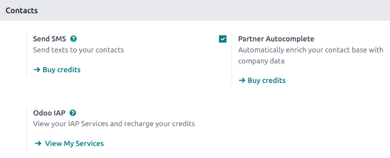
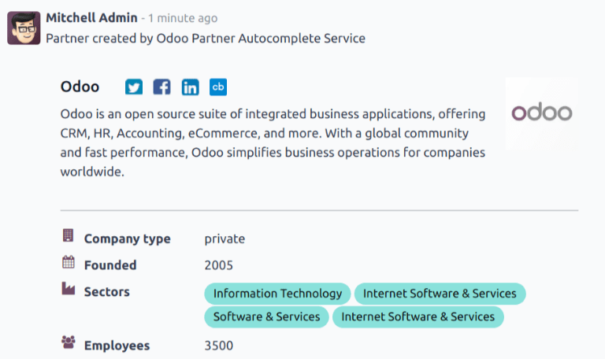

====================
Partner autocomplete
====================

The *Partner Autocomplete* feature automatically enriches contact records with company information.

Configuration
=============

Go to :menuselection:`Settings --> Contacts` and activate the *Partner Autocomplete* feature.

Enrich CRM contacts with company data
=====================================

.. tip::
  Company data can also be generated by entering a :abbr:`VAT (Value Added Tax)` number instead of a
  company name.

Pricing
=======

Partner autocomplete is an *In-App Purchase (IAP)* service, and requires credits for each use.

.. note::
   If there are no more credits available, the only information populated when clicking on the
   suggested company is the website link, and the logo.

.. seealso::
   - :ref:`IAP Low-credit notification <in_app_purchase/low-credits>`
