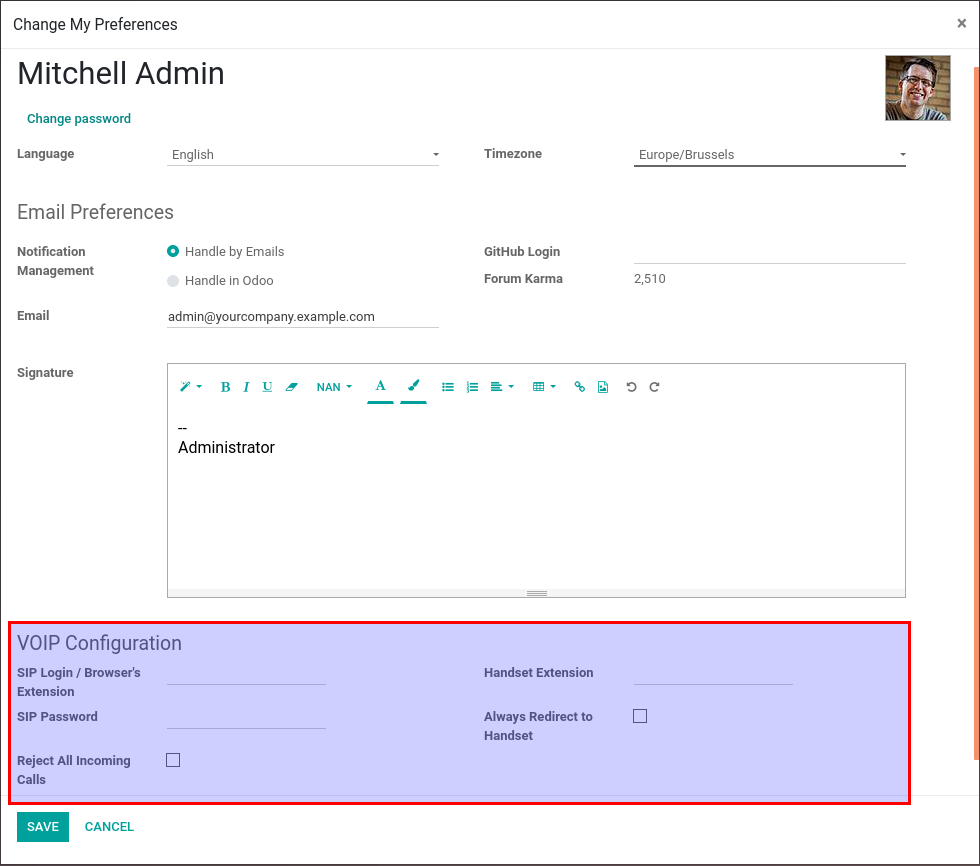
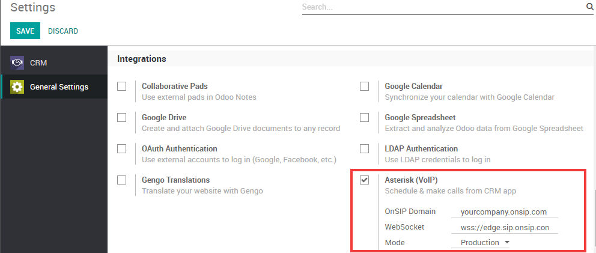

============================================
Configure your VOIP Asterisk server for Odoo
============================================

Installing Asterisk server
==========================

Dependencies
~~~~~~~~~~~~

Before installing Asterisk you need to install the following dependencies:

- wget
- gcc
- g++
- ncurses-devel
- libxml2-devel
- sqlite-devel
- libsrtp-devel
- libuuid-devel
- openssl-devel
- pkg-config

In order to install libsrtp, follow the instructions below:

.. code-block:: console

    cd /usr/local/src/
    wget http://srtp.sourceforge.net/srtp-1.4.2.tgz 
    tar zxvf srtp-1.4.2.tgz
    cd /usr/local/src/srtp
    ./configure CFLAGS=-fPIC --prefix=/usr/local/lib
    make && make install

You also need to install PJSIP, you can download the source `here <http://www.pjsip.org/download.htm>`_. Once the source directory is extracted:

- **Change to the pjproject source directory:**

.. code-block:: console

    # cd pjproject

- **run:**

.. code-block:: console

    # ./configure --prefix=/usr --enable-shared --disable-sound --disable-resample --disable-video --disable-opencore-amr CFLAGS='-O2 -DNDEBUG'

- **Build and install pjproject:**

.. code-block:: console

    # make dep
    # make
    # make install

- **Update shared library links:**

.. code-block:: console

    # ldconfig

- **Verify that pjproject is installed:**

.. code-block:: console

    # ldconfig -p | grep pj

- **The result should be:**
    
.. code-block:: console

    libpjsua.so (libc6,x86-64) => /usr/lib/libpjsua.so
    libpjsip.so (libc6,x86-64) => /usr/lib/libpjsip.so
    libpjsip-ua.so (libc6,x86-64) => /usr/lib/libpjsip-ua.so
    libpjsip-simple.so (libc6,x86-64) => /usr/lib/libpjsip-simple.so
    libpjnath.so (libc6,x86-64) => /usr/lib/libpjnath.so
    libpjmedia.so (libc6,x86-64) => /usr/lib/libpjmedia.so
    libpjmedia-videodev.so (libc6,x86-64) => /usr/lib/libpjmedia-videodev.so
    libpjmedia-codec.so (libc6,x86-64) => /usr/lib/libpjmedia-codec.so
    libpjmedia-audiodev.so (libc6,x86-64) => /usr/lib/libpjmedia-audiodev.so
    libpjlib-util.so (libc6,x86-64) => /usr/lib/libpjlib-util.so
    libpj.so (libc6,x86-64) => /usr/lib/libpj.so

Asterisk
~~~~~~~~

- In order to install Asterisk 13.7.0, you can download the source directly `there <http://downloads.asterisk.org/pub/telephony/asterisk/old-releases/asterisk-13.7.0.tar.gz>`_.

- Extract Asterisk:

.. code-block:: console
    
    tar zxvf asterisk*

- Enter the Asterisk directory:

.. code-block:: console

    cd ./asterisk*

- Run the Asterisk configure script: 

.. code-block:: console

    ./configure --with-pjproject --with-ssl --with-srtp

- Run the Asterisk menuselect tool:

.. code-block:: console

    make menuselect

- In the menuselect, go to the resources option and ensure that res_srtp is enabled. If there are 3 x’s next to res_srtp, there is a problem with the srtp library and you must reinstall it. Save the configuration (press x). You should also see stars in front of the res_pjsip lines.

- Compile and install Asterisk:

.. code-block:: console

    make && make install

- If you need the sample configs you can run 'make samples' to install the sample configs. If you need to install the Asterisk startup script you can run 'make config'.

DTLS Certificates
~~~~~~~~~~~~~~~~~

- After you need to setup the DTLS certificates.

.. code-block:: console

    mkdir /etc/asterisk/keys

- Enter the Asterisk scripts directory:

.. code-block:: console

    cd /asterisk*/contrib/scripts

- Create the DTLS certificates (replace pbx.mycompany.com with your ip address or dns name, replace My Super Company with your company name):

.. code-block:: console

    ./ast_tls_cert -C pbx.mycompany.com -O "My Super Company" -d /etc/asterisk/keys

Configure Asterisk server
=========================

For WebRTC, a lot of the settings that are needed MUST be in the peer settings. The global settings do not flow down into the peer settings very well. By default, Asterisk config files are located in /etc/asterisk/. Start by editing http.conf and make sure that the following lines are uncommented:

.. code-block:: console

    ;http.conf
    [general]
    enabled=yes
    bindaddr=127.0.0.1 ; Replace this with your IP address
    bindport=8088 ; Replace this with the port you want to listen on

Next, edit sip.conf. The WebRTC peer requires encryption, avpf, and icesupport to be enabled. In most cases, directmedia should be disabled. Also under the WebRTC client, the transport needs to be listed as ‘ws’ to allow websocket connections. All of these config lines should be under the peer itself; setting these config lines globally might not work:

.. code-block:: console

    ;sip.conf
    [general]
    realm=127.0.0.1 ; Replace this with your IP address
    udpbindaddr=127.0.0.1 ; Replace this with your IP address
    transport=udp

    [1060] ; This will be WebRTC client
    type=friend
    username=1060 ; The Auth user for SIP.js
    host=dynamic ; Allows any host to register
    secret=password ; The SIP Password for SIP.js
    encryption=yes ; Tell Asterisk to use encryption for this peer
    avpf=yes ; Tell Asterisk to use AVPF for this peer
    icesupport=yes ; Tell Asterisk to use ICE for this peer
    context=default ; Tell Asterisk which context to use when this peer is dialing
    directmedia=no ; Asterisk will relay media for this peer
    transport=udp,ws ; Asterisk will allow this peer to register on UDP or WebSockets
    force_avp=yes ; Force Asterisk to use avp. Introduced in Asterisk 11.11
    dtlsenable=yes ; Tell Asterisk to enable DTLS for this peer
    dtlsverify=no ; Tell Asterisk to not verify your DTLS certs
    dtlscertfile=/etc/asterisk/keys/asterisk.pem ; Tell Asterisk where your DTLS cert file is
    dtlsprivatekey=/etc/asterisk/keys/asterisk.pem ; Tell Asterisk where your DTLS private key is
    dtlssetup=actpass ; Tell Asterisk to use actpass SDP parameter when setting up DTLS

In the sip.conf and rtp.conf files you also need to add or uncomment the lines:

.. code-block:: console

    icesupport = true
    stunaddr = stun.l.google.com:19302

Lastly, set up extensions.conf:

.. code-block:: console

    ;extensions.conf
    [default]
    exten => 1060,1,Dial(SIP/1060) ; Dialing 1060 will call the SIP client registered to 1060

Configure Odoo VOIP
===================

In Odoo, the configuration should be done in the user's preferences.

- The SIP Login/Browser's Extension is the number you configured previously in the sip.conf file (in our example: 1060). 

- The SIP Password is the secret you chose in the sip.conf file. 

- The extension of your office's phone is not a required field but it is used if you want to transfer your call from Odoo to an external phone also configured in the sip.conf file.

The configuration should also be done in the General Settings under the "Integrations" section. 

- The PBX Server IP should be the same as the IP you define in the http.conf file.

- The WebSocket should be: ws://localhost:XXXX/ws where "localhost" needs to be the same as the IP defined previously and "XXXX" needs to be the port defined in the http.conf file.

