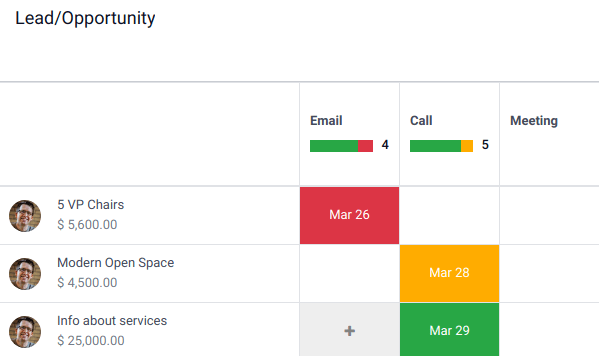
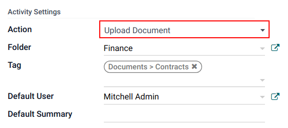
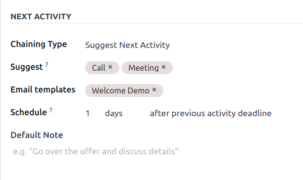
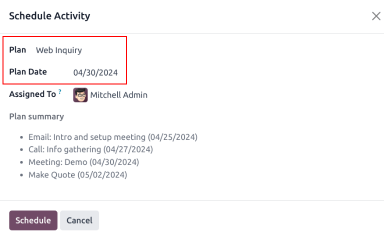

==================================
Utilize activities for sales teams
==================================

*Activities* are follow-up tasks tied to a record in an *Odoo* database. Activities can be scheduled
on any page of the database that contains a chatter thread, Kanban view, list view, or activities
view of an application.

   Planned Activities for Leads and Opportunities.

Activity types
==============

A set of preconfigured activity types is available in the *CRM* app. To view the list of available
activity types, navigate to the :menuselection:`CRM app --> Configuration --> Activity Types`.

.. note::
   Additional activity types are available within the database, and can be utilized through
   different applications. To access the complete list of activity types, go to the
   :menuselection:`Settings app`, then scroll to the :guilabel:`Discuss` section, and click
   :guilabel:`Activity Types`.

The preconfigured activity types for the *CRM* app are as follows:

 - :guilabel:`Email`: adds a reminder to the chatter that prompts the salesperson to send an email.
 - :guilabel:`Call`: opens a calendar link where the salesperson can schedule time to call the
   contact.
 - :guilabel:`Meeting`: opens a calendar link where the salesperson can schedule time to have a
   meeting with the contact.
 - :guilabel:`To Do`: adds a general reminder task to the chatter.
 - :guilabel:`Upload Document`: adds a link on the activity where an external document can be
   uploaded. Note that the *Documents* app is **not** required to utilize this activity type.

.. note::
   If other applications are installed, such as *Sales* or *Accounting*, other activity types are
   made available in the *CRM* app.

.. _crm/create-new-activity-type:

Create a new activity type
--------------------------

To create a new activity type, click :guilabel:`New` at the top-left of the page to open a blank
form.

At the top of the form, start by choosing a :guilabel:`Name` for the new activity type.

Activity settings
~~~~~~~~~~~~~~~~~

Action
******

The *Action* field specifies the intent of the activity. Some actions trigger specific behaviors
after an activity is scheduled.

- If :guilabel:`Upload Document` is selected, a link to upload a document is added directly to the
  planned activity in the chatter.
- If either :guilabel:`Phonecall` or :guilabel:`Meeting` are selected, users have the option to open
  their calendar to schedule a time for this activity.
- If :guilabel:`Request Signature` is selected, a link is added to the planned activity in the
  chatter that opens a signature request pop-up window.

.. note::
   The actions available to select on an activity type vary, depending on the applications currently
   installed in the database.

Default user
************

To automatically assign this activity to a specific user when this activity type is scheduled,
choose a name from the :guilabel:`Default User` drop-down menu. If this field is left blank, the
activity is assigned to the user who creates the activity.

Default summary
***************

To include notes whenever this activity type is created, enter them into the :guilabel:`Default
Summary` field.

.. note::
   The information in the :guilabel:`Default User` and :guilabel:`Default Summary` fields are
   included when an activity is created. However, they can be altered before the activity is
   scheduled or saved.

Next activity
~~~~~~~~~~~~~

To automatically suggest, or trigger, a new activity after an activity has been marked complete, the
:guilabel:`Chaining Type` must be set.

Suggest next activity
*********************

In the :guilabel:`Chaining Type` field, select :guilabel:`Suggest Next Activity`. Upon doing so, the
field underneath changes to: :guilabel:`Suggest`. Click the :guilabel:`Suggest` field drop-down menu
to select any activities to recommend as follow-up tasks to this activity type.

In the :guilabel:`Schedule` field, choose a default deadline for these activities. To do so,
configure a desired number of :guilabel:`Days`, :guilabel:`Weeks`, or :guilabel:`Months`. Then,
decide if it should occur :guilabel:`after completion date` or :guilabel:`after previous activity
deadline`.

This :guilabel:`Schedule` field information can be altered before the activity is scheduled.

When all configurations are complete, click :guilabel:`Save`.

.. note::
   If an activity has the :guilabel:`Chaining Type` set to :guilabel:`Suggest Next Activity`, and
   has activities listed in the :guilabel:`Suggest` field, users are presented with recommendations
   for activities as next steps.

   .. image:: utilize_activities/suggest-next-activity.png
      :align: center
      :alt: A schedule activity pop-up with emphasis on the recommended activities.

Trigger next activity
*********************

Setting the :guilabel:`Chaining Type` to :guilabel:`Trigger Next Activity` immediately launches the
next activity once the previous one is completed.

If :guilabel:`Trigger Next Activity` is selected in the :guilabel:`Chaining Type` field, the field
beneath changes to: :guilabel:`Trigger`. From the :guilabel:`Trigger` field drop-down menu, select
the activity that should be launched once this activity is completed.

In the :guilabel:`Schedule` field, choose a default deadline for these activities. To do so,
configure a desired number of :guilabel:`Days`, :guilabel:`Weeks`, or :guilabel:`Months`. Then,
decide if it should occur :guilabel:`after completion date` or :guilabel:`after previous activity
deadline`.

This :guilabel:`Schedule` field information can be altered before the activity is scheduled.

When all configurations are complete, click :guilabel:`Save`.

.. note::
   When an activity has the :guilabel:`Chaining Type` set to :guilabel:`Trigger Next Activity`,
   marking the activity as *Done* immediately launches the next activity listed in the
   :guilabel:`Trigger` field.

Activity tracking
=================

To keep the pipeline up to date with the most accurate view of the status of activities, as soon as
a lead is interacted with, the associated activity should be marked as *Done*. This ensures the next
activity can be scheduled as needed. It also prevents the pipeline from becoming cluttered with
past due activities.

The pipeline is most effective when it is kept up-to-date and accurate to the interactions it is
tracking.

.. _crm/activity-plans:

Activity plans
==============

*Activity plans* are preconfigured sequences of activities. When an activity plan is launched, every
activity in the sequence is scheduled automatically.

To create a new plan, navigate to :menuselection:`CRM app --> Configuration --> Activity Plan`.
Click :guilabel:`New` at the top-left of the page to open a blank :guilabel:`Lead Plans` form.

Enter a name for the new plan in the :guilabel:`Plan Name` field. On the :guilabel:`Activities to
Create` tab, click :guilabel:`Add a line` to add a new activity.

Select an :guilabel:`Activity Type` from the drop-down menu. Click :guilabel:`Search More` to see a
complete list of available activity types, or to create a :ref:`new one
<crm/create-new-activity-type>`.

Next, in the :guilabel:`Summary` field, enter any details to describe the specifics of the activity,
including instructions for the salesperson or information due upon the completion of the activity.
The contents of this field are included with the scheduled activity, and can be edited later.

In the :guilabel:`Assignment` field, select one of the following options:

 - :guilabel:`Ask at launch`: activities are assigned to a user when the plan is scheduled.
 - :guilabel:`Default user`: activities are always assigned to a specific user.

If :guilabel:`Default user` is selected in the :guilabel:`Assignment` field, choose a user in the
:guilabel:`Assigned to` field.

.. tip::
   Activity plans can feature activities that are assigned to default users and users assigned at
   the plan launch.

  .. image:: utilize_activities/create-activity-plan.png
     :align: center
     :alt: A Lead Plan form with scheduled activities.

Next, configure the timeline for the activity. Activities can be scheduled to occur either before
the plan date or after. Use the :guilabel:`Interval` and :guilabel:`Units` fields to set the
deadline for this activity. Lastly, in the :guilabel:`Trigger` field, select whether the activity
should occur before or after the plan date.

.. example::
   An activity plan is created to handle high priority leads. Specifically, these leads should be
   contacted quickly, with a meeting scheduled within two days of the initial contact. The plan is
   configured with the following activities:

   - Email two days **before** plan date
   - Meeting zero days **before** plan date
   - Make quote three days **after** plan date
   - Upload document three days **after** plan date
   - Follow-up five days **after** plan date

   This sets the *plan date* as the meeting deadline, which is the objective of the plan. Before
   that date, there is lead time to contact the customer and prepare for the meeting. After that
   date, the salesperson has time to create a quote, upload the document, and follow-up.

Repeat these steps for each activity included in the plan.

Launch an activity plan
-----------------------

To launch an activity plan on a *CRM* opportunity, navigate to :menuselection:`CRM app` and click on
the Kanban card of an opportunity to open it.

At the top-right of the chatter, click :guilabel:`Activities` to open the :guilabel:`Schedule
Activity` pop-up window.

In the :guilabel:`Plan` field, select the desired activity plan to launch. This generates a
:guilabel:`Plan summary`, listing out the activities included in the plan. Select a :guilabel:`Plan
Date` using the calendar popover. This updates the :guilabel:`Plan summary` with deadlines based on
the intervals configured on the :ref:`activity plan <crm/activity-plans>`.

Select a user in the :guilabel:`Assigned To` field. This user is assigned to any of the activities
on the plan were configured with :guilabel:`Ask at launch` in the :guilabel:`Assignment` field.

Click :guilabel:`Schedule`.

The details of the plan are added to the chatter, in addition to each of the activities.

.. image:: utilize_activities/activity-plan-chatter.png
   :align: center
   :alt: The chatter thread of a CRM opportunity with a launched activity plan.

.. seealso::
 - :doc:`Activities </applications/essentials/activities>`
