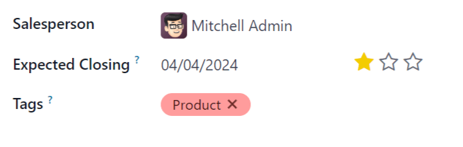
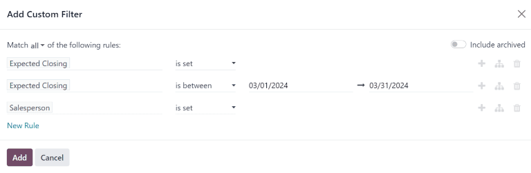
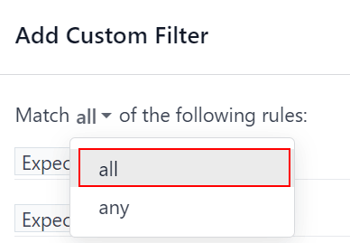

=======================
Expected revenue report
=======================

*Expected revenue* is the total cash value of leads that are expected to close by a certain date,
usually the end of the current month.

An *expected revenue report* compiles all active leads in a sales pipeline that have a set expected
closing date, and compares how sales teams are performing in a given time frame.

By pulling a monthly expected revenue report, sales managers can see which team members are reaching
their goals, and who may need additional assistance to close valuable deals.

Create an expected revenue report
=================================

To create an expected revenue report, first navigate to :menuselection:`CRM app --> Reporting -->
Pipeline`. This opens the :guilabel:`Pipeline Analysis` dashboard.

.. important::
   The *Pipeline Analysis* dashboard includes several filters in the search bar by default. Remove
   these before adding any additional custom filters.

On the top-left of the report, click :guilabel:`Measures`, then select :guilabel:`Expected Revenue`
from the drop-down menu.

At the top of the page, click the :guilabel:`🔻(triangle pointed down)` icon to the right of the
:guilabel:`Search...` bar to open the drop-down menu that contains :guilabel:`Filters`,
:guilabel:`Group By`, and :guilabel:`Favorites` columns. Under the :guilabel:`Filters` column, click
:guilabel:`Add Custom Filter`, which opens an :guilabel:`Add Custom Filter` pop-up window.

.. _expected_revenue_report/custom-filters:

Add custom filters
------------------

In order to generate an expected revenue report, filters need to be created for the following
conditions:

 - :ref:`Expected closing date <expected_revenue_report/closing-date>`: limits results to only
   include leads expected to close within a specific time frame.
 - :ref:`Exclude unassigned leads <expected_revenue_report/unassigned-leads>`: excludes leads
   without an assigned salesperson.
 - :ref:`Specific sales teams <expected_revenue_report/sales-team>`: limits results to only include
   leads assigned to one or more sales teams. This filter is optional and should not be included if
   the report is intended for the entire company.

.. _expected_revenue_report/closing-date:

Add filter for expected closing date
~~~~~~~~~~~~~~~~~~~~~~~~~~~~~~~~~~~~

On the :guilabel:`Add Custom Filter` pop-up window, click into the first field of the new rule.
Type `Expected Closing` into the :guilabel:`Search...` bar, or scroll to select it from the list.
Click in the second field and select :guilabel:`is set`. This limits the results to only include
leads where an estimated closing date is listed.

Next, click the :guilabel:`➕ (plus)` icon to the right of the rule to duplicate it.

.. tip::
   Using the :guilabel:`➕ (plus)` icon makes it easy to add multiple rules based on the same
   filter.

In the second field of the new rule, select :guilabel:`is between` from the drop-down menu. This
creates a set time frame during which the expected closing date must occur for leads to be included
in the results.

Click in each date field, one at a time, and use the calendar popover window to add both a start and
end date to the rule. This is usually the beginning and ending of the current month, or fiscal
quarter.

.. _expected_revenue_report/unassigned-leads:

Exclude unassigned leads
~~~~~~~~~~~~~~~~~~~~~~~~

After filtering for the expected closing date, add a :guilabel:`New Rule`. Then, click into the new
rule's first field, and type `Salesperson` in the :guilabel:`Search...` bar, or scroll through the
list to select it. Click in the rule's second field and select :guilabel:`is set` from the drop-down
menu. This excludes any results without an assigned salesperson.

.. _expected_revenue_report/sales-team:

Add a filter for sales teams
~~~~~~~~~~~~~~~~~~~~~~~~~~~~

.. note::
   This filter is optional. To view results for the entire company, do **not** add this filter, and
   continue to :ref:`View results <expected_revenue_report/view-results>`.

To limit the results of the report to one or more sales teams, click :guilabel:`New Rule`. Next,
click the first field for the new rule, and type `Sales Team` in the :guilabel:`Search...` bar, or
scroll to search through the list to locate it.

In the rule's second field, select :guilabel:`is in` from the drop-down menu. Selecting this
operator limits results to the sales teams indicated in the next field.

Lastly, click into the third field, and either: make a selection from the complete list revealed in
the popover menu, or type the first few characters of the specific sales team's title to quickly
find and select it as a parameter.

.. tip::
   Multiple teams can be added to the `Sales Team` rule, where each parameter is treated with an
   "or" (e.g. "any") operator in the search logic.

         report.

.. _expected_revenue_report/view-results:

View results
============

At the top of the :guilabel:`Add Custom Filter` form, there is an option to match :guilabel:`any` or
:guilabel:`all` of the rules. In order to properly run the report, only records that match **all**
of the following filters should be included. Before adding the filters, make sure :guilabel:`all` is
selected in this field.

At the bottom of the :guilabel:`Add Custom Filter` form, click :guilabel:`Add`.

View options
------------

The expected revenue report benefits from utilizing multiple views. The default graph view can be
used to identify which salespeople are expected to bring in the most revenue, while the list view
and pivot view provide more detail on specific deals.

.. tabs::

   .. tab:: Graph view

      The *graph view* is used to visualize data, and is beneficial in identifying patterns and
      trends.

      *Bar charts* are used to show the distribution of data across several categories or among
      several salespeople.

      *Line charts* are useful to show changing trends over a period of time.

      *Pie charts* are useful to show the distribution, or comparison, of data among a small number
      of categories or salespeople, specifically how they form the meaningful part of a whole
      picture.

      The default view for the expected revenue report is the bar chart, stacked. To change to a
      different graph view, click one of the icons at the top-left of the report. While both the
      line chart and bar chart are available in stacked view, the pie chart is not.

      .. figure:: expected_revenue_report/graph-view-icons.png
         :align: center
         :alt: Close up view of the graph icons on the Pipeline analysis report in the CRM app.

         Graph view icons in order: bar chart, line chart, pie chart, stacked.

   .. tab:: List view

      The *list view* provides a list of all leads that are expected to close by the designated
      date. Clicking on a lead in list view opens the record for detailed analysis, but many
      insights can be gleaned from the basic view.

      To switch to the list view, click the :guilabel:`≣ (list)` icon at the top-right of the
      report.

      .. image:: expected_revenue_report/list-icon.png
         :align: center
         :alt: Close up of the list view icon in the CRM app.

      To add additional metrics to the report, click the *additional options menu* indicated by the
      :guilabel:`toggle` icon at the top-right of the list.

      .. figure:: expected_revenue_report/toggle-icon.png
         :align: center
         :alt: Close up of the toggle icon in the CRM app.

         Clicking the toggle icon in *list view* opens the *additional options menu*.

      Select any additional metrics from the drop-down menu to add them to the list view. Some
      options that may be useful are :guilabel:`Expected Closing` and :guilabel:`Probability`.

   .. tab:: Pivot view

      The *pivot view* arranges all leads that are expected to close by the designated date into a
      dynamic table.

      To switch to the pivot view, click the :guilabel:`Pivot` icon at the top-right of the report.

      .. image:: expected_revenue_report/pivot-view-icon.png
         :align: center
         :alt: Close up of the pivot view icon in the CRM app.

      When the pivot view is selected for this report, the X-axis lists the stages in
      the pipeline, while the Y-axis defaults to group the results by their creation date. To switch
      these groupings, click the flip access icon (:guilabel:`⇄`) at the top of the report.

      To add additional measures to the report, click the :guilabel:`Measures` button at the
      top-left of the report. Select any additional metrics from the drop-down menu.

      To add a group to a row or column to the pivot view, click the :guilabel:`➕ (plus sign)` next
      to :guilabel:`Total`, and then select one of the groups. To remove one, click the
      :guilabel:`➖ (minus sign)` and de-select the appropriate option.

      Click :guilabel:`Insert in Spreadsheet` to add the pivot view into an editable spreadsheet
      format within the *Dashboards* app. If the Odoo *Documents* app is installed, the report can
      be inserted into a blank or existing spreadsheet, and exported.
