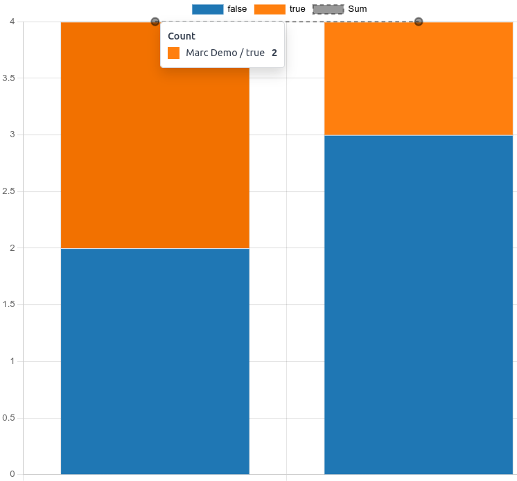
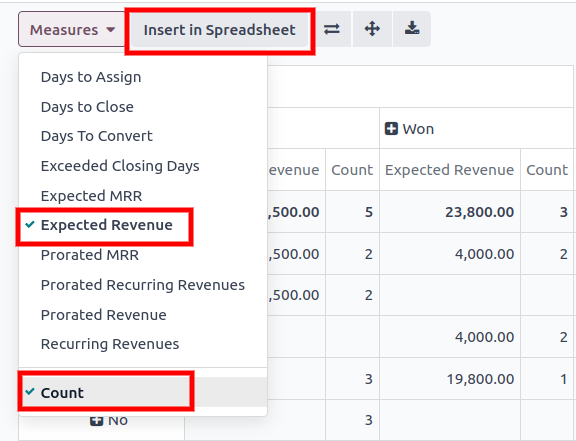
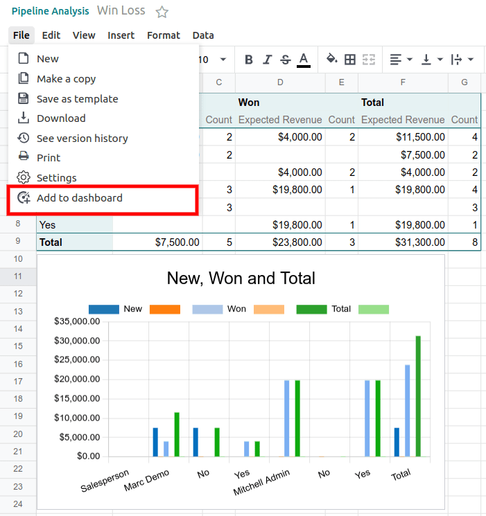
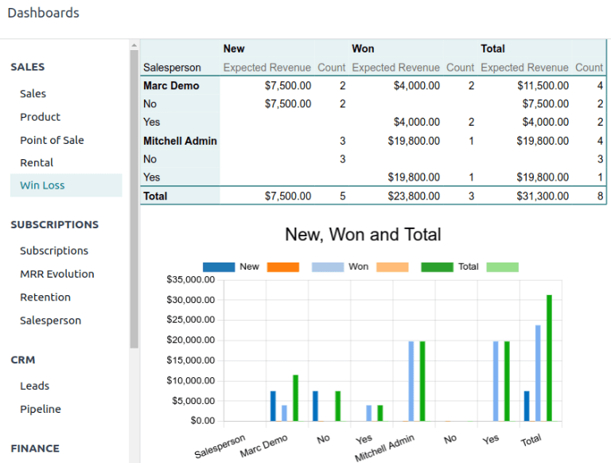

========================
Create a Win/Loss Report
========================

A Win/Loss ratio is the number of leads or opportunities a salesperson, sales team, or company have
won and lost, often represented as a percentage of wins over losses. In the CRM app, the Win/Loss
ratio is available by creating a Win/Loss report.

To create this report, open the CRM app, click the *Reporting* tab, and select the *Pipeline* view.

.. image:: win_loss/reporting-tab-and-pipeline-view.png
    :align: center
    :alt: View of CRM page showing the Reporting tab with the Pipeline view highlighted.

Open the *Search Panel* dropdown, and make the following selections:

#. Filters: *Won*.
#. Filters: *Lost*.

   - Optional: Removing or adjusting the *Created On* filter to reflect the last 30 days, the last
     quarter. By default, it reflects the entire year.

   - Optional: Show only leads that have reached the last stage of the sales pipeline (Closed) by
     adding a custom filter for *Last Stage Update is >= DATE*.
#. Group By: *Salesperson*.
#. Group By: *Add Custom Group --> Active*.

   - Optional: Group by *Sales Team* or *Company* instead of by "Salesperson*.

.. image:: win_loss/search-panel-filters-and-group-by-options.png
    :align: center
    :alt: View of CRM page showing the Search Panel open and the Won and Lost filters highlighted.

The *Search Panel* should read: *Filter: Created On: YYYY, Filter: Won or Lost, Group By:
Salesperson > Active*. If so, it now displays the *count* of wins and losses for each salesperson.
Hover over the chart to see the percentage of wins (true) or losses (false). Click on a
section of the chart to open a list of those accounts.

Additional Measurements and Views
=================================
By default, the Win/Loss report measures the total *count* of leads. Click the
*Measures* button to select other options such as *Expected Revenue*.

Click the chart icons along the top to switch the graph type from a Bar Chart to a Line Chart or Pie
Chart.

Additionally, the report can be changed from a Graph view to a Pivot view, Cohort view, or
List view.

.. image:: win_loss/measure-button-menu-pie-chart-view-and-graph-type-button.png
   :align: center
   :alt: The Measures dropdown menu and pie chart view and pivot view.

Add a Win/Loss Report to Dashboards
===================================
After configuring the views and measurements, a Win/Loss report can be saved to a spreadsheet and/or
dashboard for easier viewing in the future.

From the Win/Loss report, switch to the *Pivot* view. Click the *Measures* button
and select *count*. Click *Insert in Spreadsheet*.

Select *Blank Spreadsheet* and click *Confirm*. Name the new spreadsheet,
and add charts or additional formulas as desired.

Once complete, open the *File* menu and select *Add to dashboard*. Name the dashboard,
select a dashboard section, add access groups, and click *Create*.

The Win/Loss report is now viewable in the *Dashboards* app. This view automatically updates to
reflect the live data in the corresponding spreadsheet.

