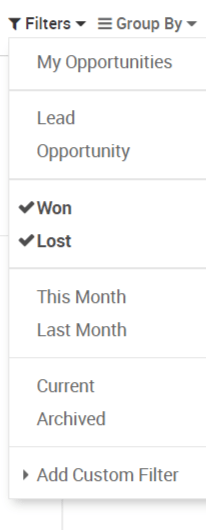
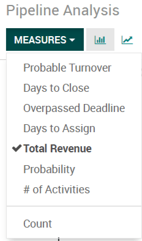

=========================
Check your Win/Loss Ratio
=========================

To see how well you are doing with your pipeline, take a look at
the Win/Loss ratio.

To access this report, go to your *Pipeline* view under the
*Reporting* tab.

From there you can filter to which opportunities you wish to see, yours,
the ones from your sales channel, your whole company, etc. You can then
click on filter and check Won/Lost.

You can also change the *Measures* to *Total Revenue*.

You also have the ability to switch to a pie chart view.

.. image:: win_loss/win_loss03.png
    :align: center
