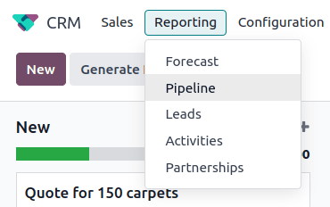
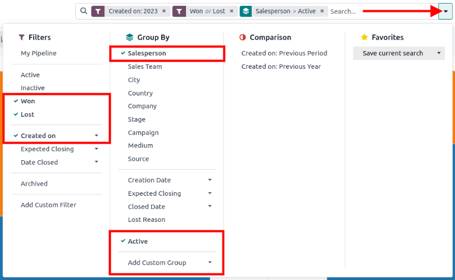
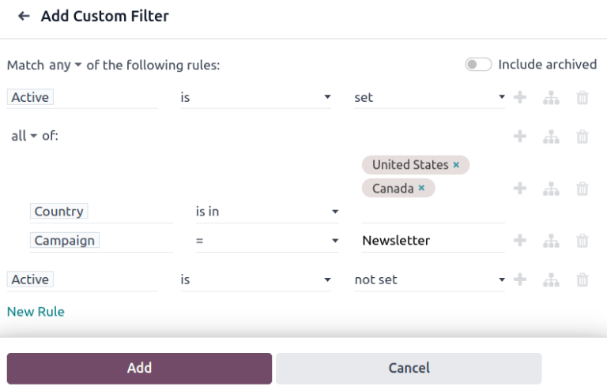
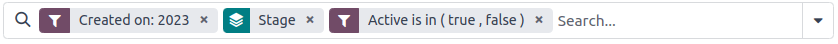
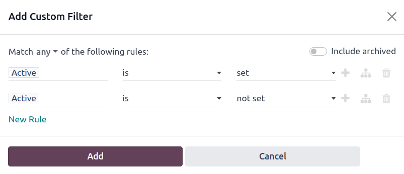
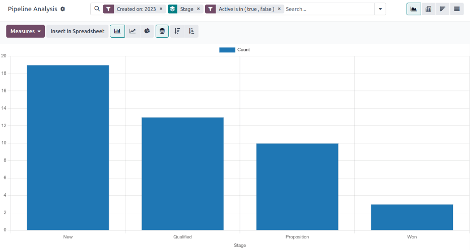

=================
Pipeline Analysis
=================

The *CRM* app manages the sales pipeline as leads/opportunities move from stage to stage,
origination to sale (**Won**) or archival (**Lost**).

After organizing the pipeline, use the search options and reports available on the *Pipeline
Analysis* page to gain insight into the effectiveness of the pipeline and its users.

To access the *Pipeline Analysis* page, go to :menuselection:`CRM app --> Reporting --> Pipeline`.

.. _win_loss/pipeline:

Navigate the pipeline analysis page
===================================

Upon accessing the :guilabel:`Pipeline Analysis` page, a bar graph showcasing the leads from the
past year automatically populates. The bars represent the number of leads in each stage of the sales
pipeline, color-coded to show the month the lead reached that stage.

.. image:: win_loss/pipeline-analysis-page.png
   :align: center
   :alt: The default state of the Pipeline Analysis page is a graph, with many options to change it.

The interactive elements of the :guilabel:`Pipeline Analysis` page manipulate the graph to report
different metrics in several views. From left-to-right, top-to-bottom, the elements include:

- :guilabel:`Actions`: represented by the :guilabel:`⚙️ (gear)` icon, located next to the
  :guilabel:`Pipeline Analysis` page title. When clicked, a drop-down menu appears with three
  options, each with their own sub-menu: :guilabel:`Knowledge`, :guilabel:`Dashboard`,
  :guilabel:`Spreadsheet`. (See :ref:`Save and share reports <win_loss/save_reports>` for more
  information)

  - The :guilabel:`Knowledge` option is for linking to or inserting the graph in a *Knowledge* app
    article.
  - The :guilabel:`Dashboard` option is for adding the graph to a dashboard in the *Dashboards* app.
  - The :guilabel:`Spreadsheet` option is for linking the graph in a spreadsheet in the *Documents*
    app.
- :guilabel:`Search...` bar: shows the filters and groupings currently being applied to the graph.
  To add new filters/groups, type them into the search bar, or click the :guilabel:`⬇️ (down arrow)`
  icon, at the end of the bar, to open a drop-down menu of options. (See :ref:`Search Options
  <win_loss/search>` for more information)

In the upper-right corner, there are view options represented by different icons. (See :ref:`View
Options <win_loss/view>` for more information)

- :guilabel:`Graph` view: displays the data in a bar graph. This is the default view.
- :guilabel:`Pivot` view: displays the data in a customizable, categorized metrics table.
- :guilabel:`Cohort` view: displays and organizes the data, based on their :guilabel:`Created on`
  and :guilabel:`Closed Date` week (default), day, month, or year.
- :guilabel:`List` view: displays the data in a list.

Located on the far-left side of the page, beneath the :guilabel:`Pipeline Analysis` page title,
there are more configurable filter and view options.

- :guilabel:`Measures`: opens a drop-down menu of different measurement options that can be seen in
  the graph, pivot, or cohort view. The :guilabel:`Measure` drop-down menu is not available in the
  list view. (See :ref:`Measurement Options <win_loss/measure>` for more information)
- :guilabel:`Insert in Spreadsheet`: opens a pop-up window with options for adding a graph or pivot
  table to a spreadsheet in the *Documents* app or a dashboard in the *Dashboards* app. This option
  is not available in the cohort or list view.

With the graph view selected, the following options are available:

- :guilabel:`Bar Chart`: switches the graph to a bar chart.
- :guilabel:`Line Chart`: switches the graph to a line chart.
- :guilabel:`Pie Chart`: switches the graph to a pie chart.
- :guilabel:`Stacked`: when selected, the results of each stage of the graph are stacked on top of
  each other. When not selected, the results in each stage are shown as individual bars.
- :guilabel:`Descending`: re-orders the stages in the graph in descending order from left-to-right.
  Click the icon a second time to deselect it. Depending on the search criteria, this option may not
  be available.
- :guilabel:`Ascending`: re-orders the stages in the graph in ascending order from left-to-right.
  Click the icon a second time to deselect it. Depending on the search criteria, this option may not
  be available.

With the pivot view selected, the following options are available:

- :guilabel:`Flip Axis`: flips the X and Y axis for the entire table.
- :guilabel:`Expand All`: when additional groupings are selected using the :guilabel:`➕ (plus
  sign)` icons, this button opens those groupings under every row.
- :guilabel:`Download xlsx`: downloads the table as an Excel file.

.. _win_loss/search:

Search options
--------------

The :guilabel:`Pipeline Analysis` page can be customized with various filters and grouping options.

To add new search criteria, type the desired criteria into the search bar, or click the
:guilabel:`⬇️ (down arrow)` icon, next to the search bar, to open a drop-down menu of all options.
See the sections below for more information on what each option does.

.. tabs::

   .. tab:: Filters

      The :guilabel:`Filters` section allows users to add pre-made and custom filters to the search
      criteria. Multiple filters can be added to a single search.

      - :guilabel:`My Pipeline`: show leads assigned to the current user.
      - :guilabel:`Opportunities`: show leads that have been qualified as opportunities.
      - :guilabel:`Leads`: show leads that have yet to be qualified as opportunities.
      - :guilabel:`Active`: show active leads.
      - :guilabel:`Inactive`: show inactive leads.
      - :guilabel:`Won`: show leads that have been marked **Won**.
      - :guilabel:`Lost`: show leads that have been marked **Lost**.
      - :guilabel:`Created On`: show leads that were created during a specific period of time. By
        default, this is the past year, but it can be adjusted as needed, or removed entirely.
      - :guilabel:`Expected Closing`: show leads that are expected to close (marked **Won**) during
        a specific period of time.
      - :guilabel:`Date Closed`: show leads that were closed (marked **Won**) during a specific
        period of time.
      - :guilabel:`Archived`: show leads that have been archived (marked **Lost**).
      - :guilabel:`Add Custom Filter`: allows the user to create a custom filter with numerous
        options. (See :ref:`Add Custom Filters and Groups <win_loss/custom_filters>` for more
        information)

   .. tab:: Group By

      The :guilabel:`Group By` section allows users to add pre-made and custom groupings to the
      search results. Multiple groupings can be added to split results into more manageable chunks.

      .. important::
         The order that groupings are added affects how the final results are displayed. Try
         selecting the same combinations in a different order to see what works best for each use
         case.

      - :guilabel:`Salesperson`: groups the results by the Salesperson to whom a lead is assigned.
      - :guilabel:`Sales Team`: groups the results by the Sales Team to whom a lead is assigned.
      - :guilabel:`City`: groups the results by the city from which a lead originated.
      - :guilabel:`Country`: groups the results by the country from which a lead originated.
      - :guilabel:`Company`: groups the results by the company to which a lead belongs (if multiple
        companies are activated in the database).
      - :guilabel:`Stage`: groups the results by the stages of the sales pipeline.
      - :guilabel:`Campaign`: groups the results by the marketing campaign from which a lead
        originated.
      - :guilabel:`Medium`: groups the results by the medium (Email, Google Adwords, Website, etc.)
        from which a lead originated.
      - :guilabel:`Source`: groups the results by the source (Search engine, Lead Recall,
        Newsletter, etc.) from which a lead originated.
      - :guilabel:`Creation Date`: groups the results by the date a lead was added to the database.
      - :guilabel:`Conversion Date`: groups the results by the date a lead was converted to an
        opportunity.
      - :guilabel:`Expected Closing`: groups the results by the date a lead is expected to close
        (marked "Won").
      - :guilabel:`Closed Date`: groups the results by the date a lead was closed(marked "Won").
      - :guilabel:`Lost Reason`: groups the results by the reason selected when a lead was marked
        "Lost."
      - :guilabel:`Add Custom Group`: allows the user to create a custom group with numerous
        options. (See :ref:`Adding Custom Filters and Groups <win_loss/custom_filters>` for more
        information)

   .. tab:: Comparison

      The :guilabel:`Comparison` section allows users to add comparisons to the same search criteria
      over another period of time.

      This option is only available if the search includes time-based filters, such as
      :guilabel:`Created On`, :guilabel:`Expected Closing`, or :guilabel:`Date Closed`. While
      multiple time-based filters can be added at once, only one comparison can be selected at a
      time.

      - :guilabel:`Previous Period`: adds a comparison to the same search criteria from the previous
        period.
      - :guilabel:`Previous Year`: adds a comparison to the same search criteria from the previous
        year.

   .. tab:: Favorites

      The :guilabel:`Favorites` section allows users to save a search for later, so it does not need
      to be recreated every time.

      Multiple searches can be saved, shared with others, or even set as the default for whenever
      the :guilabel:`Pipeline Analysis` page is opened.

      - :guilabel:`Save current search`: save the current search criteria for later.

        - :guilabel:`Default filter`: when saving a search, check this box to make it the default
          search filter when the :guilabel:`Pipeline Analysis` page is opened.
        - :guilabel:`Shared`: when saving a search, check this box to make it available to other
          users.

.. _win_loss/custom_filters:

Add custom filters and groups
~~~~~~~~~~~~~~~~~~~~~~~~~~~~~

In addition to the pre-made options in the search bar, the :guilabel:`Pipeline Analysis` page can
also utilize custom filters and groups.

Custom filters are complex rules that further customize the search results, while custom groups
display the information in a more organized fashion.

**To add a custom filter:**

1. On the :guilabel:`Pipeline Analysis` page, click the :guilabel:`down arrow` icon next to the
   :guilabel:`Search...` bar.
2. In the drop-down menu, click :guilabel:`Add Custom Filter`.
3. The :guilabel:`Add Custom Filter` pop-up window appears with a default rule (:guilabel:`Country
   is in _____`) comprised of three unique fields. These fields can be edited to make a custom rule,
   and multiple rules can be added to a single custom filter.
4. To edit a rule, start by clicking the first field (:guilabel:`Country`), and select an option
   from the drop-down menu. The first field determines the primary subject of the rule.
5. Next, click the second field, and select an option from the drop-down menu. The second field
   determines the relationship of the first and third fields, and is usually an **is** or **is not**
   statement, but can also be **greater than or less than** statements, and more.
6. Finally, click the third field, and select an option from the drop-down menu. The third field
   determines the secondary subject of the rule.
7. With all three fields selected, the rule is complete.

   - **To add more rules:** click :guilabel:`New Rule` and repeat steps 4-7, as needed.
   - **To delete a rule:** click the :guilabel:`🗑️ (trash)` icon to the right of the rule.
   - **To duplicate an existing rule:** click the :guilabel:`➕ (plus sign)` icon to the right of
     the rule.
   - **To create more complex rules:** click the :guilabel:`Add branch` icon to the right of the
     rule. This adds another modifier below the rule for adding an "all of" or "any of" statement.

8. Once all rules have been added, click :guilabel:`Add` to add the custom filter to the search
   criteria.

   - **To remove a custom filter:** click the :guilabel:`✖️ (x)` icon beside the filter in the
     search bar.

**To add a custom group:**

1. On the :guilabel:`Pipeline Analysis` page, click the :guilabel:`down arrow` icon next to the
   search bar.
2. In the drop-down menu that appears, click :guilabel:`Add Custom Group`.
3. Scroll through the options in the drop-down menu, and select one or more groups.

   - **To remove a custom group:** click the :guilabel:`✖️ (x)` icon beside the custom group in the
     search bar.

.. _win_loss/measure:

Measurement options
-------------------

By default, the :guilabel:`Pipeline Analysis` page measures the total :guilabel:`Count` of leads
that match the search criteria, but can be changed to measure other items of interest.

To change the selected measurement, click the :guilabel:`Measures` button on the top-left of the
page, and select one of the following options from the drop-down menu:

- :guilabel:`Days to Assign`: measures the number of days it took a lead to be assigned after
  creation.
- :guilabel:`Days to Close`: measures the number of days it took a lead to be closed (marked
  **Won**).
- :guilabel:`Days to Convert`: measures the number of days it took a lead to be converted to an
  opportunity.
- :guilabel:`Exceeded Closing Days`: measures the number of days by which a lead exceeded its
  Expected Closing date.
- :guilabel:`Expected MRR`: measures the Expected Recurring Revenue of a lead.
- :guilabel:`Expected Revenue`: measures the Expected Revenue of a lead.
- :guilabel:`Prorated MRR`: measures the Prorated Monthly Recurring Revenue of a lead.
- :guilabel:`Prorated Recurring Revenues`: measures the Prorated Recurring Revenues of a lead.
- :guilabel:`Prorated Revenue`: measures the Prorated Revenue of a lead.
- :guilabel:`Recurring Revenues`: measures the Recurring Revenue of a lead.
- :guilabel:`Count`: measures the total amount of leads that match the search criteria.

.. _win_loss/view:

View options
------------

After configuring filters, groupings, and measurements, the :guilabel:`Pipeline Analysis` page can
display the data in a variety of ways. By default, the page uses the graph view, but can be changed
to a pivot view, cohort view, or list view.

To change the pipeline to a different view, click one of the four view icons, located in the
top-right of the :guilabel:`Pipeline Analysis` page.

.. tabs::

   .. tab:: Graph View

      The graph view is the default selection for the :guilabel:`Pipeline Analysis` page. It
      displays the analysis as either a: bar chart, line chart, or pie chart.

      This view option is useful for quickly visualizing and comparing simple relationships, like
      the :guilabel:`Count` of leads in each stage, or the leads assigned to each
      :guilabel:`Salesperson`.

      By default, the graph measures the :guilabel:`Count` of leads in each group, but this can be
      changed by clicking the :guilabel:`Measures` button, and :ref:`selecting another option
      <win_loss/measure>` from the resulting drop-down menu.

      .. image:: win_loss/graph-view.png
         :align: center
         :alt: The Graph View displays the analysis as a Bar Chart, Line Chart, or Pie Chart.

      .. tip::
         When using a bar chart in this view, consider deselecting the :guilabel:`Stacked` option,
         in order to make the breakdown of results more legible.

   .. tab:: Pivot View

      The pivot view displays the results of the analysis as a table. By default, the table groups
      the results by the stages of the sales pipeline, and measures :guilabel:`Expected Revenue`.

      The pivot view is useful for analyzing more detailed numbers than the graph view can handle,
      or for adding the data to a spreadsheet, where custom formulas can be set up, like in an Excel
      file.

      .. image:: win_loss/pivot-view.png
         :align: center
         :alt: The Pivot View displays the analysis as a table.

      The three icons at the top-left of the page perform the following functions:

      - :guilabel:`Flip Axis`: flips the X and Y axis for the entire table.
      - :guilabel:`Expand All`: when additional groupings are selected using the :guilabel:`➕ (plus
        sign)` icons, this button opens those groupings under every row.
      - :guilabel:`Download xlsx`: downloads the table as an Excel file.

      .. note::
         The :guilabel:`Stage` grouping cannot be removed, but the measurement can be changed by
         clicking the :guilabel:`Measures` button, and selecting another option.

   .. tab:: Cohort View

      The cohort view displays the analysis as periods of time (cohorts) that can be set to days,
      weeks, months, or years. By default, :guilabel:`Week` is selected.

      This view option is useful specifically for comparing how long it has taken to close leads.

      .. image:: win_loss/cohort-view.png
         :align: center
         :alt: The Cohort View displays the analysis as individual weeks of the year.

      From left-to-right, top-to-bottom, the columns in the chart represent the following:

      - :guilabel:`Created On`: rows in this column represent the weeks of the year, in which
        records matching the search criteria exist.

        - When set to :guilabel:`Week`, a row with the label :guilabel:`W52 2023` means the results
          occurred in: Week 52 of the Year 2023.
      - :guilabel:`Measures`: the second column in the chart is the measurement of the results. By
        default, it is set to :guilabel:`Count`, but can be changed by clicking the
        :guilabel:`Measures` button, and selecting an option from the drop-down menu.
      - :guilabel:`Closed Date - By Day/Week/Month/Year`: this column looks at what percentage of
        the measured results were closed in subsequent days/weeks/months/years.
      - :guilabel:`Average`: this row provides the average of all other rows in the column.

      The cohort view can also be downloaded as an Excel file, by clicking the :guilabel:`Download`
      icon in the top-left of the page.

   .. tab:: List View

      The list view displays a single list of all leads matching the search criteria. Clicking a
      lead opens the record for closer review. Additional details such as :guilabel:`Country`,
      :guilabel:`Medium`, and more can be added to the list, by clicking the :guilabel:`Filters`
      icon in the top-right of the list.

      This view option is useful for reviewing many records at once.

      .. image:: win_loss/list-view.png
         :align: center
         :alt: The List View displays a single list of all records matching the search criteria.

      Clicking the :guilabel:`⚙️ (gear)` icon opens the Actions drop-down menu, with options for the
      following:

      - :guilabel:`Import records`: opens a page for uploading a spreadsheet of data, as well as a
        template spreadsheet to easily format that data.
      - :guilabel:`Export All`: downloads the list as an xlsx file for Excel.
      - :guilabel:`Knowledge`: inserts a view of, or link to, the list in an article in the
        *Knowledge* app.
      - :guilabel:`Dashboard`: adds the list to *My Dashboard* in the *Dashboards* app.
      - :guilabel:`Spreadsheet`: links to, or inserts, the list in a spreadsheet in the *Documents*
        app.

      .. note::
         On the list view, clicking :guilabel:`New` closes the list, and opens the *New Quotation*
         page. Clicking :guilabel:`Generate Leads` opens a pop-up window for lead generation.
         Neither feature is intended to manipulate the list view.

.. _win_loss/reports:

Create reports
==============

After understanding how to :ref:`navigate the pipeline analysis page <win_loss/pipeline>`, the
:guilabel:`Pipeline Analysis` page can be used to create and share different reports. Between the
pre-made options and custom filter and groupings, almost any combination is possible.

Once created, reports can be :ref:`saved to favorites, shared with other users, and/or added to
dashboards and spreadsheets <win_loss/save_reports>`.

A few common reports that can be created using the :guilabel:`Pipeline Analysis` page are detailed
below.

.. _win_loss/win_loss:

Win/Loss reports
----------------

Win/Loss is a calculation of active or previously active leads in a pipeline that were either marked
as **Won** or **Lost** over a specific period of time. By calculating opportunities won over
opportunities lost, teams can clarify key performance indicators (KPIs) that are converting leads
into sales, such as specific teams or team members, certain marketing mediums or campaigns, and so
on.

.. math::
   \begin{equation}
   Win/Loss Ratio = \frac{Opportunities Won}{Opportunities Lost}
   \end{equation}

A win/loss report filters the leads from the past year, whether won or lost, and groups the results
by their stage in the pipeline. Creating this report requires a custom filter, and grouping the
results by :guilabel:`Stage`.

Follow the steps below to create a win/loss report:

1. Navigate to :menuselection:`CRM app --> Reporting --> Pipeline`.
2. On the :guilabel:`Pipeline Analysis` page, click the :guilabel:`⬇️ (down arrow)` icon, next to
   the search bar, to open a drop-down menu of filters and groupings.

   .. image:: win_loss/filters-for-basic-win-loss-report.png
      :align: center
      :alt: The Search menu containing the filters for a basic win/loss report.

3. In drop-down menu that appears, under the :guilabel:`Group By` heading, click :guilabel:`Stage`.
4. Under the :guilabel:`Filters` heading, click :guilabel:`Add Custom Filter` to open another pop-up
   menu.
5. In the :guilabel:`Add Custom Filter` pop-up menu, click on the first field in the
   :guilabel:`Match any of the following rules:` section. By default, this field displays
   :guilabel:`Country`.
6. Clicking that first field reveals a sub-menu with numerous options to choose from. From this
   sub-menu, locate and select the :guilabel:`Active` option. Doing so automatically populates the
   remaining fields.

   The first field reads: :guilabel:`Active`. The second field reads: :guilabel:`is`. And lastly,
   the third field reads: :guilabel:`set`.

   In total, the rule reads: :guilabel:`Active is set`.
7. Click :guilabel:`New Rule`, change the first field to :guilabel:`Active`, and the last field to
   :guilabel:`not set`. In total, the rule reads :guilabel:`Active is not set`.
8. Click :guilabel:`Add`.

The report now displays the total :guilabel:`Count` of leads, whether "Won" or "Lost," grouped by
their stage in the CRM pipeline. Hover over a section of the report to see the number of leads in
that stage.

Customize win/loss reports
~~~~~~~~~~~~~~~~~~~~~~~~~~

After :ref:`creating a win/loss report <win_loss/win_loss>`, consider using the options below to
customize the report for different needs.

.. example::
   A sales manager might group wins and losses by salesperson, or sales team, to see who has the
   best conversion rate. Or, a marketing team might group by sources, or medium, to determine where
   their advertising has been most successful.

.. tabs::

   .. tab:: Filters and groups

      To add more filters and groups, click the :guilabel:`⬇️ (down arrow)` icon, next to the search
      bar, and select one or more options from the drop-down menu.

      Some useful options include:

      - :guilabel:`Created on`: adjusting this filter to a different period of time, such as the
        last 30 days, or the last quarter, can provide more timely results.
      - :guilabel:`Add Custom Filter`: clicking this option, and scrolling through the numerous
        options in the drop-down menu, opens up additional search criteria, like :guilabel:`Last
        Stage Update` or :guilabel:`Lost Reason`.
      - :guilabel:`Add Custom Group > Active`: Clicking :menuselection:`Add Custom Group --> Active`
        separates the results into **Won** (:guilabel:`true`) or **Lost** (:guilabel:`false`). This
        shows at what stage leads are being marked **Won** or **Lost**.
      - :guilabel:`Multiple Groupings`: add multiple :guilabel:`Group By` selections to split
        results into more relevant and manageable chunks.

        - Adding :guilabel:`Salesperson` or :guilabel:`Sales Team` breaks up the total count of
          leads in each :guilabel:`Stage`.
        - Adding :guilabel:`Medium` or :guilabel:`Source` can reveal what marketing avenues generate
          more sales.

      .. image:: win_loss/search-panel-filters-and-group-by-options.png
         :align: center
         :alt: The Search menu open and the Won and Lost filters highlighted.

   .. tab:: Pivot View

      By default, pivot view groups win/loss reports by :guilabel:`Stage` and measures
      :guilabel:`Expected Revenue`.

      To flesh out the table:

      1. Click the :guilabel:`⬇️ (down arrow)` next to the search bar.
      2. In the pop-up menu, replace the :guilabel:`Stage` grouping with something like
         :guilabel:`Salesperson` or :guilabel:`Medium`.
      3. Click the :guilabel:`Measures` button and click :guilabel:`Count` to add the number of
         leads back into the report.

         - Other useful measures for pivot view include :guilabel:`Days to Assign` and
           :guilabel:`Days to Close`.

      .. image:: win_loss/win-loss-pivot-view.png
         :align: center
         :alt: A win/loss report in Pivot View displays the data in table form.

      .. important::
         In pivot view, the :guilabel:`Insert In Spreadsheet` button may be greyed out due to the
         report containing :guilabel:`duplicate group bys`. To fix this, replace the
         :guilabel:`Stage` grouping in the search bar with another option.

   .. tab:: List View

      In list view, a win/loss report displays all leads on a single page.

      To better organize the list, click the :guilabel:`⬇️ (down arrow)` next to the search bar, and
      add more relevant groupings or re-organize the existing ones. To re-order the nesting, remove
      all :guilabel:`Group By` options and re-add them in the desired order.

      To add more columns to the list:

      1. Click the :guilabel:`Filters` icon in the top-right of the page.
      2. Select options from the resulting drop-down menu. Some useful filters include:

         - **Campaign**: Shows the marketing campaign that originated each lead.
         - **Medium**: Shows the marketing medium (Banner, Direct, Email, Google Adwords, Phone,
           Website, etc.) that originated each lead.
         - **Source**: Shows the source of each lead (Newsletter, Lead Recall, Search Engine, etc.).

      .. image:: win_loss/win-loss-list-view.png
         :align: center
         :alt: A win/loss report in List View displays all leads in an easy-to-read list.

.. _win_loss/save_reports:

Save and share reports
======================

After :ref:`creating a report <win_loss/reports>`, the search criteria can be saved, so the report
does not need to be created again in the future. Saved searches automatically update their results
every time the report is opened.

Additionally, reports can be shared with others, or added to spreadsheets/dashboards for greater
customization and easier access.

.. tabs::

   .. tab:: Save to Favorites

      To save a report for later:

      1. On the :guilabel:`Pipeline Analysis` page, click the :guilabel:`⬇️ (down arrow)` icon, next
         to the search bar.
      2. In the drop-down menu that appears, under the :guilabel:`Favorites` heading, click
         :guilabel:`Save current search`.
      3. In the next drop-down menu that appears, enter a name for the report.

         - Checking the :guilabel:`Default filter` box sets this report as the default analysis when
           the :guilabel:`Pipeline Analysis` page is accessed.
         - Checking the :guilabel:`Shared` box makes this report available to other users.

      4. Finally, click :guilabel:`Save`. The report is now saved under the :guilabel:`Favorites`
         heading.

      .. image:: win_loss/save-to-favorites.png
         :align: center
         :alt: Under the Favorites heading, click Save current search and save the report for later.

   .. tab:: Add to a Spreadsheet

      Inserting a report into a spreadsheet not only saves a copy of the report, it allows users to
      add charts and formulas like in an Excel file.

      To save a report as a spreadsheet:

      - **In Graph or Pivot View**:

        1. Click the :guilabel:`Insert in spreadsheet` button.
        2. In the pop-up menu that appears, click :guilabel:`Confirm`.

      - **In Cohort or List View**:

        1. Click the :guilabel:`⚙️ (gear)` icon.
        2. In the drop-down menu that appears, hover over :guilabel:`Spreadsheet`.
        3. In the next drop-down menu, click either :guilabel:`Insert in spreadsheet` or
           :guilabel:`Link in spreadsheet`.

      Saved reports are viewable in the *Documents* app.

        .. image:: win_loss/pivot-view-in-spreadsheet.png
           :align: center
           :alt: Pivot View reports especially benefit from being inserted in spreadsheets.

      .. tip::
         After modifying a spreadsheet and adding additional formulas, consider then adding the
         entire spreadsheet to a dashboard. Using this method, the spreadsheet can be added to a
         public dashboard instead of only :guilabel:`My Dashboard`.

         1. Click :menuselection:`File --> Add to dashboard`.
         2. In the pop-up menu that appears, name the spreadsheet and select a :guilabel:`Dashboard
            Section` to house the report.
         3. Click :guilabel:`Create`.

   .. tab:: Add to a Dashboard

      Adding a report to a dashboard saves it for later and makes it easy to view alongside the rest
      of :guilabel:`My Dashboard`.

      To add a report to :guilabel:`My dashboard`:

      1. On the :guilabel:`Pipeline Analysis` page, click the :guilabel:`⚙️ (gear)` icon.
      2. In the drop-down menu that appears, hover over :guilabel:`Dashboard`.
      3. In the :guilabel:`Add to my dashboard` drop-down menu, enter a name for the report (by
         default, it is named :guilabel:`Pipeline`).
      4. Click :guilabel:`Add`.

      To view a saved report:

      1. Return to the main apps page, and navigate to :menuselection:`Dashboards app --> My
         Dashboard`.

      .. image:: win_loss/add-to-dashboard.png
         :align: center
         :alt: To access the saved report, open the Dashboard app and click My Dashboard.

.. seealso::
   - :doc:`../acquire_leads/convert`
   - :doc:`../acquire_leads/send_quotes`
   - :doc:`../pipeline/lost_opportunities`
