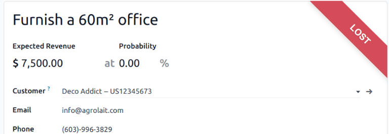

=========================
Manage lost opportunities
=========================

Not every opportunity results in a successful sale. To keep the pipeline up-to-date, *lost*
opportunities need to be identified. Specifying why an opportunity was lost provides additional
insight that can prove useful for future opportunities.

Mark an opportunity as lost
===========================

To mark an opportunity as lost, first open the :menuselection:`CRM app`, and select an opportunity
from the pipeline, by clicking on its corresponding Kanban card. Doing so reveals that opportunity's
detail form.

Then, click :guilabel:`Lost`, located at the top of the opportunity's detail form.

.. image:: lost_opportunities/lost-opps-lost-button.png
   :align: center
   :alt: Buttons from the top of an opportunity record with the lost button emphasized.

This opens the :guilabel:`Mark Lost` pop-up window. From the :guilabel:`Lost Reason` drop-down menu,
choose an existing lost reason. If no applicable reason is available, create a new one by entering
it into the :guilabel:`Lost Reason` field, and clicking :guilabel:`Create`.

Additional notes and comments can be added below the lost reason in the designated
:guilabel:`Closing Note` field.

.. tip::
   Neither the :guilabel:`Lost Reason` field, nor the :guilabel:`Closing Note` field, on the
   :guilabel:`Mark Lost` pop-up window are required. However, it is recommended to include this
   information for the sake of traceability, accountability, and reporting purposes.

When all the desired information has been entered in the :guilabel:`Mark Lost` pop-up window, click
:guilabel:`Mark as Lost`.

.. image:: lost_opportunities/lost-opps-lost-reason.png
   :align: center
   :alt: Lost reasons popup with sample reasons.

After clicking :guilabel:`Mark as Lost`, a red :guilabel:`Lost` banner is added to the upper-right
corner of the opportunity.

.. note::
   To mark an *inactive* (archived) opportunity as lost, set the :guilabel:`Probability` field to
   `0` percent.

.. _crm/lost-reasons:

Create/edit lost reasons
========================

To create a new lost reason, or edit an existing one, navigate to :menuselection:`CRM app -->
Configuration --> Lost Reasons`.

To edit an existing lost reason:

#. Click on the reason to be edited to highlight it.
#. Change the selected lost reason by editing the :guilabel:`Description` field.
#. When finished, click :guilabel:`Save` in the upper-left corner.

To create a new lost reason:

#. Click :guilabel:`New` in the upper-left corner of the :guilabel:`Lost Reasons` page.
#. In the new blank line, click in the :guilabel:`Description` field, then type the new lost reason.
#. When finished, click :guilabel:`Save`.

View lost opportunities
=======================

To retrieve lost opportunities in Odoo *CRM*, open the :menuselection:`CRM app`. On the main
:guilabel:`Pipeline` dashboard, click into the :guilabel:`Search...` bar at the top of the page, and
remove all of the default filters.

.. image:: lost_opportunities/lost-opps-lost-filter.png
   :align: center
   :alt: Search bar with lost filter emphasized.

Open the :guilabel:`Filters` drop-down menu, by clicking the :guilabel:`🔻(triangle pointed down)`
icon to the right of the :guilabel:`Search...` bar to open the drop-down menu containing
:guilabel:`Filters`, :guilabel:`Group By`, and :guilabel:`Favorites` options, designated into
respective columns.

Select the :guilabel:`Lost` option from the :guilabel:`Filters` section. Upon selecting
:guilabel:`Lost`, only the opportunities marked as `Lost` appear on the :guilabel:`Pipeline` page.

Sort opportunities by lost reason
---------------------------------

To filter opportunities by a specific lost reason, click the :guilabel:`🔻(triangle pointed down)`
icon to the right of the :guilabel:`Search...` bar again to open the drop-down menu. In addition to
the :guilabel:`Lost` filter, under the :guilabel:`Filters` column, click :guilabel:`Add Custom
Filter`, which opens an :guilabel:`Add Custom Filter` pop-up window.

On the :guilabel:`Add Custom Filter` pop-up window, click in the first field, and type `Lost Reason`
in the :guilabel:`Search...` bar, or scroll to search through the list to locate it. Then, click
into the next field, and select :guilabel:`=` from the drop-down menu. Click into the third field,
and select a lost reason from the drop-down menu. Finally, click :guilabel:`Add`.

.. image:: lost_opportunities/lost-opps-lost-custom-filter.png
   :align: center
   :alt: Search bar with custom filter added for lost reason.

.. tip::
   To view results for more than one lost reason, select the operator :guilabel:`is in` in the
   second field of the custom filter in the :guilabel:`Add Custom Filter` pop-up window. Choosing
   this operator makes it possible to choose multiple lost reasons in the third field.

   .. image:: lost_opportunities/multiple-lost-reasons.png
      :align: center
      :alt: Add Custom Filter pop-up with multiple lost reasons selected.

Restore lost opportunities
==========================

To restore a lost opportunity, open the :menuselection:`CRM app` to reveal the :guilabel:`Pipeline`
dashboard. Or, navigate to :menuselection:`CRM app --> Sales --> My Pipeline`. From here, click the
:guilabel:`🔻(triangle pointed down)` icon to the right of the :guilabel:`Search...` bar to open the
drop-down menu that contains :guilabel:`Filters`, :guilabel:`Group By`, and :guilabel:`Favorites`
columns.

Under the :guilabel:`Filters` column, select :guilabel:`Lost`. Doing so reveals all the lost
opportunities on the :guilabel:`Pipeline` page.

.. tip::
   To see all opportunities in the database, remove the default :guilabel:`My Pipeline` filter from
   the :guilabel:`Search...` bar.

Then, click on the Kanban card of the desired lost opportunity to restore, which opens that
opportunity's detail form.

From the lost opportunity's detail form, click :guilabel:`Restore` in the upper-left corner. Doing
so removes the red :guilabel:`Lost` banner from the opportunity form, signifying the opportunity has
been restored.

.. image:: lost_opportunities/lost-opps-restore.png
   :align: center
   :alt: Lost opportunity with emphasis on the Restore button.

Restore multiple opportunities at once
--------------------------------------

To restore multiple opportunities at once, navigate to the main :guilabel:`Pipeline` dashboard in
the *CRM* app, open the :guilabel:`Filters` drop-down menu, and select the :guilabel:`Lost` option.

Next, select the list view option, represented by the :guilabel:`≣ (list)` icon in the upper-right
corner. Doing so places all the opportunities from the :guilabel:`Pipeline` page in a list view.
With the list view chosen, select the checkbox to the left of each opportunity to be restored.

Once the desired opportunities have been selected, click the :guilabel:`⚙️ Actions` drop-down menu
at the top of the :guilabel:`Pipeline` page. From the :guilabel:`⚙️ Actions` drop-down menu, select
:guilabel:`Unarchive`.

Doing so removes those selected opportunities from the :guilabel:`Pipeline` page because they no
longer fit the :guilabel:`Lost` filter criteria. Delete the :guilabel:`Lost` filter from the search
bar to reveal these newly-restored opportunities.

.. image:: lost_opportunities/lost-opps-unarchive.png
   :align: center
   :alt: Action button from list view with the Unarchive option emphasized.

Manage lost leads
=================

If *Leads* are enabled on a database, they can be marked as *lost* in the same manner as
opportunities. Leads use the same :ref:`lost reasons <crm/lost-reasons>` as opportunities.

.. note::
   To enable leads, navigate to :menuselection:`CRM app --> Configuration --> Settings` and check
   the :guilabel:`Leads` checkbox. Then, click :guilabel:`Save`. This adds a new :guilabel:`Leads`
   menu to the header menu bar at the top of the page.

Mark a lead as lost
-------------------

To mark a lead as lost, navigate to :menuselection:`CRM app --> Leads`, and select a lead from the
list. Doing so reveals that lead's detail form.

Then, click :guilabel:`Lost`, located at the top of the lead's detail form.

This opens the :guilabel:`Mark Lost` pop-up window. From the :guilabel:`Lost Reason` drop-down menu,
choose an existing lost reason. If no applicable reason is available, create a new one by entering
it into the :guilabel:`Lost Reason` field, and clicking :guilabel:`Create`.

Additional notes and comments can be added below the lost reason designated in the
:guilabel:`Closing Note` field.

When all the desired information has been entered in the :guilabel:`Mark Lost` pop-up window, click
:guilabel:`Mark as Lost`.

Restore lost leads
------------------

To restore a lost lead, navigate to :menuselection:`CRM app --> Leads`, then click the :guilabel:`🔻
(triangle pointed down)` icon to the right of the :guilabel:`Search...` bar to open the drop-down
menu that contains the :guilabel:`Filters`, :guilabel:`Group By`, and :guilabel:`Favorites` columns.

Under the :guilabel:`Filters` column, select :guilabel:`Lost`. Doing so reveals all the lost leads
on the :guilabel:`Leads` page.

Then, click on the desired lost lead to restore, which opens that lead's detail form.

From the lost lead's detail form, click :guilabel:`Restore` in the upper-left corner. Doing so
removes the red :guilabel:`Lost` banner from the lead form, signifying the lead has been restored.

Restore multiple leads at once
------------------------------

To restore multiple leads at once, navigate to :menuselection:`CRM app --> Leads`, open the
:guilabel:`Filters` drop-down menu, and select the :guilabel:`Lost` option. Select the checkbox to
the left of each lead to be restored.

Once the desired leads have been selected, click the :guilabel:`⚙️ Actions` drop-down menu at the
top of the :guilabel:`Leads` page. From the :guilabel:`⚙️ Actions` drop-down menu, select
:guilabel:`Unarchive`.

Doing so removes those selected leads from the :guilabel:`Leads` page because they no longer fit the
:guilabel:`Lost` filter criteria. Delete the :guilabel:`Lost` filter from the :guilabel:`Search...`
bar to reveal these newly-restored leads.

.. seealso::
   :doc:`../performance/win_loss`
