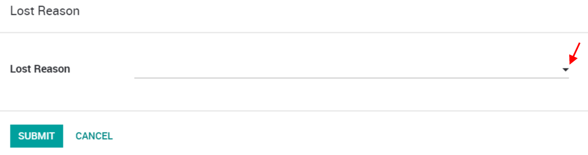
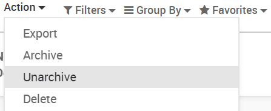

=========================
Manage lost opportunities
=========================

While working with your opportunities, you might lose some of them. You
will want to keep track of the reasons you lost them and also which ways
Odoo can help you recover them in the future.

Mark a lead as lost
===================

While in your pipeline, select any opportunity you want and you will see
a *Mark Lost* button.

You can then select an existing *Lost Reason* or create a new one
right there.

Manage & create lost reasons
----------------------------

You will find your *Lost Reasons* under :menuselection:`Configuration --> Lost Reasons`.

You can select & rename any of them as well as create a new one from
there.

Retrieve lost opportunities
===========================

To retrieve lost opportunities and do actions on them (send an email,
make a feedback call, etc.), select the *Lost* filter in the search
bar.

.. image:: lost_opportunities/lost_opportunities02.png
   :align: center

You will then see all your lost opportunities.

If you want to refine them further, you can add a filter on the *Lost
Reason*.

For Example, *Too Expensive*.

.. image:: lost_opportunities/lost_opportunities03.png
   :align: center

Restore lost opportunities
==========================

From the Kanban view with the filter(s) in place, you can select any
opportunity you wish and work on it as usual. You can also restore it by
clicking on *Archived*.

.. image:: lost_opportunities/lost_opportunities04.png
   :align: center

You can also restore items in batch from the Kanban view when they
belong to the same stage. Select *Restore Records* in the column
options. You can also archive the same way.

.. image:: lost_opportunities/lost_opportunities05.png
   :align: center

To select specific opportunities, you should switch to the list view.

.. image:: lost_opportunities/lost_opportunities06.png
   :align: center

Then you can select as many or all opportunities and select the actions
you want to take.

.. seealso::
   * :doc:`../performance/win_loss`
