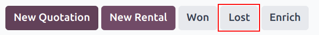
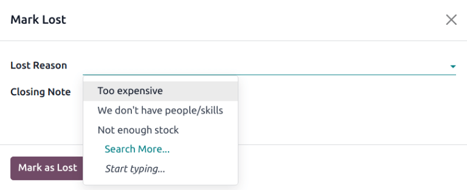
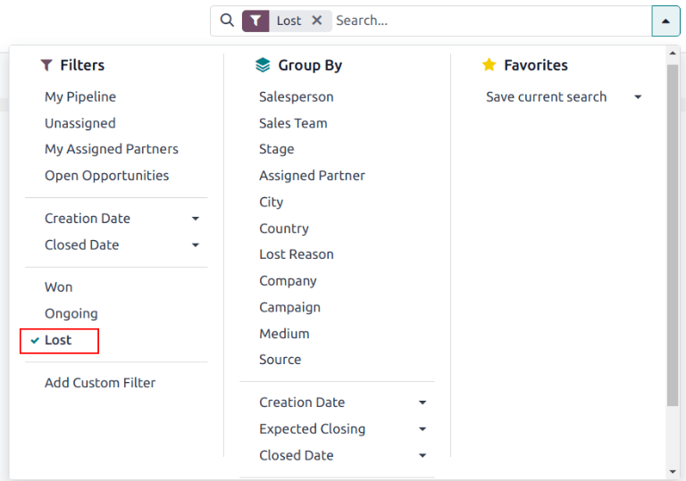
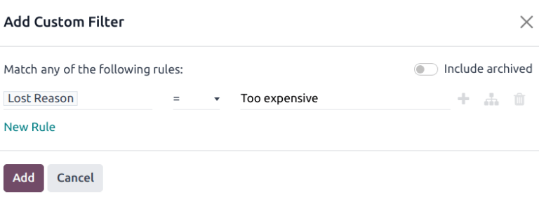
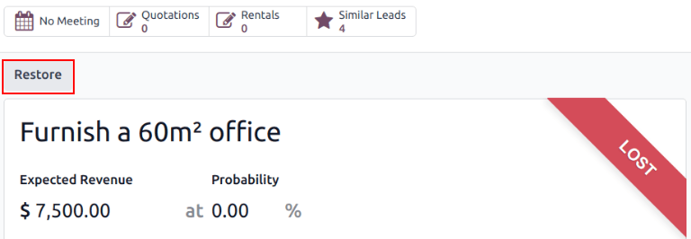
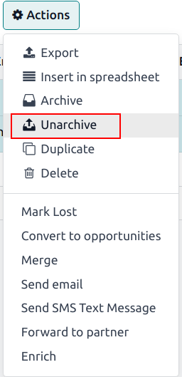

=========================
Manage lost opportunities
=========================

Not all opportunities result in successful sales. In order to keep the pipeline up to date, lost
opportunities need to be identified. Specifying the reason why an opportunity was lost provides
additional insight that can prove useful for future opportunities.

Mark a lead as lost
===================

To mark a lead as lost, open the :menuselection:`CRM` application, and select a lead from the
pipeline, by clicking on its corresponding kanban card. Doing so reveals that lead's detail form.

Then, click :guilabel:`Lost`, located at the top of the lead's detail form.

This opens the :guilabel:`Lost Reason` popup. From the drop-down, choose an existing lost reason. If
no applicable reason is available, create a new one by entering it into the :guilabel:`Lost Reason`
field, and clicking :guilabel:`Create`.

Additional notes and comments can be added below the lost reason designated in the :guilabel:`Lost
Reason` field.

When all the desired information has been entered in the :guilabel:`Lost Reason` pop-up window,
click :guilabel:`Submit`.

Upon clicking :guilabel:`Submit`, the pop-up window disappears, and Odoo returns to the lead detail
form, where a new red :guilabel:`Lost` banner is now present in the upper-right corner of the lead.

Create/edit lost reasons
========================

To create a new lost reason, or edit an existing one, navigate to :menuselection:`CRM app -->
Configuration --> Lost Reasons`.

To edit an existing reason, click on the reason that should be modified. When clicked, that reason
becomes highlighted. Once highlighted, change the description of the selected lost reason by editing
the :guilabel:`Description` field. When done, click :guilabel:`Save` in the upper-left corner.

To create a new lost reason, click :guilabel:`Create` in the upper-left corner of the
:guilabel:`Lost Reasons` page. Doing so reveals a new blank line in the :guilabel:`Description`
field. Then, proceed to type in the new lost reason in that new line. Once ready, click
:guilabel:`Save`.

Retrieve lost opportunities
===========================

To retrieve lost opportunities in Odoo *CRM*, open the :menuselection:`CRM app` to the main
:guilabel:`Pipeline` dashboard. Then, click the :guilabel:`Filters` drop-down menu, located beneath
the search bar.

From the :guilabel:`Filters` drop-down menu, select the :guilabel:`Lost` option. Upon selecting
:guilabel:`Lost`, only the leads that have been marked as `Lost` appear on the :guilabel:`Pipeline`
page.

To filter leads by a specific lost reason, select :menuselection:`Filters --> Add Custom Filter`.
Doing so reveals another drop-down menu with three fields.

In the top field drop-down menu, select :guilabel:`Lost Reason`. In the second field drop-down menu,
select :guilabel:`Contains`. Then, in the third field of the :guilabel:`Add Custom Field` sub menu,
type in the specific keyword(s). Lastly, click :guilabel:`Apply`. Upon clicking :guilabel:`Apply`,
Odoo reveals all the lost leads with a reason that contains that specified keyword(s).

Restore lost opportunities
==========================

To restore a lost opportunity, navigate to the main :guilabel:`Pipeline` dashboard on the *CRM* app,
open the :guilabel:`Filters` drop-down menu, and select the :guilabel:`Lost` option. Doing so
reveals all the lost opportunities on the :guilabel:`Pipeline` page.

Then, click on the kanban card of the desired lost opportunity to restore, which opens that lead's
detail form.

From the lost lead's detail form, click :guilabel:`Restore` in the upper-left corner. Doing so
removes the red :guilabel:`Lost` banner from the lead form, signifying the lead has been restored.

Restore multiple opportunities at once
--------------------------------------

To restore multiple opportunities at once, navigate to the main :guilabel:`Pipeline` dashboard in
the *CRM* app, open the :guilabel:`Filters` drop-down menu, and select the :guilabel:`Lost` option.

Next, select the list view option, which is represented by the three-line :guilabel:`☰ (list)` icon
in the upper-right corner. Doing so places all the leads from the :guilabel:`Pipeline` page in a
list form. With the list form chosen, select the checkbox to the left of each desired
opportunity/lead to be restored.

Once the desired opportunities/leads have been selected, click the :guilabel:`⚙️ Action (gear)`
drop-down menu at the top of the :guilabel:`Pipeline` page. From the :guilabel:`⚙️ Action (gear)`
drop-down menu, select :guilabel:`Unarchive`.

Doing so removes those selected lost opportunities from the :guilabel:`Pipeline` page because they
no longer fit into the `Lost` filter criteria. To reveal these newly-restored leads, delete the
`Lost` filter from the search bar.

.. seealso::
   :doc:`../performance/win_loss`
