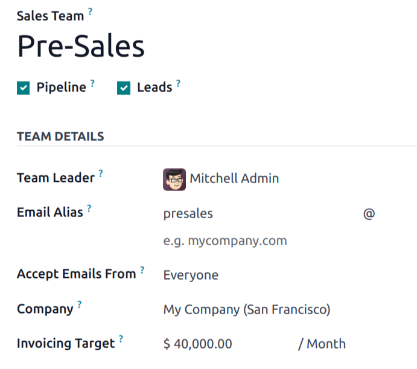
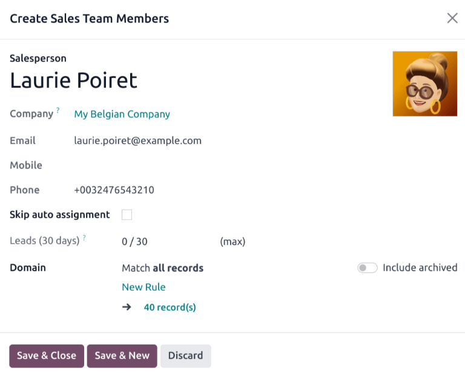
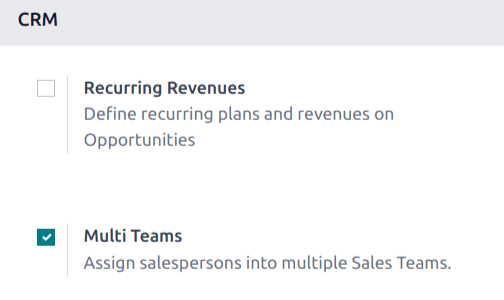
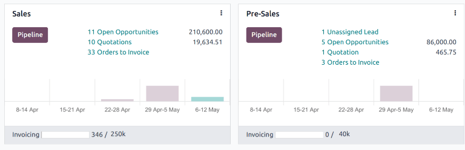

==================
Manage sales teams
==================

The *Sales Teams* feature within Odoo's *CRM* app allows for the creation and management of multiple
sales teams, each with their own assignment rules, invoicing targets, and roster of salespeople.

Create a sales team
===================

To create a new sales team, go to :menuselection:`CRM app --> Configuration --> Sales Teams`, then
click :guilabel:`New`.

On the blank sales team form, enter a name in the :guilabel:`Sales Team` field.

Next, select a :guilabel:`Team Leader` from the drop-down list.

Set an :guilabel:`Email Alias` to automatically generate a lead/opportunity for this sales team
whenever a message is sent to that unique email address. Choose whether to accept emails from
:guilabel:`Everyone`, :guilabel:`Authenticated Partners`, :guilabel:`Followers Only`, or
:guilabel:`Authenticated Employees`.

Select a :guilabel:`Company` from the drop-down menu to assign this team to.

.. note::
   The :guilabel:`Company` field is only visible in multi-company databases, and is not required.

.. note::
   If the *Sales* app is installed on the database, an :guilabel:`Invoicing Target` field appears on
   the sales team form. This is the revenue target for the current month. The amount entered in this
   field is used to populate the invoicing progress bar on the :ref:`sales team dashboard
   <crm/sales-team-dashboard>`.

Add sales team members
----------------------

To add team members, click :guilabel:`Add` under the :guilabel:`Members` tab when editing the sales
team's configuration page. This opens a :guilabel:`Create Sales Team Members` pop-up window.

.. note::
   If the :guilabel:`Rule-Based Assignment` feature has **not** been enabled on the *CRM* app's
   *Settings* page, clicking :guilabel:`Add` under the :guilabel:`Members` tab opens an
   :guilabel:`Add: Salespersons` pop-up window. Tick the checkbox to the far-left of the
   salesperson to be added to the team, then click :guilabel:`Select`.

   .. image:: manage_sales_teams/add-salespersons.png
      :align: center
      :alt: The Add: Salespersons pop-up window on a new sales team.

Select a user from the :guilabel:`Salesperson` drop-down list to add them to the team. To prevent
this salesperson from being automatically assigned leads, tick the :guilabel:`Skip auto assignment`
checkbox. If this feature is activated, the salesperson can still be assigned leads manually.

The :guilabel:`Leads (30 days)` field tracks how many leads the salesperson has been assigned in the
past thirty days for this team, and the maximum number of leads they should be assigned. To edit the
maximum number of leads this salesperson can be assigned, enter that amount in the :guilabel:`Leads
(30 days)` field.

.. tip::
   :doc:`Assignment rules <../track_leads/lead_scoring>` can be configured for individual
   salespeople using the :guilabel:`Domain` section.

Click :guilabel:`Save & Close` when finished, or :guilabel:`Save & New` to add additional members.

Enable multi teams
==================

To allow salespeople to be assigned to more than one sales team, the *Multi Teams* setting needs to
be enabled. First, navigate to :menuselection:`CRM app --> Configuration --> Settings`. Under the
:guilabel:`CRM` section, tick the checkbox labeled :guilabel:`Multi Teams`. Then, click
:guilabel:`Save` at the top-left of the page.

.. _crm/sales-team-dashboard:

Sales team dashboard
====================

To view the sales team dashboard, go to :menuselection:`CRM app --> Sales --> Teams`. Any team the
user is a member of appears in the dashboard.

Each Kanban card gives an overview of the sales team's open opportunities, quotations, sales orders,
and expected revenue, as well as a bar graph of new opportunities per week, and an invoicing
progress bar.

Click the :guilabel:`Pipeline` button to go directly to that team's *CRM* pipeline.

Click on the :icon:`fa-ellipsis-v` :guilabel:`(vertical ellipsis)` icon in the top-right corner of
the Kanban card to open a drop-down menu. Then, to view or edit the team's settings, click
:guilabel:`Configuration`.

.. seealso::
   - :doc:`../optimize/utilize_activities`
   - :doc:`../track_leads/lead_scoring`
