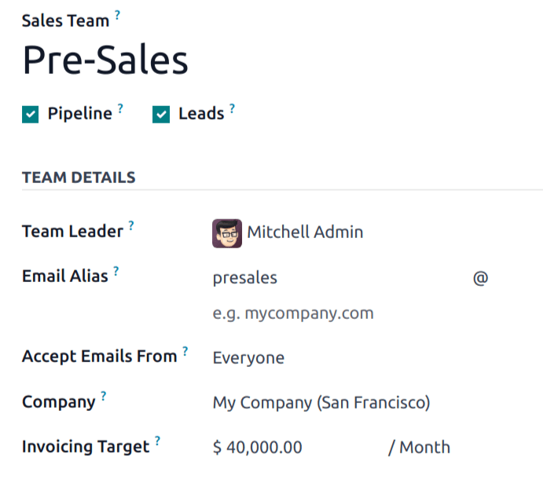
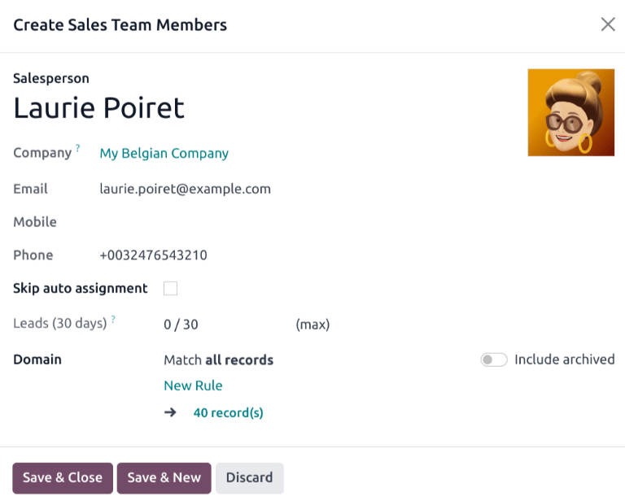
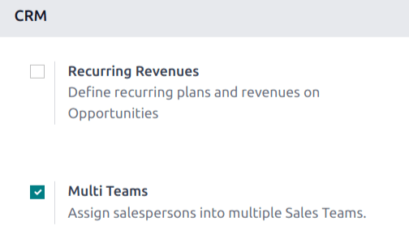
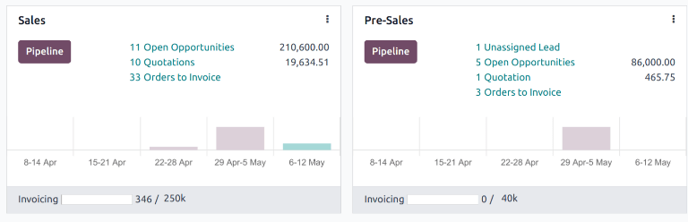

==================
Manage sales teams
==================

The *Sales Teams* feature within Odoo's **CRM** app allows for the creation and management of
multiple sales teams, each with their own assignment rules, invoicing targets, and roster of
salespeople. This in turn makes it easy to have different sales teams for different regions,
different languages, different compensation structures, performance tracking purposes, and more.

Create a sales team
===================

To create a new sales team, go to :menuselection:`CRM app --> Configuration --> Sales Teams`, then
click :guilabel:`New`. On the blank sales team form, enter a name in the :guilabel:`Sales Team`
field.

Next, select a :guilabel:`Team Leader` from the drop-down list.

Set an :guilabel:`Email Alias` to automatically generate a lead/opportunity for this sales team
whenever a message is sent to that unique email address. Choose whether to accept emails from
:guilabel:`Everyone`, :guilabel:`Authenticated Partners`, :guilabel:`Followers only`, or
:guilabel:`Authenticated Employees`.

For databases with multiple companies, select a :guilabel:`Company` from the drop-down menu to
assign this team to. Please note, this field is not required.

If *Leads* have been enabled in the **CRM** app's Configuration settings, two checkboxes appear that
determine whether leads assigned to the sales team should go directly into the pipeline or be set as
leads first.

.. note::
   If the **Sales** app is installed on the database, an :guilabel:`Invoicing Target` field appears
   on the sales team form. This is the revenue target for the current month. The amount entered in
   this field is used to populate the invoicing progress bar on the :ref:`sales team dashboard
   <crm/sales-team-dashboard>`.

Add sales team members
----------------------

The workflow for adding members to a sales team varies slightly based on whether or not *Rules-Based
Assignment* has been enabled in :menuselection:`CRM app --> Configuration --> Settings`. Both
workflows begin on a sales team's configuration page. By default, rules-based assignment is not
enabled.

With rules-based assignment
~~~~~~~~~~~~~~~~~~~~~~~~~~~

To add team members with rules-based assignment enabled, click the :guilabel:`Add Sales Team
Members` link under the :guilabel:`Members` tab. This opens the :guilabel:`Create Sales Team
Members` pop-up window. Assign a salesperson in the :guilabel:`Salesperson` field and adjust their
lead assignment rules if desired under the :guilabel:`Lead Assignment` tab. Click the
:guilabel:`Save & Close` button to finish, or click :guilabel:`Save & New` to open a blank form and
keep adding sales team members.

.. note::
   When using rules-based assignment, Odoo automatically limits the maximum number of leads an
   individual team member can be assigned in a day. This limit is determined by the number in the
   :guilabel:`Capacity` field and is equal to that number divided by 30 (for the number of days in
   the period). **This may result in leads going unassigned if all sales team members' daily
   capacity has been met.**

.. example::
   Sales team member John Doe has a :guilabel:`Capacity` maximum of 120 leads in a 30-day period.
   This means that the database automatically assigns John a maximum of 4 leads per day. If John
   were the only member of the sales team and 10 leads were created in a single day, only 4 would be
   assigned to him. The other 6 would go unassigned.

If it's necessary to prevent this salesperson from being automatically assigned leads, tick the
:guilabel:`Pause assignment` checkbox. If auto assignment is paused, the salesperson can still be
assigned leads manually.

The :guilabel:`Leads (30 days)` graphic on the sales team members' cards tracks how many leads a
salesperson has been assigned in the past thirty days for this team relative to the maximum number
that they should be assigned. A sales team member's maximum number of leads may be set on their
:guilabel:`Open: Sales Team Members` form.

.. tip::
   :doc:`Assignment rules <../track_leads/lead_scoring>` can be configured for individual
   salespeople using the :guilabel:`Domain` section.

Without rules-based assignment
~~~~~~~~~~~~~~~~~~~~~~~~~~~~~~

To add team members without rules-based assignment enabled, click the :guilabel:`Add Salespersons`
link under the :guilabel:`Members` tab. This opens the :guilabel:`Add: Salespersons` pop-up window.
Tick the checkbox to the left of the salesperson to be added to the team, then click
:guilabel:`Select`. New salespersons can be created from this window by clicking the :guilabel:`New`
button, as well.

   .. image:: manage_sales_teams/add-salespersons.png
      :alt: The Add: Salespersons pop-up window on a new sales team with Mitchell Admin selected.

If creating a new salesperson, click :guilabel:`Save & Close` when finished, or :guilabel:`Save &
New` to add additional members.

Enable multi teams
==================

To allow salespeople to be assigned to more than one sales team, the *Multi Teams* setting needs to
be enabled. First, navigate to :menuselection:`CRM app --> Configuration --> Settings`. Under the
:guilabel:`CRM` section, tick the checkbox labeled :guilabel:`Multi Teams`. Then, click
:guilabel:`Save` at the top-left of the page.

.. _crm/sales-team-dashboard:

Sales team dashboard
====================

To view the sales team dashboard, go to :menuselection:`CRM app --> Sales --> Teams`. Any team the
user is a member of appears in the dashboard.

Click on the :icon:`fa-ellipsis-v` :guilabel:`(vertical ellipsis)` icon in the top-right corner of
team's card to open a drop-down menu. Then, to view or edit the team's settings, click
:guilabel:`Configuration`.

.. seealso::
   - :doc:`../optimize/utilize_activities`
   - :doc:`../track_leads/lead_scoring`
