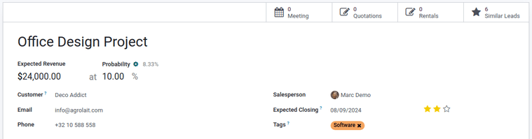
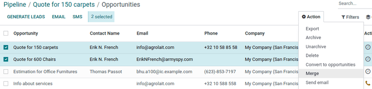

=====================================
Merge similar leads and opportunities
=====================================

Odoo automatically detects similar *leads* and *opportunities* within the **CRM** app. These
identified duplicate records can be merged, without losing any information in the process.
Doing so keep the pipeline organized, and prevents customers from being contacted by more
than one salesperson.

.. note::
   When merging opportunities, no information is lost. Data from the other opportunity is logged in
   the chatter, and the information fields, for reference.

Identify similar leads and opportunities
========================================

Similar leads and opportunities are identified by comparing the email address and phone number of
the associated contact. If a similar lead/opportunity is found, a *Similar Leads* smart button
appears at the top of the lead (or opportunity) record.

Compare similar leads and opportunities
---------------------------------------

To compare the details of similar leads/opportunities, navigate to :menuselection:`CRM app -->
Sales --> My Pipeline`, or :menuselection:`CRM app --> Leads`. Open a lead or opportunity, and click
the :guilabel:`Similar Leads` smart button. Doing so opens an :guilabel:`Opportunities` page, in
Kanban view, that only displays similar leads/opportunities. Click on a card to view the details for
the lead/opportunity, and confirm if they should be merged.

.. note::
   *Leads* will not appear in the header menu unless the leads feature has been activated. This can
   be done by navigating to :guilabel:`CRM app --> Configuration --> Settings` and ticking the
   checkbox next to :guilabel:`Leads`, then clicking :guilabel:`Save`.

Merge similar leads and opportunities
=====================================

.. important::
   When merging, Odoo gives priority to whichever lead/opportunity was created in the system first,
   merging the information into the first created lead/opportunity. However, if a lead and an
   opportunity are being merged, the resulting record is referred to as an opportunity, regardless
   of which record was created first.

After confirming the leads/opportunities should be merged, return to the :guilabel:`Opportunities`
page, in Kanban view, using the breadcrumb link, or by clicking the :guilabel:`Similar Leads` smart
button on the opportunity form. Click the :icon:`oi-view-list` :guilabel:`(list)` icon to change to
list view.

Tick the checkbox on the left of the page for the leads/opportunities to be merged. Then, click the
:icon:`fa-cog` :guilabel:`Action` icon at the top of the page, to reveal a drop-down menu. From
that drop-down menu, select the :guilabel:`Merge` option to merge the selected opportunities or
leads.

When :guilabel:`Merge` is selected from the :icon:`fa-cog` :guilabel:`Action` drop-down menu, a
:guilabel:`Merge` pop-up modal appears. In that pop-up modal, under the :guilabel:`Assign
opportunities to` section, optionally select a :guilabel:`Salesperson` and :guilabel:`Sales Team`
from the appropriate drop-down menus.

Below those fields, the leads/opportunities to merge are listed, along with their related
information. To add more, click :guilabel:`Add a line`, tick the checkbox next to the desired
leads/opportunities from the resulting :guilabel:`Add: Leads/Opportunities' pop-up modal, then click
the :guilabel:`Select` button. The additional selections now appear in the list. To merge those
selected leads/opportunities, click :guilabel:`Merge`.

The pop-up window disappears, and the detail card for the merged opportunity/lead appears.

.. danger::
   Merging is an irreversible action. Do **not** merge leads/opportunities unless absolutely certain
   they should be combined.

When leads/opportunities should not be merged
=============================================

There may be instances where a similar lead or opportunity is identified, but should *not* be
merged. These circumstances vary, based on the processes of the sales team and organization. Some
potential scenarios are listed below.

Lost leads
----------

If a lead/opportunity has been marked as :doc:`lost <lost_opportunities>`, it can still be merged
with an active lead or opportunity. The resulting lead/opportunity is marked active, and added to
the pipeline.

Different contact within an organization
----------------------------------------

Leads/opportunities from the same organization, but with different points of contact, may not have
the same needs. In this case, it is beneficial to *not* merge these records, though assigning the
same salesperson, or sales team, can prevent duplicated work and miscommunication.

Duplicates with more than one salesperson
-----------------------------------------

If more than one lead/opportunity exists in the database, there may be multiple salespeople assigned
to them, who are actively working on them independently. While these leads/opportunities may need
to be managed separately, it is recommended that any affected salespeople be tagged in an internal
note for visibility.

Contact information is similar, but not identical
-------------------------------------------------

Similar leads and opportunities are identified by comparing the email addresses and phone numbers of
the associated contacts. However, if the email address is similar, but not identical, they may need
to remain independent.

.. example::
   Three different leads were added to the pipeline, and assigned to different salespeople. They
   were identified as *Similar Leads*, due to the email addresses of the contacts.

   Two of the leads appear to come from the same individual, `Robin`, and have identical email
   addresses. These leads should be merged.

   The third lead has the same email domain, but the address is different, as is the contact name.
   While this lead is most likely from the same organization, it is from a different contact, and
   should **not** be merged.

   .. image:: merge_similar/contact-info-example.png
      :align: center
      :alt: List of similar leads with emphasis on the contact information in the CRM app.
