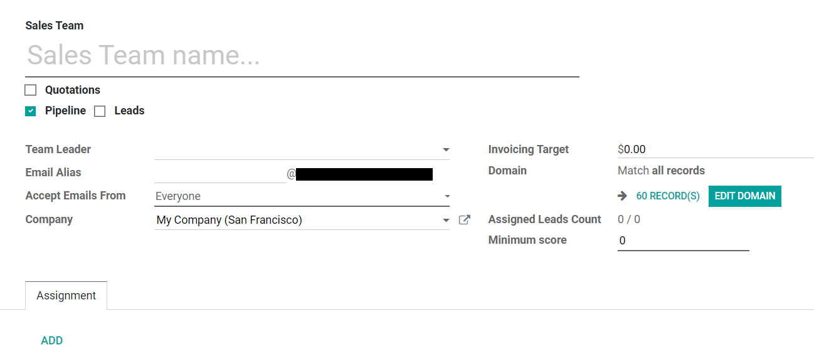
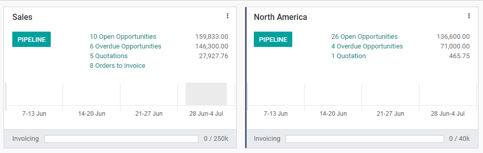

====================
Multiple sales teams
====================

Odoo lets you manage several sales teams, departments, or channels, each with their own unique
sales processes, using *Sales Teams*.

Create a new Sales Team
=======================

To create a new Sales Team, go to :menuselection:`CRM --> Configuration --> Sales Teams` then
click **Create**.

On the creation page, set an *Email Alias* to automatically generate a lead/opportunity for this
Sales Team every time a message is sent to that unique email address. You can also choose whether
to accept emails from *Everyone*, *Authenticated Partners*, or *Followers Only*.

Set a *Domain* to assign leads/opportunities to this Sales Team based on specific filters, such as
country, language, or campaign. Set an *Invoicing Target* if this team has specific monthly revenue
goals.

Add members to a Sales Team
---------------------------

To add team members, click **Add** under the Assignment tab when editing the Sales Team's
configuration page. Select a salesperson from the dropdown menu or create new salesperson. Set a
maximum number of leads that can be assigned to this salesperson in a 30-day period to ensure that
they do not overwork.

.. image:: multiple_sales_teams/add-a-salesperson.png
   :align: center
   :alt: Adding a Salesperson

One person can be added as a team member or Team Leader to multiple Sales Teams, allowing them to access all of the pipelines that they need to.

Sales Team dashboard
====================

To view the Sales Team dashboard, go to :menuselection:`CRM --> Configuration --> Sales Teams`. Any
teams you are a part of will appear as dashboard tiles.

Each tile gives an overview of the Sales Team's open opportunities, quotations, sales orders, and
expected revenue, as well as a bar graph of new opportunities per week and an invoicing progress
bar.

Click on the three dots in the corner of a tile to open a navigational menu that lets you quickly
view documents or reports, create new quotations or opportunities, pick a color for this team, or
access its configuration page.

.. image:: multiple_sales_teams/team-overview-three-dot-menu.png
   :align: center
   :alt: Three Dot Menu

Click on the **Pipeline** button to go directly to that team's CRM pipeline.

