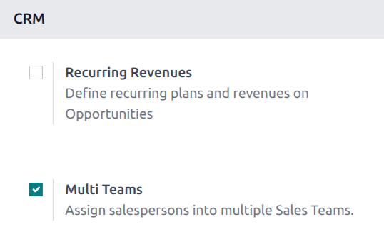
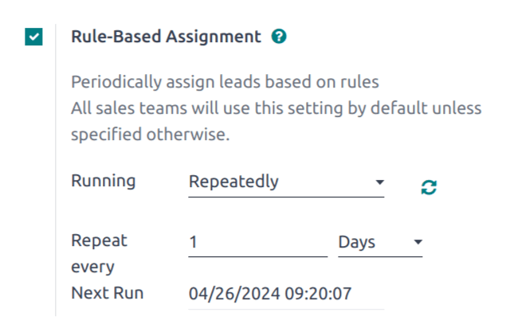
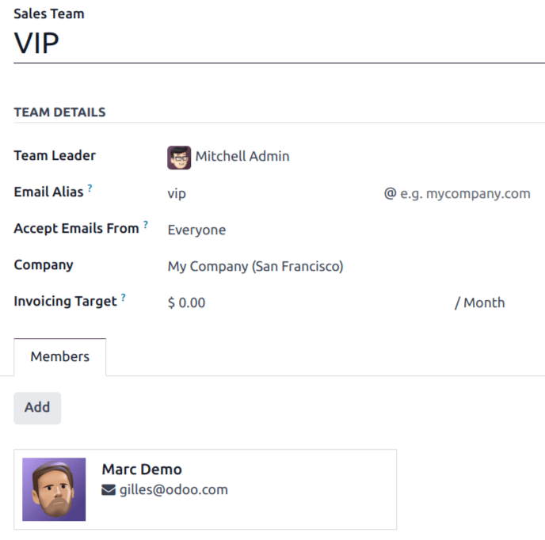
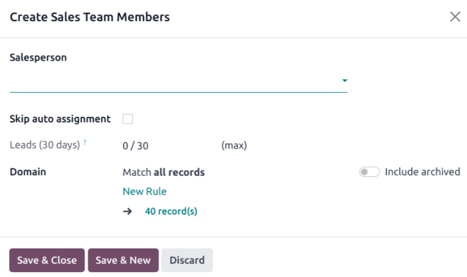
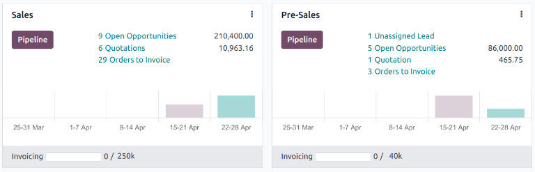
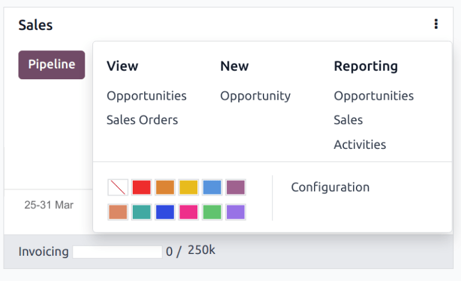

====================
Multiple sales teams
====================

The *Multi Teams* feature in Odoo's *CRM* app allows salespeople to be assigned to multiple sales
teams. Multiple teams can be created and managed in one dashboard, each with their own pipeline for
leads and opportunities.

Enable multi teams
==================

To allow salespeople to be assigned to more than one sales team, the :guilabel:`Multi Teams` setting
needs to be enabled. First, navigate to :menuselection:`CRM app --> Configuration --> Settings`.
Under the :guilabel:`CRM` section, tick the checkbox labeled :guilabel:`Multi Teams`. Then, click
:guilabel:`Save` at the top-left of the page.

.. _crm/assignment-rules:

Enable assignment rules
=======================

To periodically :doc:`assign leads <../track_leads/lead_scoring>` based on rules, the
:guilabel:`Rule-Based Assignment` feature needs to be enabled. Navigate to :menuselection:`CRM app
--> Configuration --> Settings`. Under the :guilabel:`CRM` section, tick the checkbox labeled
:guilabel:`Rule-Based Assignment`.

This causes a new field, :guilabel:`Running`, to appear. Select an option from the drop-down menu in
this field to manage how assignments are triggered.

The :guilabel:`Rule-Based Assignment` feature can be set to run :guilabel:`Manually`, meaning an
Odoo user must manually trigger the assignment, or :guilabel:`Repeatedly`, meaning Odoo
automatically triggers the assignments.

Selecting :guilabel:`Repeatedly` causes additional fields to appear. Use the :guilabel:`Repeat
every` fields to select how frequently the rules should be triggered. The :guilabel:`Next Run` field
automatically updates, though it can be manually updated, if needed.

Once all desired configurations are complete, click :guilabel:`Save`.

.. seealso::
   For more information on assigning leads, see the :doc:`assign leads
   <../track_leads/lead_scoring>` documentation.

Create sales teams
==================

To create a new sales team, go to :menuselection:`CRM app --> Configuration --> Sales Teams`, then
click :guilabel:`New`.

On the blank sales team form, enter a name in the :guilabel:`Sales Team` field.

Next, select a :guilabel:`Team Leader` from the drop-down list.

Set an :guilabel:`Email Alias` to automatically generate a lead/opportunity for this sales team
whenever a message is sent to that unique email address. Choose whether to accept emails from
:guilabel:`Everyone`, :guilabel:`Authenticated Partners`, :guilabel:`Followers Only`, or
:guilabel:`Authenticated Employees`.

Add members to a sales team
---------------------------

To add team members, click :guilabel:`Add` under the :guilabel:`Members` tab when editing the sales
team's configuration page. This opens a :guilabel:`Create Sales Team Members` pop-up window.

Select a user from the :guilabel:`Salesperson` drop-down list to add them to the team. To prevent
this salesperson from being :ref:`automatically assigned leads <crm/assignment-rules>`, tick the
:guilabel:`Skip auto assignment` checkbox. If this feature is activated, the salesperson can still
be assigned leads manually.

The :guilabel:`Leads (30 days)` field tracks how many leads the salesperson has been assigned in the
past thirty days, and the maximum number of leads they should be assigned. To edit the maximum
number of leads this salesperson can be assigned, enter the new number in the :guilabel:`Leads (30
days)` field.

.. tip::
   :doc:`Assignment rules <../track_leads/lead_scoring>` can be configured for individual
   salespeople using the :guilabel:`Domain` section.

Click :guilabel:`Save & Close` when finished, or :guilabel:`Save & New` to add additional members.

.. note::
   If the :guilabel:`Rule-Based Assignment` feature has **not** been enabled, clicking
   :guilabel:`Add` under the :guilabel:`Members` tab opens a :guilabel:`Add:Salespersons` pop-up
   window. Tick the checkbox to the far-left of the salesperson to be added to the team, then click
   :guilabel:`Select`.

   .. image:: multi_sales_team/add-salespersons.png
      :align: center
      :alt: The Add:Salespersons pop-up window in the CRM app.

Sales team dashboard
====================

To view the sales team dashboard, go to :menuselection:`CRM app --> Sales --> Teams`. Any team a
user is a member of appears in the dashboard.

Each tile gives an overview of the sales team's open opportunities, quotations, sales orders, and
expected revenue, as well as a bar graph of new opportunities per week and an invoicing progress
bar.

Click on the three dots in the corner of a tile to open a navigational menu that lets users quickly
view documents or reports, create new quotations or opportunities, pick a color for this team, or
access the team's configuration page.

Click on the :guilabel:`Pipeline` button to go directly to that team's CRM pipeline.
