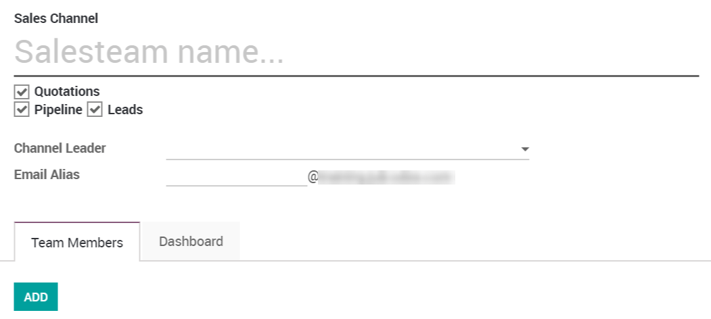
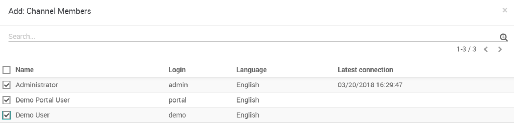
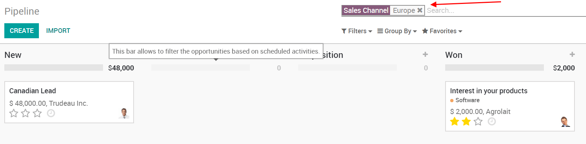

===========================
Manage multiple sales teams
===========================

In Odoo, you can manage several sales teams, departments or channels
with specific sales processes. To do so, we use the concept of *Sales
Channel*.

Create a new sales channel
==========================

To create a new *Sales Channel*, go to :menuselection:`Configuration --> Sales Channels`.

There you can set an email alias to it. Every message sent to that email
address will create a lead/opportunity.

Add members to your sales channel
---------------------------------

You can add members to any channel; that way those members will see the
pipeline structure of the sales channel when opening it. Any
lead/opportunity assigned to them will link to the sales channel.
Therefore, you can only be a member of one channel.

This will ease the process review of the team manager.

If you now filter on this specific channel in your pipeline, you will
find all of its opportunities.

Sales channel dashboard
=======================

To see the operations and results of any sales channel at a glance, the
sales manager also has access to the *Sales Channel Dashboard* under
*Reporting*.

It is shared with the whole ecosystem so every revenue stream is
included in it: Sales, eCommerce, PoS, etc.
