========================
Lead distribution report
========================

A *lead distribution report* can be used to see if active leads are being assigned equitably
across sales members. It can also be used to view the distribution of good or :doc:`quality leads
<quality_leads_report>`, and see how frequently each salesperson is receiving (and keeping) leads.

Lead distribution reports can be run each week to help keep salespeople on track, while
providing them with ample good leads. These reports can also be used to see whether sales members
are staying productive, if good leads are being lost too often by one salesperson, and what
percentage of good leads are being retained overall.

Create lead distribution reports
================================

To create a lead distribution report, first navigate to :menuselection:`CRM app --> Reporting -->
Pipeline`, which reveals the :guilabel:`Pipeline Analysis` dashboard.

Remove all the default filters in the :guilabel:`Search...` bar at the top of the page. Doing so
displays data related to *all* leads.

Custom filters can now be added by clicking the :icon:`fa-caret-down` :guilabel:`(down caret)`
icon, to the right of the :guilabel:`Search...` bar, to reveal a drop-down menu of search and filter
options.

Three columns are displayed: :guilabel:`Filters`, :guilabel:`Group By`, and
:guilabel:`Favorites`.

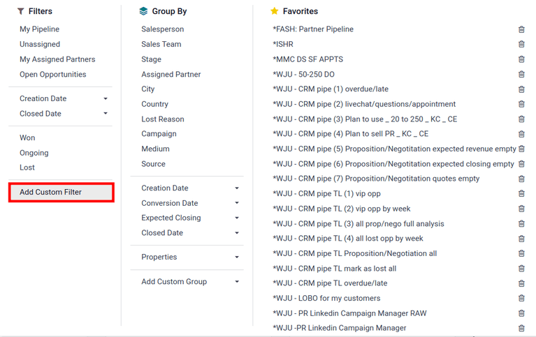

To begin, navigate to the bottom of the :guilabel:`Filters` column, and click :guilabel:`Add Custom
Filter`. This opens an :guilabel:`Add Custom Filter` pop-up window, where a custom filter can be
created.

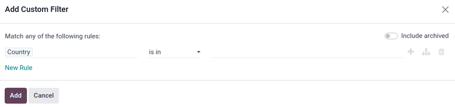

Custom filters
--------------

The following conditions are provided as an example of a *good*, but *not comprehensive*,
set of rules for finding good leads. These filters should be applied in the order specified to
achieve a heavily-detailed filter.

:ref:`creation-date`

:ref:`team-location`

:ref:`phone-number`

:ref:`active-status`

:ref:`referred-by`

:ref:`source`

:ref:`notes`

:ref:`tags`

:ref:`email`

:ref:`salesperson`

These conditions can be added, removed, or modified to best fit the desired information in
the report.

.. _creation-date:

1. Lead creation date
~~~~~~~~~~~~~~~~~~~~~

Click the first field, under :guilabel:`Match any of the following rules:`, that has the value
:guilabel:`Country` in it. A pop-up window appears. In that pop-up window, type `Created on` in the
:guilabel:`Search...` bar, or scroll to search through the list to locate and select it.

Then, in the second field of the :guilabel:`Add Custom Filter` pop-up window, select :guilabel:`>=`
from the drop-down menu. This operator **only** includes values greater than (or equal to) the value
in the third, rightmost field.

The third field on the :guilabel:`Add Custom Filter` pop-up window should contain the earliest date
leads are selected from.

For example, setting `01/01/2024 00:00:00` only includes leads created from, and including, the
first day of 2024.

.. image:: lead_distribution_report/created-on.png
  :align: center
  :alt: Add a Created On rule for the start of the year onward.

.. _team-location:

2. Sales team location
~~~~~~~~~~~~~~~~~~~~~~

Click :guilabel:`New rule` to add a new set of rule fields to the :guilabel:`Add Custom Filter`
pop-up window. Click the first field for the new rule, and set it to :guilabel:`Sales Team`. Then,
click the second field of the new rule, and select :guilabel:`contains` from the drop-down menu.
Selecting this operator filters for any records that contain the words in the third, rightmost
field.

In this third field, enter the name of the desired sales team(s). For example, setting `us direct sf
northam` **only** includes sales teams with titles containing *US*, *direct*, *San Francisco*, and
*North America*.

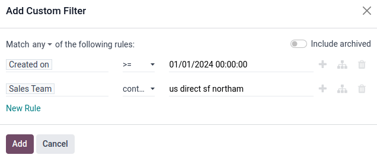

By adding this new rule, a new line appears at the top of the pop-up menu showing :guilabel:`Match
any of:` with a :icon:`fa-caret-down` :guilabel:`(down caret)` icon.

Click the icon, then select :guilabel:`all` from the resulting list. This setting causes the filter
to **only** show records that match all the rules contained inside. This uses the same logic as an
AND (&) logical operator.

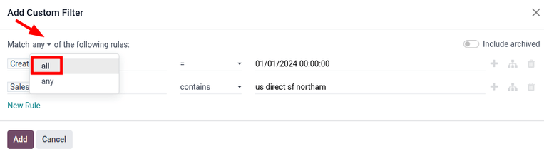

.. _phone-number:

3. Phone number
~~~~~~~~~~~~~~~

Click :guilabel:`New rule` to add a new rule to the filter. Set the first field to
:guilabel:`Phone`. Then, select :guilabel:`is set` from the drop-down menu in the second field.
Selecting this operator **only** filters for records that have a phone number associated with the
lead.

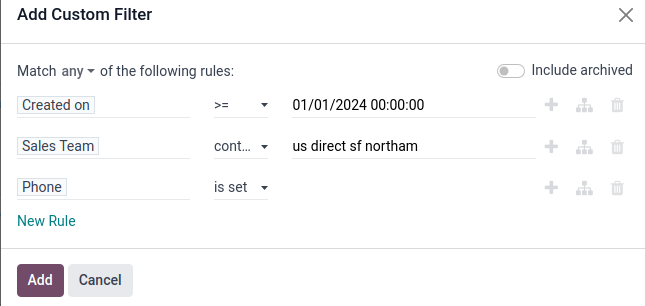

This rule adds only leads with an associated phone number to the report.

.. _active-status:

4. Active status
~~~~~~~~~~~~~~~~

Click the :icon:`fa-sitemap` :guilabel:`(Branch)` icon to the right of the `Phone is set` line, to
add a new rule that branches from the rules above.

Two horizontal sets of fields appear below a line showing :guilabel:`any of:` with a
:icon:`fa-caret-down` :guilabel:`(down caret)` icon. This setting filters for
records that match **any** of the rules contained inside. This uses the same logic as an OR (|)
logical operator.

Set the first field to :guilabel:`Active`. Then, select :guilabel:`is set` in the next field.

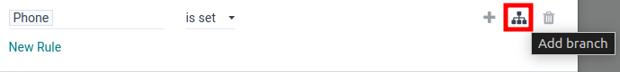

Next, click the :icon:`fa-plus` :guilabel:`(New Rule)` button next to :guilabel:`Active is set` to
create a new line of fields beneath it.

Set the first field to :guilabel:`Active`. Then, select :guilabel:`is not set` in the next field.

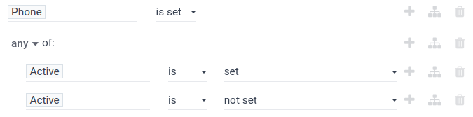

This rule adds the activity status of the lead to the report.

.. _referred-by:

5. Referred by
~~~~~~~~~~~~~~

Click the :icon:`fa-plus` :guilabel:`(New Rule)` button next to :guilabel:`Active is not set` to
create a new line of fields beneath it.

Next, set the first field to :guilabel:`Referred By`. In the second field, select
:guilabel:`contains` from the drop-down menu. In the last field, type `appointment`.

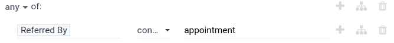

This rule adds any leads that were referred by an appointment to the report.

.. _source:

6. Source
~~~~~~~~~

Click the :icon:`fa-plus` :guilabel:`(New Rule)` button next to the line for `Referred by
appointment`.

Next, set the first field to :guilabel:`Source`. Select :guilabel:`contains` from the
drop-down menu in the second field. Type `livechat` in the third field.

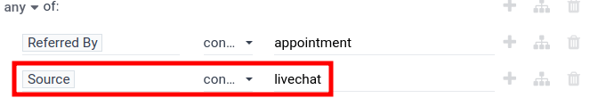

This rule adds any leads that came from livechat to the report.

.. _notes:

7. Notes
~~~~~~~~

Click the :icon:`fa-plus` :guilabel:`(New Rule)` button next to line for `Source contains livechat`.

Next, set the first field to :guilabel:`Notes`. Click the second field, and select
:guilabel:`contains` from the drop-down menu. Type `mrp` in the third field.

Click the :icon:`fa-plus` :guilabel:`(New Rule)` icon next to the line for `Notes contains mrp`, and
add a new rule for notes containing `stock`. Repeat the process to create new rules containing the
following terms:

#. purchase
#. plm
#. crm
#. sales
#. project
#. fsm

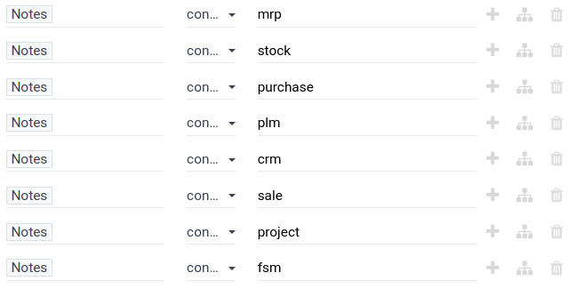

This rule includes any leads with the above terms in the attached notes to the report.

.. _tags:

8. Tags
~~~~~~~

Click the :icon:`fa-plus` :guilabel:`(New Rule)` icon next to line for `Notes contains fsm`.

Next, set the first field to `Tags`. Select :guilabel:`contains` from the drop-down menu in the
second field. Then, type `20` in the third field.

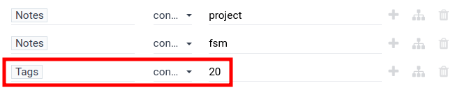

This rule adds any leads that are tagged as a size of 5-20 or 20-50 to the report.

.. _email:

9. Email
~~~~~~~~

Click :guilabel:`New rule` at the bottom of the pop-up menu to add a new rule. This new rule is
created outside the :guilabel:`any of:` group. Set the first field to :guilabel:`Email`. Select
:guilabel:`does not contain` from the drop-down menu in the next field. Next, type `hotmail` into
the rightmost field.

Repeat the previous steps to add rules for the following contents:

#. aol.com
#. icloud.com
#. yahoo

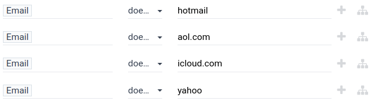

This rule filters out any undesired email addresses from the report.

.. _salesperson:

10. Salesperson
~~~~~~~~~~~~~~~

Click :guilabel:`New rule` to add a new rule. Click the first field, then locate and select
:guilabel:`Salesperson`. Click the :icon:`fa-chevron-right` :guilabel:`(right chevron)` button to
the right. A new list of salespeople attributes appears. Select :guilabel:`Active` from the list.
In the second field, select :guilabel:`is` from the drop-down menu. In the third drop-down menu,
select :guilabel:`set`.

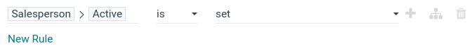

This rule ensures only leads with an active salesperson are added to the report.

Save the filter settings
========================

Now that all the rules for the filter are set, click the purple :guilabel:`Confirm` button at the
bottom of the pop-up menu to save the custom filter and close the pop-up menu.

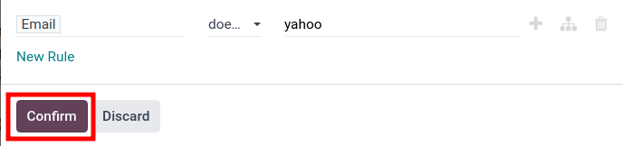

The :guilabel:`Pipeline Analysis` dashboard is now displayed again with each filter rule in the
:guilabel:`Search...` bar. Click the :icon:`fa-caret-down` :guilabel:`(down caret)` icon, to the
right of the :guilabel:`Search...` bar, to reveal a drop-down menu of search and filter options.

Scroll to the bottom and click the :guilabel:`Save current search` button. Next, type a name for the
filter in the text box below. Check the :guilabel:`Shared` checkbox to have the filter shared with
any user with access to the pipeline. Finally, click the purple :guilabel:`Save` button below to
save the filter.

The filter will now appear with the name it was given under the :guilabel:`Favorites` section of the
drop-down menu and can be re-applied by clicking on it.

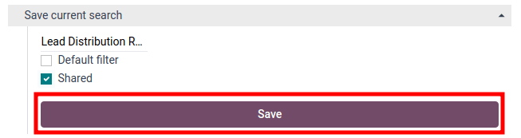

View lead distribution reports
==============================

From the :guilabel:`Pipeline Analysis` dashboard, apply the filter created above in the
:guilabel:`Search...` bar if it does not appear in the search already. Next, click the
:icon:`oi-list-view` :guilabel:`(List view)` button to view all the leads that fit the filter in A
list format. :icon:`fa-caret-down` :guilabel:`(down caret)` icon to expand the list and view leads.

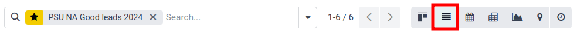

.. seealso::
   :doc:`../../../essentials/search`
