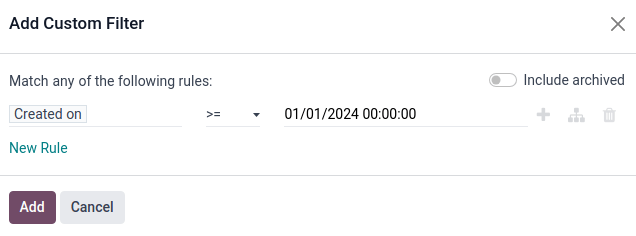

========================
Lead distribution report
========================

A *lead distribution report* can be used to see if active leads are being assigned equitably
across sales members. It can also be used to view the distribution of good or :doc:`quality leads
<quality_leads_report>`, and see how frequently each salesperson is receiving (and keeping) leads.

Lead distribution reports can be run each week to help keep salespeople on track, while
providing them with ample good leads. These reports can also be used to see whether sales members
are staying productive, if good leads are being lost too often by one salesperson, and what
percentage of good leads are being retained overall.

Create lead distribution reports
================================

To create a lead distribution report, first navigate to :menuselection:`CRM app --> Reporting -->
Pipeline`, which reveals the :guilabel:`Pipeline Analysis` dashboard.

Remove all the default filters in the search bar at the top of the page. Doing so
displays data related to *all* leads.

:ref:`Custom filters <search/custom-filters>` can now be added by clicking the :icon:`fa-caret-down`
:guilabel:`(down caret)` icon, to the right of the search bar, to reveal a drop-down menu of search
and filter options.

Three columns are displayed: :ref:`Filters <search/filters>`, :ref:`Group By <search/group>`, and
:ref:`Favorites <search/favorites>`. To begin, navigate to the bottom of the :guilabel:`Filters`
column, and click :guilabel:`Add Custom Filter`. This opens an :guilabel:`Add Custom Filter` pop-up
window, where the essential filters can be added one at a time.

.. _crm/track_leads/essential-filters:

Essential filters
-----------------

The following filter conditions are used to create a basic lead distribution report. Together they
gather all leads created within a certain timespan that have an associated contact method and have
been assigned to a sales team.

Lead creation date
~~~~~~~~~~~~~~~~~~

Click the first field, under :guilabel:`Match any of the following rules:`, that has the value
:guilabel:`Country` in it. In the popover that appears, type `Created on` in the search bar, or
scroll to search through the list to locate and select it.

Then, in the second field of that row, select :guilabel:`>=` from the drop-down menu. This operator
**only** includes values greater than (or equal to) the value in the third, rightmost field.

The third field on the :guilabel:`Add Custom Filter` pop-up window should contain the earliest date
leads are selected from.

For example, setting `01/01/2024 00:00:00` only includes leads created from, and including, the
first day of 2024.

.. _crm/track_leads/sales-team:

Sales team
~~~~~~~~~~

Click :guilabel:`New rule` to add another row to the form, and choose :guilabel:`Sales Team` for
this rule's parameter. Then, click the second field of the new rule, and select :guilabel:`contains`
from the drop-down menu. Selecting this operator filters for any records that contain the words in
the third, rightmost field.

.. tip::
   For certain pre-determined, limited choices like a sales team, the :guilabel:`is in` operator
   helps make for an easier and more accurate selection, via a drop-down menu in the third field,
   instead of risking a typo or incorrect value in the text box field that accompanies the
   :guilabel:`contains` operator.

In this third field, enter the name of the desired sales team(s) that are to be included in the
report. It is important for all :guilabel:`contains` argument values to be specific enough and
spelled correctly as they exist in Odoo, otherwise this risks returning multiple (or zero) values.

.. important::
   By adding more than one rule to the form, a new option emerges at the top of the pop-up window
   above all the filters, to specify whether :guilabel:`any` :icon:`fa-caret-down` or
   :guilabel:`all` :icon:`fa-caret-down` of the conditions should match. This distinction is
   important to set correctly, as it impacts the driving logic of how the filters return data.

Click the default :guilabel:`any` :icon:`fa-caret-down` menu item and be sure the :guilabel:`all`
:icon:`fa-caret-down` option is chosen instead. This setting will **only** show records that match
*all* the rules contained inside the form.

.. _crm/track_leads/phone-number:

Contact method
~~~~~~~~~~~~~~

.. note::
   The instruction below is not necessary, however, it's highly recommended to add a set contact
   value to the report's search criteria. A lot of spam, duplicate, or low quality leads can easily
   be screened out of the report simply by adding either a set :guilabel:`Phone` or
   :guilabel:`Email` rule.

Add another :guilabel:`New rule` to the form and set the first field to the first field to
:guilabel:`Phone`. Then, select :guilabel:`is set` from the drop-down menu in the second field.
Selecting this operator **only** filters for records that have a phone number associated with the
lead.

Alternatively (or in addition to the above rule), click :guilabel:`New rule` and set the first field
to :guilabel:`Email`. Then, select :guilabel:`is set` from the drop-down menu in the second field.

These rules add only leads with an associated contact method to the report.

.. _crm/track_leads/active-status:

Active status
~~~~~~~~~~~~~

Click the :icon:`fa-sitemap` :guilabel:`(Add branch)` icon to the right of the `Phone is set` line,
to add a new rule that branches from the rules above.

Two horizontal sets of fields appear below a line showing :guilabel:`any` :icon:`fa-caret-down`
:guilabel:`of:` option. This setting filters for records that match **any** of the rules contained
inside. This uses the same logic as an OR (`|`) logical operator.

Set the first field to :guilabel:`Active`. Then, select :guilabel:`is set` in the next field.

Next, click the :icon:`fa-plus` :guilabel:`(Add New Rule)` button next to :guilabel:`Active is set`
to create a new line of fields beneath it.

Set the first field to :guilabel:`Active`. Then, select :guilabel:`is not set` in the next field.

.. image:: lead_distribution_report/active-set.png
   :align: center
   :alt: Use Active to include active status in the report.

This rule adds the activity status of the lead to the report.

.. note::
   Active status is an important filter to include when creating a lead distribution report because
   it includes **all** leads regardless of won/lost or active/inactive status in the report. This
   provides a comprehensive view of all the leads assigned to each sales member.

Group by
~~~~~~~~

Once all filters are set, click the :guilabel:`Add` button to add these filters to the search bar.
To have the report grouped appropriately, click the :icon:`fa-caret-down` :guilabel:`(down caret)`
icon, to the right of the search bar, and click :guilabel:`Salesperson` in the :guilabel:`Group
By` section. All results are now grouped by the salesperson assigned to each lead.

Once the rules for the filter are set, click the purple :guilabel:`Confirm` button at the bottom of
the pop-up menu to save the custom filter and close the pop-up menu.

The :guilabel:`Pipeline Analysis` dashboard is now displayed again with each filter rule in the
search bar.

Click the :icon:`fa-area-chart` :guilabel:`(Graph)` icon, to the right of the search bar, to view
the report as a bar chart. Alternatively, click the :icon:`oi-view-list` :guilabel:`(List)` icon to
view leads in a grouped list.

.. tip::
   To save the filter so it can easily be re-applied, click the :guilabel:`Save current search`
   button in the :guilabel:`Favorites` section of the search bar drop-down menu.

   Next, type a name for the filter in the text box below. Check the :guilabel:`Shared` checkbox to
   have the filter shared with any user with access to the pipeline. Finally, click the purple
   :guilabel:`Save` button below to save the filter.

   The filter will now appear with the name it was given under the :guilabel:`Favorites` section of
   the drop-down menu and can be re-applied by clicking on it.

Filter for quality leads
------------------------

The following additional conditions are provided as an example of a *good*, but *not comprehensive*,
set of rules for finding quality leads. These filters should be applied on top of the
:ref:`crm/track_leads/essential-filters` in the order specified to achieve a heavily-detailed
filter.

- **Referred-by:** Filter for referrals, such as by appointment or sales member.
- **Source:** Filter for specific source UTMs, such as Facebook or LinkedIn.
- **Notes:** Filter for internal notes.
- **Tags:** Filter for categorical tags.
- **Email:** Filter for specific email domains, such as gmail.com or yahoo.com.
- **Salesperson:** Filter for leads associated with certain sales members.

These conditions can be added, removed, or modified to best fit the desired information in the
report.

.. seealso::
   - :ref:`quality_leads_report/add-quality-rules`
   - :doc:`../../../essentials/search`
