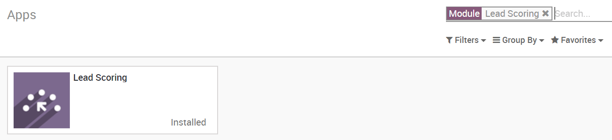
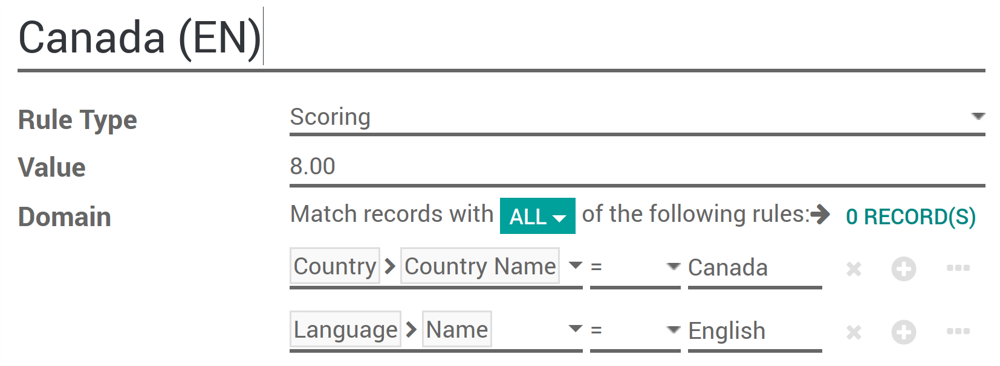
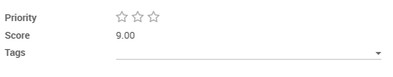
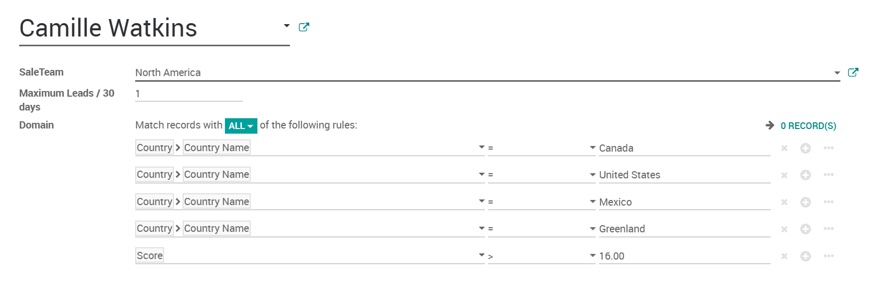
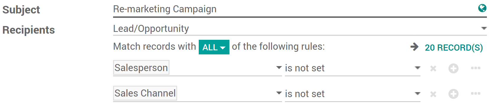

=============================
Assign leads based on scoring
=============================

With *Leads Scoring* you can automatically rank your leads based on
selected criterias.

For example you could score customers from your country higher or the
ones that visited specific pages on your website.

Configuration
=============

To use scoring, install the free module *Lead Scoring* under your
*Apps* page (only available in Odoo Enterprise).

Create scoring rules
====================

You now have a new tab in your *CRM* app called *Leads Management*
where you can manage your scoring rules.

Here's an example for a Canadian lead, you can modify for whatever
criteria you wish to score your leads on. You can add as many criterias
as you wish.

Every hour every lead without a score will be automatically scanned and
assigned their right score according to your scoring rules.

Assign leads
============

Once the scores computed, leads can be assigned to specific teams using
the same domain mechanism. To do so go to :menuselection:`CRM --> Leads Management --> Team Assignation`
and apply a specific domain on each team. This domain can include scores.

.. image:: media/lead_scoring04.png
   :align: center

Further on, you can assign to a specific vendor in the team with an even
more refined domain.

To do so go to :menuselection:`CRM --> Leads Management --> Leads Assignation`.

.. note::
   The team & leads assignation will assign the unassigned leads
   once a day.

Evaluate & use the unassigned leads
===================================

Once your scoring rules are in place you will most likely still have
some unassigned leads. Some of them could still lead to an opportunity
so it is useful to do something with them.

In your leads page you can place a filter to find your unassigned leads.

.. image:: media/lead_scoring06.png
   :align: center

Why not using :menuselection:`Email Marketing` or
:menuselection:`Marketing Automation` apps to send a mass email to
them? You can also easily find such unassigned leads from there.

