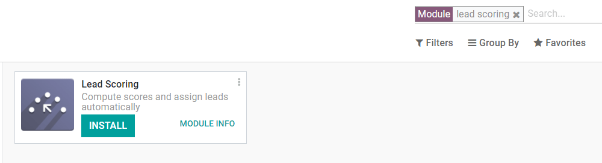
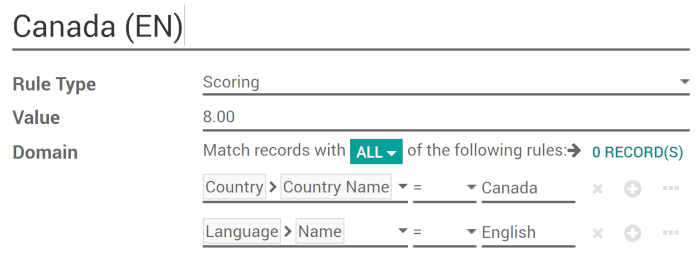
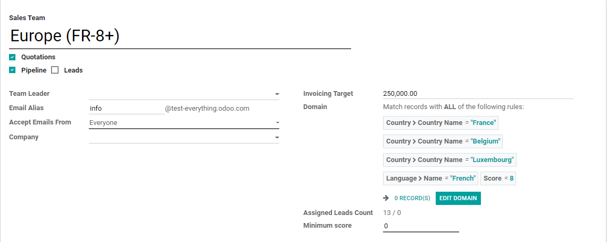
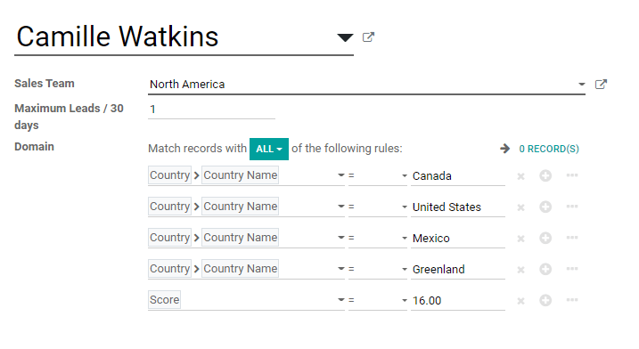

=============================
Assign leads based on scoring
=============================

*Lead Scoring* lets you rank and prioritize leads based on selected criteria. A higher score
indicates that a lead is more likely to bring value to your company.

For example, if customers from Canada tend to be more likely to purchase your products, you can
assign them a higher score than customers from other countries.

Configuration
=============

To use scoring, go to :menuselection:`Apps`, remove the :guilabel:`Apps` filter, search for
:guilabel:`Lead Scoring` and then install the module.

Create scoring rules
====================

To manage scoring rules, go to :menuselection:`CRM --> Leads --> Scoring Rules`.

Customize your rules to fit the needs of your business, and add as many criteria as you want.

Every hour, Odoo automatically assigns scores to new leads according to your configured rules.

.. image:: lead_scoring/scoring-section-on-lead.png
   :align: center
   :alt: Scoring section on a lead

Assign leads
============

Odoo can also assign leads to specific teams based on configured rules. To configure assignment
rules, go to the individual Sales Team's configuration page via :menuselection:`CRM --> Leads -->
Team Assignment` or :menuselection:`CRM --> Configuration --> Sales Teams`, and apply a specific
Domain to each team. The Domain can include lead scores.

Assign leads to specific salespeople using further refined Domains at :menuselection:`CRM --> Leads
--> Leads Assignment`.

Odoo automatically assigns new leads to teams/salespeople once per day.

Evaluate and use the unassigned leads
=====================================

Not all leads will fall into your set Domains and get assigned automatically by Odoo.

To view your unassigned leads, go to :menuselection:`CRM --> Leads --> Leads` and select the
Unassigned filter.

.. image:: lead_scoring/unassigned-filter.png
   :align: center
   :alt: Filtering for unassigned leads

.. note::
   You can also find unassigned leads and create re-engagement campaigns using the :guilabel:`Email
   Marketing` or :guilabel:`Marketing Automation` apps.
