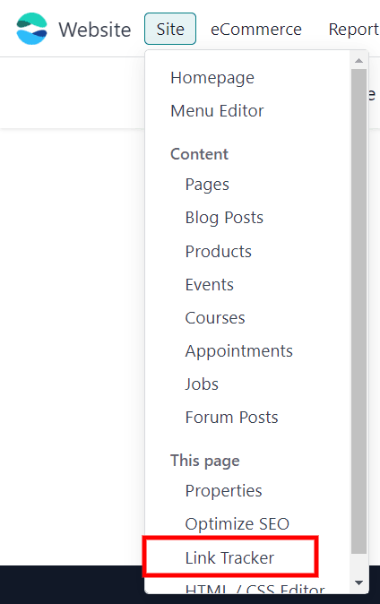
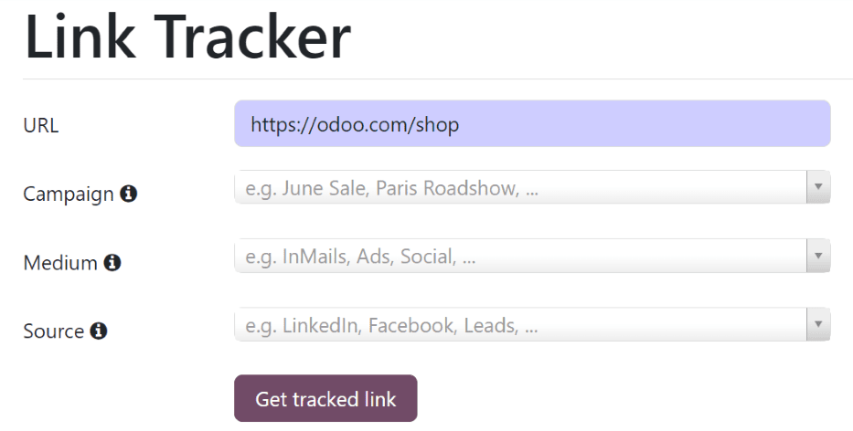
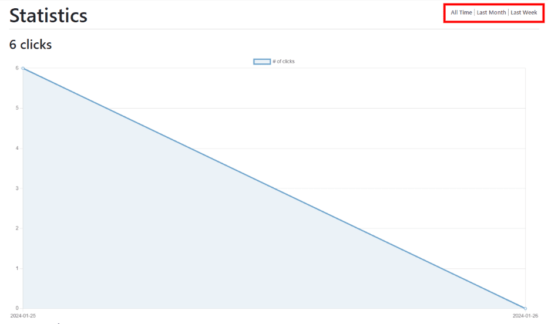
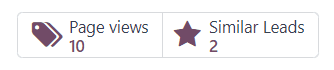
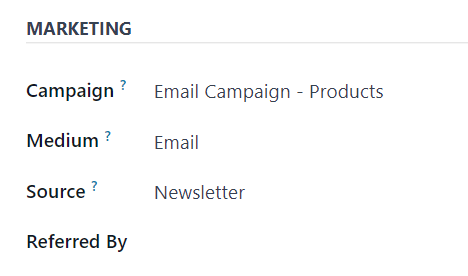

====================
Track webpage visits
====================

Tracking the number of visits to individual webpages provides valuable insight about the interests
of website visitors. It can also be used to analyze the success of marketing campaigns.

With Odoo, tracking links can be created to track visits for any page on the website. When a lead is
created from a website contact form, every page that the prospective customer visits is recorded on
the lead/opportunity form in the *CRM* app.

.. _crm/track_leads/link-tracker:

Track a webpage
===============

Odoo's *link tracker* creates a unique tracking link for any page on a company website. The link
contains analytics trackers that can be used in Google Analytics to track clicks and visitors, as
well as in Odoo Reports to track opportunities and revenue.

The link can also be sent as part of a marketing campaign to track clicks and webpage views for that
particular campaign.

To set up tracking for a webpage, go to any static page on the website through the
:menuselection:`Website` app. Then, click on the :guilabel:`Site` header menu at the top of the
page, and select :guilabel:`Link Tracker`.

On the :guilabel:`Link Tracker` page, the :guilabel:`URL` field is already filled in based on the
webpage that was open when :guilabel:`Link Tracker` was clicked from the :guilabel:`Site` drop-down
menu. However, the :guilabel:`URL` can be changed to any page on the website.

In the :guilabel:`Campaign` field, specify a marketing campaign to associate with the tracking link.

In the :guilabel:`Medium` field, define the specific medium used to share the link, like `Email`,
for example.

In the :guilabel:`Source` field, define the source that the webpage traffic comes from, like
`Facebook`, for example.

.. note::
   The :guilabel:`Campaign`, :guilabel:`Medium`, and :guilabel:`Source` information appears in the
   :guilabel:`Marketing` section of the :guilabel:`Extra Information` tab of a lead or opportunity
   form.

To create a new :guilabel:`Campaign`, :guilabel:`Medium`, or :guilabel:`Source` directly from this
page, click on the field's drop-down menu, type in the name of the new campaign, medium, or source,
and then click :guilabel:`Create`.

When the above fields are filled out as desired, click the :guilabel:`Get tracked link` button to
create a unique tracking link for the selected webpage.

Customize the tracked link URL in the :guilabel:`Your tracked links` section of the :guilabel:`Link
Tracker` page by clicking on the :guilabel:`✏️ (pencil)` icon next to the link.

To quickly copy the tracked link, click the :guilabel:`Copy` button to the right of the link in the
:guilabel:`Your tracked links` section.

View analytics
--------------

To view the status of tracked links, navigate to :menuselection:`Website app --> Site --> Link
Tracker`. In the :guilabel:`Your tracked links` section, the number of clicks that each tracked link
has gotten appears on the left side of each link.

To view the tracked link statistics in graph format, click on the :guilabel:`Stats` button to the
right of each link. Doing so reveals a separate page with information and metrics related to that
specific tracked link.

In the :guilabel:`Statistics` section of the page, toggle the graph views by clicking :guilabel:`All
Time`, :guilabel:`Last Month`, or :guilabel:`Last Week` to the right of the :guilabel:`Statistics`
heading.

Track page views for leads/opportunities
========================================

When a lead is created from a prospective customer filling out a :ref:`contact form
<crm/track_leads/webpage-visits-contact-form>` on the website, Odoo tracks every webpage visited by
that contact. This information is available on the lead/opportunity form in the *CRM* app.

To see a prospective customer's page views, navigate to their lead/opportunity form in the
:menuselection:`CRM` app.

The :guilabel:`Page Views` smart button at the top of the opportunity form shows the total number of
times the prospective customer viewed a page on the website (including multiple views of the same
webpage). Click on the smart button to see an organized list of each individual page view.

If a prospective customer clicks on a tracked link, then fills out a contact form on the website,
and the contact form is :ref:`configured to create a lead
<crm/track_leads/webpage-visits-contact-form>` in Odoo, then the campaign, medium, and source
information from the :ref:`link tracker <crm/track_leads/link-tracker>` appears on the lead form.

This information appears in the :guilabel:`Marketing` section of the :guilabel:`Extra Information`
tab of the lead or opportunity form.

.. _crm/track_leads/webpage-visits-contact-form:

Contact form configuration
--------------------------

To configure a website contact form that creates a lead or opportunity in the *CRM* app when it is
filled out, navigate to the contact form page on the :menuselection:`Website` app, which is
typically accessible via a :guilabel:`Contact Us` page in the header menu of the company website.
Then, click the :guilabel:`Edit` button at the top-right of the page to open the website editor.

Next, click on the existing contact form block on the webpage. Or, to add a new form block, scroll
down to the :guilabel:`Dynamic Content` section of the :guilabel:`Blocks` tab in the website editor.
Then drag-and-drop the :guilabel:`Form` block onto the body of the webpage.

Click on any field of the form block on the webpage to reveal the :guilabel:`Customize` tab of the
website editor on the right sidebar. In the :guilabel:`Form` section, set the :guilabel:`Action` to
:guilabel:`Create an Opportunity`.

With this configuration, submitting a filled-out contact form creates a lead in the *Leads* section
of the *CRM* app. Or, if the *Leads* feature is **not** activated in the *CRM* settings, it creates
an opportunity in the first stage of the pipeline.

Finally, click :guilabel:`Save` at the top of the website editor to save any changes.

.. seealso::
   :doc:`../acquire_leads/generate_leads`
