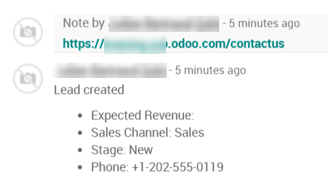

===========================
Track your prospects visits
===========================

Tracking your website pages will give you much more information about
the interests of your website visitors.

Every tracked page they visit will be recorded on your lead/opportunity
if they use the contact form on your website.

Configuration
=============

To use this feature, install the free module *Lead Scoring* under your
*Apps* page (only available in Odoo Enterprise).

.. image:: prospect_visits/prospect_visits01.png
   :align: center

Track a webpage
===============

Go to any static page you want to track on your website and under the
*Promote* tab you will find *Optimize SEO*

.. image:: prospect_visits/prospect_visits02.png
   :align: center

There you will see a *Track Page* checkbox to track this page.

.. image:: prospect_visits/prospect_visits03.png
   :align: center

See visited pages in your leads/opportunities
=============================================

Now each time a lead is created from the contact form it will keep track
of the pages visited by that visitor. You have two ways to see those
pages, on the top right corner of your lead/opportunity you can see a
*Page Views* button but also further down you will see them in the
chatter.

Both will update if the viewers comes back to your website and visits
more pages.

The feature will not repeat multiple viewings of the same pages in the
chatter.

Your customers will no longer be able to keep any secrets from you!
