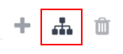

====================
Quality leads report
====================

A *quality lead* is a lead that is likely to result in a sale. It should match the criteria most
commonly believed to help salespeople close a deal and more precise criteria specific to each
organization.

.. note::
   The specific criteria that defines a *quality lead* is different for every organization. For more
   information, see :ref:`Define quality leads <track_links/define-a-lead>`.

A quality leads report compares how many quality leads each salesperson has received over a specific
time, such as the past 30 days. Sales managers can use such a report to make an informed decision
when assigning new leads.

.. example::
   A sales manager pulls the quality leads report pictured below. They see that although everyone's
   ability to close a deal has varied, the sales people on the right of the report have received a
   good amount of quality leads, while the sales people on the left of the report have received
   relatively few.

   .. image:: quality_leads_report/example-report.png
      :align: center
      :alt: An example of a quality leads report in the Odoo CRM application.

   Using this information, the sales manager may decide to assign more quality leads to the sales
   people currently on the lower end to balance out the distribution of quality leads.

.. _track_links/create-quality-leads-report:

Create a quality leads report
=============================

To create a quality leads report, first navigate to :menuselection:`CRM app --> Reporting -->
Pipeline` to open the :guilabel:`Pipeline Analysis` report. Click into the search bar at the top of
the page and remove any active filters.

Click the down arrow to the right of the search bar to open the filters drop-down menu. Click
:guilabel:`Add Custom Filter`. This opens a :guilabel:`Add Custom Filter` pop-up window.

.. important::
   At the top of the :guilabel:`Add Custom Filter` form, there is an option to match :guilabel:`any`
   or :guilabel:`all` of the rules. In order to properly run the report, only records that match
   **all** of the following filters should be included. Before adding the filters, make sure
   :guilabel:`all` is selected in this field.

   .. image:: quality_leads_report/match-all-rules.png
     :align: center
     :alt: Close up on the match all rules option on the add a custom filter pop-up window.

Add a starting date filter
--------------------------

Click the first field for the new rule, and type `Created On` in the search bar, or scroll to search
through the list.

In the rule's second field, select :guilabel:`>=` from the drop-down menu.

Click into the third field and use the pop-up calendar to select a starting date.

Add a sales team filter
-----------------------

Click :guilabel:`New Rule`. Click the first field for the new rule, and type `Sales Team` in the
search bar, or scroll to search through the list.

In the rule's second field, select :guilabel:`is in` from the drop-down menu. This options allows
allows for more than one selection to be made in the next field.

In the third field, select one or more sales teams from the drop-down menu.

.. note::
   This filter is optional. To view results for the entire company, do **not** add this filter.

Exclude unassigned leads
------------------------

Click :guilabel:`New Rule`. Click the first field for the new rule, and type `Salesperson` in the
search bar, or scroll to search through the list.

In the rule's second field, select :guilabel:`is set` from the drop-down menu. Selecting this filter
excludes any leads that have note been assigned to a specific salesperson.

Include active and inactive leads
---------------------------------

Next, add filters to ensure that both active and inactive leads are included in the report. Click
the :guilabel:`Add branch` icon to the right of the last rule created.

   The Add branch icon on the Add Custom Filter pop-up window.

This adds two new blank rules under a *match any* filter.

For the first rule, click the first field, and type `Active` into the search bar, or scroll to
select it from the list. The second and third fields default to :guilabel:`is` and :guilabel:`set`.

For the second rule, click the first field, and type `Active` into the search bar, or scroll to
select it from the list. The second field defaults to :guilabel:`is`. Click the third field and
select :guilabel:`not set` from the drop-down list.

.. figure:: quality_leads_report/configured-custom-rules.png
   :align: center
   :alt: An example of the Custom Filter pop-up window with all of the rules configured.

   An example of the Custom Filter pop-up window with all of the default rules configured.

Add rules for quality leads
---------------------------

This step differs based on how an organization defines a *quality lead*. For more information, see
:ref:`Define quality leads <track_links/define-a-lead>`.

View the report
===============

After the filters are configured, click :guilabel:`Add`. The default display for the report is a bar
graph, where the leads are grouped by *stage*.

To group the results by salesperson, click the down arrow to the right of the search bar. Under the
:guilabel:`Group By` heading, select :guilabel:`Salesperson`. Under the same :guilabel:`Group By`
heading, click :guilabel:`Add a Custom Group`, then select :guilabel:`Active` on the resulting
drop-down menu.

The report now displays the total count of *quality leads* each salesperson has received in the
designated time period. The leads are color-coded to identify whether they are *active* or *marked
as lost*.

.. tip::
   To save this search for later, click the down arrow icon next to the search bar to open the
   filters drop-down menu. Under the :guilabel:`Favorites` heading, click :guilabel:`Save current
   search`.

   In the drop-down menu, rename the report from `Pipeline Analysis` to `Quality Leads` and click
   :guilabel:`Save`.

.. _track_links/define-a-lead:

Define a quality lead
=====================

A *quality lead* is one that is likely to result in a sale. Although the exact criteria for a
quality lead varies from organization to organization, it is often a combination of factors
commonly believed to be the most beneficial to a salesperson, in addition to factors valued by the
specific organization.

In addition to the basic filters and grouping options outlined in the general :ref:`Quality leads
report <track_links/create-quality-leads-report>`, consider the following filters when defining a
quality lead:

- :guilabel:`Email` or :guilabel:`Phone`: the information in these fields can help determine whether
  or not a lead is a professional contact.
- :guilabel:`Source`: this field links to the marketing and lead generation efforts from other
  *Odoo* applications, including *Live Chat*, *Social Marketing*, and *Email Marketing*.
- :guilabel:`Stage`: this filter can be used to eliminate or target leads that have reached specific
  stages.

.. tip::
   When adding rules to a custom filter, keep the statements preceding each rule in mind. The
   statement above a rule determines whether the search results much match **all** of the rules
   below the statement, or **any** of the rules below the statement.

   .. image:: quality_leads_report/match-all-match-any.png
     :align: center
     :alt: Close up of the match rule options on a add custom filter pop-up window.
