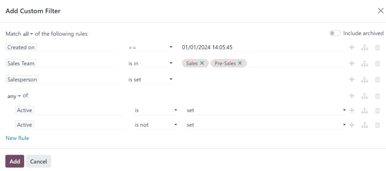
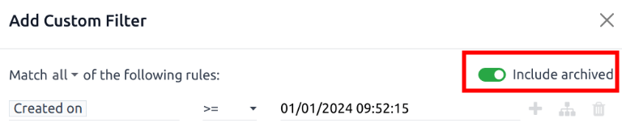

====================
Quality leads report
====================

A *quality lead* is a lead that is likely to result in a sale. It should match the characteristics
most commonly believed to help salespeople close a deal, in addition to more precise criteria that
is specific to each organization.

.. note::
   The specific criteria that defines a *quality lead* is different for every organization. For more
   information, see :ref:`Define a quality lead <track_links/define-a-lead>`.

A quality leads *report* compares how many quality leads each salesperson has received over a
specific amount of time, such as within the past 30 days. Sales managers can use such a report to
make more informed decisions when assigning new leads to their team

.. example::
   A sales manager pulls a quality leads report using their company's criteria:

   - Leads must include a phone number and an email address.
   - The email address must be from a professional domain.
   - The source for the lead must be from a live chat conversation or an appointment with a
     salesperson.

  After running the report, the manager can see that, although everyone's ability to close a deal
  has varied, some members of the sales team have received a higher number of quality leads than
  others.

   .. image:: quality_leads_report/example-report.png
      :align: center
      :alt: An example of a quality leads report in the Odoo CRM application.

   Using this information, the sales manager may decide to assign more quality leads to the sales
   people currently on the lower end, to balance out the distribution of quality leads.

.. _track_links/create-quality-leads-report:

Create a quality leads report
=============================

To create a quality leads report, first navigate to :menuselection:`CRM app --> Reporting -->
Pipeline` to open the :guilabel:`Pipeline Analysis` dashboard. Click into the :guilabel:`Search...`
bar at the top of the page and remove any active filters.

Click the :guilabel:`🔻(triangle pointed down)` icon to the right of the :guilabel:`Search...` bar
to open the drop-down mega menu that contains :guilabel:`Filters`, :guilabel:`Group By`, and
:guilabel:`Favorites` columns. Click :guilabel:`Add Custom Filter`. This opens a :guilabel:`Add
Custom Filter` pop-up window.

The :guilabel:`Add Custom Filter` pop-up window allows for the creation of more specific filters.

Add custom filters
------------------

In order to generate a quality leads report, filters need to be created for the following
conditions:

- :ref:`Starting date <quality_leads_report/starting-date>`: limits results to those created within
  a specific time frame.
- :ref:`Specific sales teams <quality_leads_report/sales-team>`: limits results to only include
  leads for one or more sales teams. This filter is optional and should not be included if the is
  intended for the entire company.
- :ref:`Exclude unassigned leads <quality_leads_report/unassigned-leads>`: excludes leads without an
  assigned salesperson.
- :ref:`Include archived leads <quality_leads_report/archived-leads>`: ensures that both active and
  inactive leads are included in the results.
- :ref:`Add rules for quality leads <quality_leads_report/add-quality-rules>`: includes or excludes
  results based on criteria that is specific to a company or sales team.

   An example of the *Custom Filter* pop-up window with all of the default rules configured.

.. _quality_leads_report/starting-date:

Add a starting date filter
~~~~~~~~~~~~~~~~~~~~~~~~~~

Begin by first defining the rule's parameter with a date range, by clicking into the first field, on
the left of the row, and typing `Created On` in the :guilabel:`Search...` bar, or by scrolling
through the menu's list to locate it.

In the rule's operator drop-down menu, define the parameter further by selecting either:

- :guilabel:`>= (greater than or equal to)` to specify a start date and include all entries *after*
  that start date (as well as the initial value itself); or
- :guilabel:`is between` to more sharply define a time frame with a clear start and end date. All
  matching entries that fit within the defined start and end dates are included in the report.

With either option, use the pop-up calendar's day and time pickers, in the far right field, to
define the respective date range. Setting these values concludes the creation of the first rule.

.. _quality_leads_report/sales-team:

Add a sales team filter
~~~~~~~~~~~~~~~~~~~~~~~

.. note::
   This filter is optional. To view results for the entire company, do **not** add this filter.

To limit the results of the report to one or more sales teams, click :guilabel:`New Rule`. Next,
click the first field for the new rule, and type `Sales Team` in the :guilabel:`Search...` bar, or
scroll to search through the list to locate it.

In the rule's second field, select :guilabel:`is in` from the drop-down menu. Selecting this
operator limits results to the sales teams selected in the next field.

Lastly, in the third field, select the desired sales team from the drop-down menu. Multiple teams
can be added in this field, where each parameter is treated with an "or" (e.g. "any") operator in
the search logic.

.. _quality_leads_report/unassigned-leads:

Exclude unassigned leads
~~~~~~~~~~~~~~~~~~~~~~~~

Next, add a :guilabel:`New Rule`. Then, click into the first field for the new rule, and type
`Salesperson` in the :guilabel:`Search...` bar, or scroll to search through the list to locate it.

In the rule's second field, select :guilabel:`is set` from the drop-down menu. Selecting this
operator excludes any leads not assigned to a specific salesperson.

.. _quality_leads_report/archived-leads:

Include archived leads
~~~~~~~~~~~~~~~~~~~~~~

.. tip::
   This filter is also optional, as it adds archived (inactive) leads to the report, however it is
   recommended to include this since it pulls *all* assigned leads, regardless of status, into the
   report. This ensures a more accurate representation of assigned leads is captured. However, to
   pull a report that only includes active leads, do **not** activate this feature.

Next, in the upper-right corner of the :guilabel:`Add Custom filter` pop-up window, move the
:guilabel:`Include archived` toggle to active.

Enabling this feature adds archived (inactive) leads to the report.

.. _quality_leads_report/add-quality-rules:

Add rules for quality leads
~~~~~~~~~~~~~~~~~~~~~~~~~~~

The filters added in this step vary, based on how an organization defines a *quality lead*.

.. _track_links/define-a-lead:

Define a quality lead
*********************

As defined earlier, a *quality lead* is a lead that is likely to result in a won opportunity.
Although the exact criteria for a quality lead varies from organization to organization, it is often
a combination of factors commonly attributed to positive sales outcomes, in addition to factors
valued by the specific organization.

In addition to the basic filters and grouping options outlined in the general :ref:`Quality leads
report <track_links/create-quality-leads-report>`, consider the following filters when defining a
quality lead:

- :guilabel:`Email` or :guilabel:`Phone`: the information in these fields can help determine whether
  or not a lead is a professional contact.
- :guilabel:`Source`: this field links to the marketing and lead generation efforts from other Odoo
  applications, including *Live Chat*, *Social Marketing*, and *Email Marketing*.
- :guilabel:`Stage`: this filter can be used to eliminate or target leads that have reached specific
  stages.
- :guilabel:`Medium`: a lead's source can indicate its quality level, as various channels have
  different won rates and expected revenues.
- :guilabel:`Campaign`: adding this filter helps track of the success of different marketing efforts
  to capture high quality leads.
- :guilabel:`Lost Reason`: exclude leads that may appear to be quality based on various criteria,
  but have been marked as *lost* for specified reasons.
- :guilabel:`Tags`: include or exclude results based on one or more customized tags.

.. tip::
   When adding rules to a custom filter, keep the statements preceding each rule in mind. The
   statement above a rule determines whether the search results must match **all** of the rules
   below the statement, or **any** of the rules below the statement.

   .. image:: quality_leads_report/match-all-match-any.png
     :align: center
     :alt: Close up of the match rule options on a add custom filter pop-up window.

View the report
===============

.. important::
   At the top of the :guilabel:`Add Custom Filter` form, there is an option to match :guilabel:`any`
   or :guilabel:`all` of the rules. In order to properly run the report, only records that match
   **all** of the following filters should be included. Before adding the filters, make sure
   :guilabel:`all` is selected in this field.

   .. image:: quality_leads_report/match-all-rules.png
     :align: center
     :alt: Close up on the match all rules option on the add a custom filter pop-up window.

After the filters are configured, click :guilabel:`Add`. The default display for the report is a bar
graph, where the leads are grouped by *stage*.

To group the results by salesperson, click the :guilabel:`🔻(triangle pointed down)` icon to the
right of the :guilabel:`Search...` bar to open the drop-down mega menu. Under the :guilabel:`Group
By` heading, select :guilabel:`Salesperson`. In the same column, under the :guilabel:`Group By`
heading, click :guilabel:`Add a Custom Group`, then select :guilabel:`Active` on the resulting
drop-down menu to layer in lead *status*, under the parent :guilabel:`Salesperson` grouping.

The report now displays the total count of *quality leads* each salesperson has received in the
designated time period. Because there are layered :guilabel:`Group By` filters, the grouped leads
are also color-coded to identify whether they are *active* or *marked as lost*.

.. tip::
   To save this search for later, click the :guilabel:`🔻(triangle pointed down)` icon next to the
   :guilabel:`Search...` bar to open the drop-down menu. Under the :guilabel:`Favorites` heading,
   click :guilabel:`Save current search`.

   In the drop-down menu, rename the report from the default `Pipeline` label to `Quality Leads`,
   and click :guilabel:`Save`.
