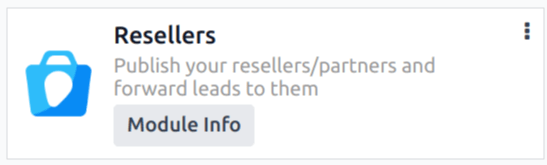
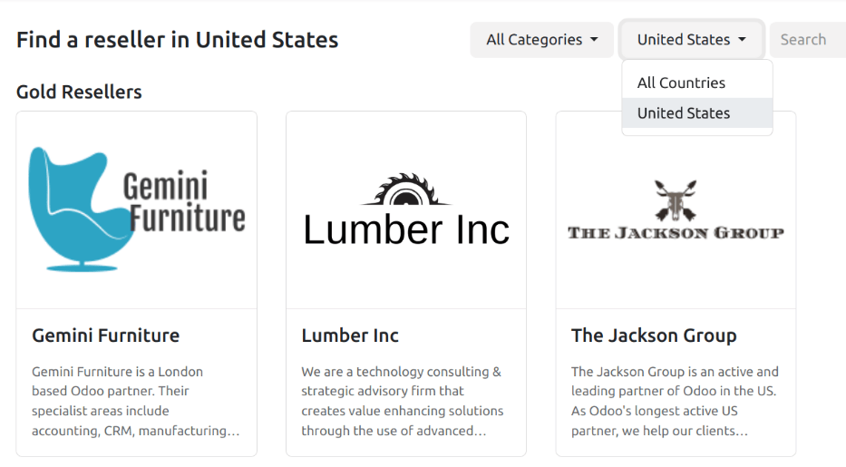

=========
Resellers
=========

Within Odoo's *CRM* app, leads can be forwarded to resellers (or partners). Leads can be manually
assigned, or automatically assigned, based on the resellers' designated *level* and location.

Configuration
=============

To utilize the reseller features, the *Resellers* module first needs to be installed. Navigate to
the :menuselection:`Apps application`, and remove the :guilabel:`Apps` filter from the
:guilabel:`Search...` bar. Then, search for `Resellers`.

Click :guilabel:`Activate` on the :guilabel:`Resellers` module card that appears. Doing so installs
the module, and returns to the main Odoo dashboard.

After the module is installed, navigate to the :menuselection:`CRM app`. Under the
:menuselection:`Configuration` menu is a new section, titled :guilabel:`Resellers`, with three
options beneath it: :guilabel:`Partner Levels`, :guilabel:`Partner Activations`, and
:guilabel:`Commission Plans`.

.. _crm/partner-levels:

Partner levels
==============

Partner *levels* are used to differentiate between various resellers. To view the partner levels,
navigate to :menuselection:`CRM app --> Configuration --> Resellers: Partner Levels`.

On the :guilabel:`Partner Levels` page that appears, there are three default levels:

- :guilabel:`Gold`
- :guilabel:`Silver`
- :guilabel:`Bronze`

New levels can be added, as needed, by clicking :guilabel:`New`, and filling out the resulting level
form.

Existing levels can also be edited and renamed, if desired, as well. To modify a level, select it
from the list, and proceed to make any desired changes from the level form page that appears.

Level weight is used to decide the probability a partner to be assigned a lead or opportunity. On
the level form, assign a numerical value (greater than zero) to the :guilabel:`Level Weight` field.
If the weight is zero, no leads are assigned.

.. tip::
   *Level Weight* can be assigned on an individual contact record. The weight assigned on the
   individual record overwrites the default weight assigned on the level configuration form.

.. _crm/partner-activations:

Partner activations
===================

Partner *activations* are used to identify the status of a partner. Activations are assigned on an
individual contact record, and can be used to group or filter the *Partnership Analysis* report
(:menuselection:`CRM app --> Reporting --> Partnerships`).

To view the partner levels, navigate to :menuselection:`CRM app --> Configuration --> Partner
Activations`.

Three activation types are created by default in the *CRM* app:

- :guilabel:`Fully Operational`
- :guilabel:`Ramp-up`
- :guilabel:`First Contact`

New partner activations can be added, as needed, by clicking :guilabel:`New`, and entering a
:guilabel:`Name` on the new line that appears. Then, select the desired status in the
:guilabel:`Active` column.

Existing partner activations can also be edited and renamed, if desired. To rename a status, click
the :guilabel:`Name` field of a desired level, and enter a new name.

To change the active status of an activation, slide the toggle in the :guilabel:`Active` column of
the desired activation to the *inactive* position.

.. figure:: resellers/activations-toggle.png
   :align: center
   :alt: The list of default partner activations in the CRM app.

   The list of default Partner Activations in the CRM app. The toggle for First Contact is in the
   inactive position, while the rest are active.

Partner assignments
===================

After :ref:`partner levels <crm/partner-levels>` and :ref:`partner activations
<crm/partner-activations>` configured.

To update an individual partner record, navigate to :menuselection:`CRM app --> Sales -->
Customers`, and click the Kanban card for the desired partner to open the customer record.

On the customer record, click the :guilabel:`Partner Assignment` tab.

Click the :guilabel:`Partner Level` field, and select an option from the drop-down menu to assign a
level. Click the :guilabel:`Activation` field, and select a partner activation type from the
drop-down list, if desired. Then, click the :guilabel:`Level Weight` field to assign a different
level weight, if necessary.

Publish partners
================

With the Odoo *Website* and *Resellers* apps installed, a new webpage (`/partners`) is created to
display a list of all active partners from the *CRM* app.

Next, return to :menuselection:`CRM app --> Sales --> Customers`, and click the Kanban card for a
partner. From that partner's contact form, click the :guilabel:`Go to Website` smart button at the
top of the page to open that partner's webpage.

Next, click :guilabel:`Edit` at the top-right of the partner's webpage, and use the :doc:`building
blocks <../../../websites/website/web_design/building_blocks>` to add any additional design
elements, or information about the partner.

.. tip::
   A company summary is a useful addition to this page.

After making any necessary changes to the page, click :guilabel:`Save`. At the top of the page,
slide the :guilabel:`Unpublished` toggle to the active, :guilabel:`Published` position, if needed.

Repeat these steps for all partners.

