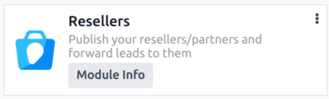
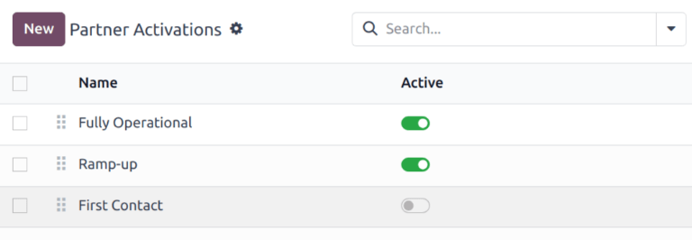
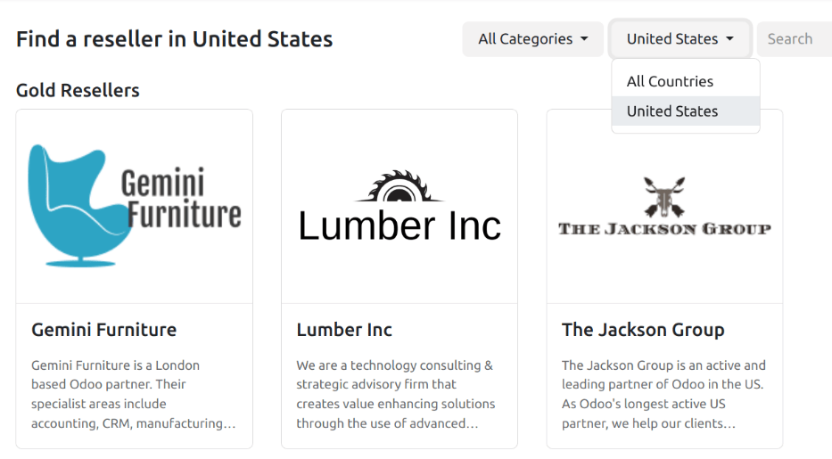
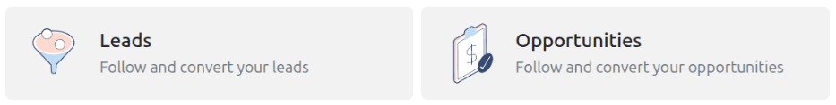
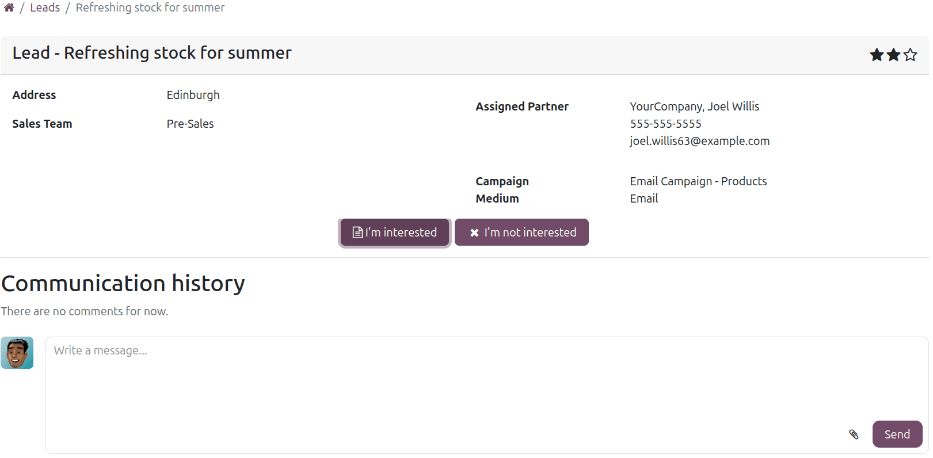
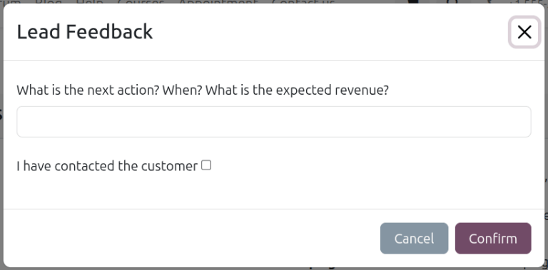
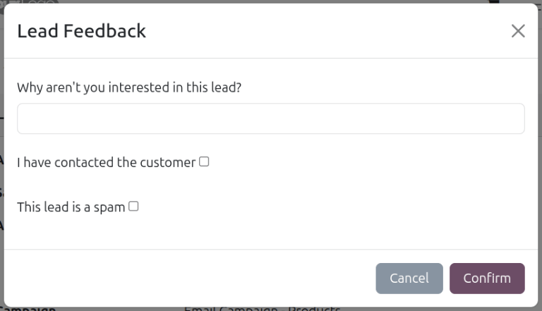
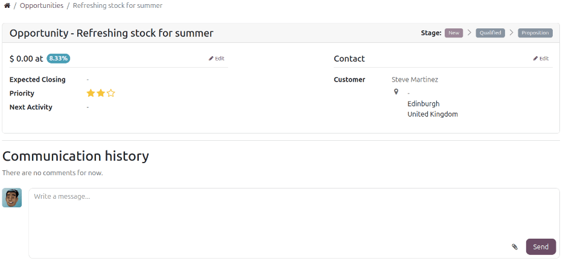

=========
Resellers
=========

Within Odoo's **CRM** app, leads can be forwarded to resellers (or partners). Leads can be manually
assigned or automatically assigned based on the resellers' designated *level* and location. Reseller
partners may also take assigned leads and convert them into opportunities in the user portal.

Configuration
=============

To use the reseller features, the *Resellers* module must be installed first. Navigate to the
:guilabel:`Apps` application, and remove the :guilabel:`Apps` filter from the search bar. Then,
search for `Resellers`.

Click :guilabel:`Activate` on the :guilabel:`Resellers` module card that appears. Doing so installs
the module and returns to the main Odoo dashboard.

After the module is installed, navigate to :menuselection:` CRM app --> Configuration`. There is a
new section, titled :guilabel:`Resellers`, with two options beneath it: :guilabel:`Levels` and
:guilabel:`Partner Activations`. There may be additional options depending on the apps and modules
that are installed in the database.

.. _crm/partner-levels:

Levels
======

*Levels* are used to differentiate between various resellers. To view the levels, navigate to
:menuselection:`CRM app --> Configuration --> Members --> Levels`. On the :guilabel:`Levels` page
that appears, there are three default levels:

- :guilabel:`Gold`
- :guilabel:`Silver`
- :guilabel:`Bronze`

New levels can be added as needed by clicking :guilabel:`New` and filling out the resulting level
form.

Existing levels can also be edited and renamed if desired. To modify a level, select it from the
list and make any desired changes on the level form page that appears.

Level weight is used to decide the probability that a partner is assigned a lead or opportunity. On
the level form, assign a numerical value (greater than zero) to the :guilabel:`Level Weight` field.
If the weight is zero, no leads are assigned.

.. tip::
   *Level Weight* can also be assigned on an individual contact record. The weight assigned to the
   individual record overrides the default weight set in the level configuration form.

.. _crm/partner-activations:

Partner activations
===================

Partner *activations* are used to determine a partner's status. Activations are assigned on an
individual contact record, and can be used to group or filter the *Partnership Analysis* report
(:menuselection:`CRM app --> Reporting --> Partnerships`).

To view the partner levels, navigate to :menuselection:`CRM app --> Configuration --> Partner
Activations`.

Three activation types are created by default in the **CRM** app:

- :guilabel:`Fully Operational`
- :guilabel:`Ramp-up`
- :guilabel:`First Contact`

New partner activations can be added, as needed, by clicking :guilabel:`New` and entering a
:guilabel:`Name` on the new line that appears. Then, select the desired status in the
:guilabel:`Active` column.

Existing partner activations can also be edited and renamed, if desired. To rename a status, click
the :guilabel:`Name` field of a desired level and enter a new name.

To change the active status of an activation, slide the toggle in the :guilabel:`Active` column of
the desired activation to the *inactive* position.

Partner assignments
===================

After :ref:`levels <crm/partner-levels>` and :ref:`partner activations <crm/partner-activations>`
are configured, partners may be assigned to handle specific customers.

To update an individual partner record, navigate to :menuselection:`CRM app --> Sales -->
Customers`, and click the Kanban card for the desired partner to open the customer record.

Click the :guilabel:`Partner Level` field, and select an option from the drop-down menu to assign a
level. Click the :guilabel:`Partner Assignment` tab and click the :guilabel:`Activation` field under
the :guilabel:`Partner Activation header`. Select a partner activation type from the drop-down list,
if desired. Then, click the :guilabel:`Level Weight` field to assign a different level weight, if
necessary.

Publish partners
================

With the Odoo **Website** app and *Resellers* module installed, a new webpage (`/partners`) is
created to display a list of all active partners from the **CRM** app.

Next, return to :menuselection:`CRM app --> Sales --> Customers`, and click the Kanban card for a
partner. From that partner's contact form, click the :guilabel:`Go to Website` smart button at the
top of the page to open that partner's webpage.

Next, click :guilabel:`Edit` at the top-right of the partner's webpage, and use the :doc:`building
blocks <../../../websites/website/web_design/building_blocks>` to add any additional design elements
or information about the partner.

.. tip::
   A company summary is a useful addition to this page.

After making any necessary changes to the page, click :guilabel:`Save`. At the top of the page,
slide the :guilabel:`Unpublished` toggle to the active, :guilabel:`Published` position, if needed.

Repeat these steps for all partners.

Partners and the user portal
============================

Reseller partners who have been assigned leads and opportunities can view them in their user
portals. Clicking either the :guilabel:`Leads` or :guilabel:`Opportunities` button brings up a list
of all leads or opportunities assigned to that partner. Individual leads and opportunities can be
clicked for more details.

Partner leads
-------------

Leads viewed through a partner's user portal contain the same information as the lead viewed through
the **CRM** app. Reseller partners may click either the :guilabel:`I'm interested` or :guilabel:`I'm
not interested` buttons. Clicking either button brings up the :guilabel:`Lead Feedback` form.

If the partner has expressed interest, the form prompts them to enter their next planned action and
expected revenue for the lead and to confirm that they have contacted the customer. Entering this
information and clicking the :guilabel:`Confirm` button converts the lead into an opportunity.
Failing to fill out the form **prevents** the lead from converting to an opportunity.

If the partner is not interested in the opportunity, the :guilabel:`Lead Feedback` form prompts the
partner to enter why they're not interested in the lead, whether they've contacted the customer, and
whether they think the lead is spam. This version of the :guilabel:`Lead Feedback` form does not
need to be completed by the partner to be confirmed.

Partner opportunities
---------------------

Leads accepted by the partner are converted into *opportunities*. Clicking an opportunity reveals
the same information displayed in the **CRM** app, but in a view designed for the user portal. From
an opportunity's page, the reseller may:

- Change the opportunity's stage.
- Edit the opportunity's information, including priority, planned revenue, and pertinent dates.
- Update the contact information for the opportunity.
- Leave notes, messages, and more in the opportunity's chatter.

.. note::
   The reseller's ability to change these settings depends on the access granted to them by a
   database administrator. See the :doc:`access rights <../../../general/users/access_rights>`
   documentation for more details.

.. seealso::
   - :doc:`../../../general/users/user_portals`
   - :doc:`../acquire_leads/convert`
