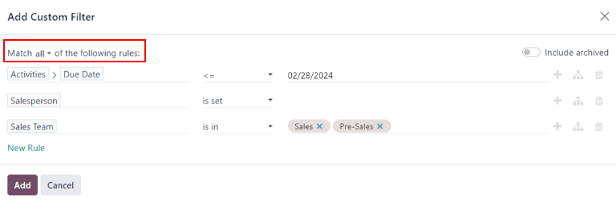
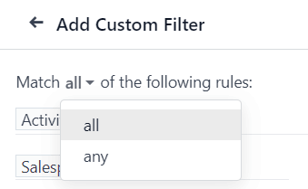

=======================
Unattended leads report
=======================

*Unattended leads* are leads that have scheduled activities that are either due or past due.
Whenever an activity is scheduled, Odoo tracks the due date, and sends email reminders to the users
the activity is assigned to.

An *unattended leads report* compiles all active leads in the pipeline with due or past due
activities, allowing a sales manager to identify which opportunities require immediate attention.

By pulling a daily unattended leads report, sales managers can remind their teams to address
outstanding activities before they become past due, helping avoid neglected leads and reinforcing
proactive behaviors in their salespeople.

.. example::

   A sales manager starts their day by pulling an unattended leads report, and upon switching to
   list view, they see the following:

   .. image:: unattended_leads_report/unattended-leads-example.png
      :align: center
      :alt: List view of a sample Unattended Leads report with the activities emphasized.

  Their team member, Mitchell, has two leads in the *Proposition* stage with activities that are
  due.

  The yellow :guilabel:`📞 (phone)` icon indicates that the `Modern Open Space` lead has a phone
  call activity scheduled for today. The red :guilabel:`✉️ (envelope)` icon indicates that the `5 VP
  Chairs` lead has an email activity scheduled that is past due.

  Clicking on the `5 VP Chairs` lead, the sales manager opens the record of the lead and reviews the
  chatter. They see that the email was scheduled to be sent two days ago, but Mitchell never marked
  this activity as done.

  .. image:: unattended_leads_report/overdue-activities-email.png
     :align: center
     :alt: Example of overdue activities notification in the chatter of a lead.

.. important::
   In order to pull a unattended leads report, sales teams **must** be regularly utilizing activity
   in the *CRM* pipeline, on individual lead and opportunity cards.

   It is **not** possible to compile a complete report if the sales people are not using the
   *Activities* feature in the *chatter*

   For more information, refer to :doc:`Activities <../../../essentials/activities>`

Create an unattended leads report
=================================

To create an unattended leads report, first navigate to :menuselection:`CRM app --> Reporting -->
Pipeline` to open the :guilabel:`Pipeline Analysis` dashboard. Click into the :guilabel:`Search...`
bar at the top of the page, and remove all of the default filters.

.. note::
   The :guilabel:`Created on` filter can remain active, as this variable may be useful to include in
   the report.

Next, add custom filters by clicking the :guilabel:`🔻(triangle pointed down)` icon to the right of
the :guilabel:`Search...` bar to open the drop-down menu that contains :guilabel:`Filters`,
:guilabel:`Group By`, and :guilabel:`Favorites` columns. Under the :guilabel:`Filters` column,
click :guilabel:`Add Custom Filter`, which opens an :guilabel:`Add Custom Filter` pop-up window.

The :guilabel:`Add Custom Filter` pop-up window allows for the creation of more specific filters.

Add custom filters
------------------

In order to generate an unattended leads report, filters need to be created for the following
conditions:

 - :ref:`Past due activities <unattended_leads_report/past-due>`: limits the results to only include
   leads with an assigned activity where the due date has past. This can be altered to include
   activities due to occur on the date the report is generated as well.
 - :ref:`Unassigned leads <unattended_leads_report/exclude-unassigned>`: excludes leads without an
   assigned salesperson.
 - :ref:`Specific sales teams <unattended_leads_report/sales-team>`: limits results to only include
   leads assigned to one or more sales teams. This filter is optional and should not be included if
   the report is intended for the entire company.

.. _unattended_leads_report/past-due:

Add filter for past due activities
~~~~~~~~~~~~~~~~~~~~~~~~~~~~~~~~~~

Click the first field for the new rule, and type `Activities` in the :guilabel:`Search...` bar, or
scroll to search through the list to locate it. Then, next to :guilabel:`Activities`, click the
:guilabel:`> (greater than sign)` to open a new drop-down menu with secondary conditions.

Type `Due Date` in the :guilabel:`Search...` bar, or scroll to search through the list. Click
:guilabel:`Due Date` to add it to the rule.

  .. image:: unattended_leads_report/activities-due.png
     :align: center
     :alt: Custom filter pop-up with emphasis on the options for activities and due date.

Then, click into then next field and select :guilabel:`<=` from the drop-down menu. Selecting this
operator includes all activities with a due date up to, and including, the date selected in the next
field.

The third field can be left as today's date, or adjusted as needed.

.. _unattended_leads_report/exclude-unassigned:

Exclude unassigned leads
~~~~~~~~~~~~~~~~~~~~~~~~

After filtering for activities, add a :guilabel:`New Rule`. Then, click into the first field for the
new rule, and type `Salesperson` in the :guilabel:`Search...` bar, or scroll to search through the
list to locate it.

In the rule's second field, select :guilabel:`is set` from the drop-down menu. Selecting this
operator excludes any leads not assigned to a specific salesperson.

.. _unattended_leads_report/sales-team:

Add a Sales team
~~~~~~~~~~~~~~~~

.. note::
   This filter is optional. To view results for the entire company, do **not** add this filter, and
   continue to :ref:`View results <unattended_leads_report/view-results>`

To limit the results of the report to one or more sales teams, click :guilabel:`New Rule`. Next,
click the first field for the new rule, and type `Sales Team` in the :guilabel:`Search...` bar, or
scroll to search through the list to locate it.

In the rule's second field, select :guilabel:`is in` from the drop-down menu. Selecting this
operator limits results to the sales teams selected in the next field.

Lastly, in the third field, select the desired sales team from the drop-down menu. Multiple teams
can be added in this field, where each parameter is treated with an "or" (e.g. "any") operator in
the search logic.

   An example of the **Add Custom Filter** pop-up window with all of the rules configured.

.. _unattended_leads_report/view-results:

View results
============

At the top of the :guilabel:`Add Custom Filter` form, there is an option to match :guilabel:`any` or
:guilabel:`all` of the rules. In order to properly run the report, only records that match **all**
of the following filters should be included. Before adding the filters, make sure :guilabel:`all` is
selected in this field.

After the filters are configured, click :guilabel:`Add`. The resulting report displays all leads
assigned to a salesperson where an activity is past due, or is due on the current date. The default
display is a bar graph, where the leads are grouped by *stage*.

To group the results by salesperson, click the :guilabel:`🔻(triangle pointed down)` icon to the
right of the :guilabel:`Search...` bar to open the drop-down menu that contains :guilabel:`Filters`,
:guilabel:`Group By`, and :guilabel:`Favorites` columns. Under the :guilabel:`Group By` heading,
select :guilabel:`Salesperson`.

.. note::
   The option to group by :guilabel:`Sales Team` is also available under the :guilabel:`Group By`
   heading.

To change to a *list* view, click the :guilabel:`≣ (list)` icon in the top-right corner of the
screen.

.. tip::
   Clicking the :guilabel:`(toggle) icon` opens a drop-down menu of additional columns that can be
   added to the report.

   Some options that are beneficial for this report include:

   - :guilabel:`Activities`: the summary of the latest activity for this lead.
   - :guilabel:`Expected Closing`: the estimated date on which the lead will be won.
   - :guilabel:`Probability`: estimated success rate based on the stage.

  .. image:: unattended_leads_report/additional-options.png
     :align: center
     :alt: Custom filter pop-up with emphasis on the options for activities and due date.

.. seealso::
   :doc:`Activities <../../../essentials/activities>`
