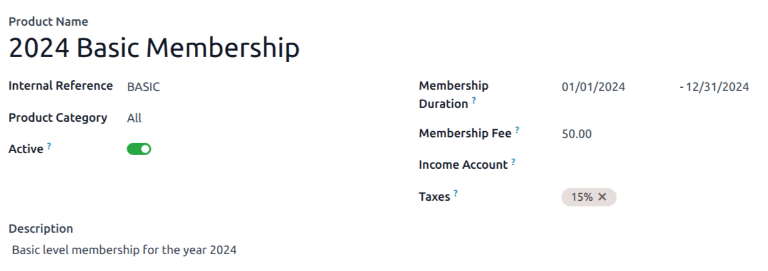
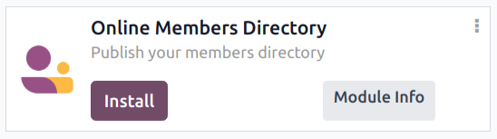

:show-content:

=======
Members
=======

The *Members* application is where all operations related to memberships can be configured and
managed. The *Members* app integrates with the *Sales* and *Accounting* applications to sell and
invoice memberships directly to customers.

Membership products
===================

To create a new membership product, navigate to :menuselection:`Members app --> Configuration -->
Membership Products`, and click :guilabel:`New` to open a blank product record.

Complete the blank form with the necessary information, including the :guilabel:`Membership
Duration`.

.. note::
   Membership products require a start and end date, as they are used to determine :ref:`membership
   status <sales/membership-status>`. Membership products can be sold *before* their active start
   date.

Membership products can be added to a sales order, and invoiced as regular products or
subscriptions.

Activate a membership
=====================

To activate a membership from the *Contacts* application, navigate to :menuselection:`Contacts app`,
and click on a contact to open that specific contact's detail form.

From the resulting contact form, open the :guilabel:`Membership` tab, and click :guilabel:`Buy
Membership`.

On the :guilabel:`Join Membership` pop-up window that appears, select a :guilabel:`Membership` from
the drop-down menu. Then, configure a :guilabel:`Member Price`.

Click :guilabel:`Invoice Membership` when both fields are filled in. Doing so reveals a
:guilabel:`Membership Invoices` page, wherein invoices can be confirmed and completed.

Alternatively, to offer a free membership, tick the :guilabel:`Free Member` checkbox, in the
:guilabel:`Membership` tab of a contact form.

.. _sales/membership-status:

Membership status
=================

The :guilabel:`Current Membership Status` is listed on the :guilabel:`Membership` tab of each
contact record:

- :guilabel:`Non Member`: a partner who has **not** applied for membership.
- :guilabel:`Cancelled Member`: a member who has cancelled their membership.
- :guilabel:`Old Member`: a member whose membership end date has passed.
- :guilabel:`Waiting Member`: a member who has applied for membership, but whose invoice has not
  yet been created.
- :guilabel:`Invoiced Member`: a member whose invoice has been created, but has not been paid.
- :guilabel:`Paid Member`: a member who has paid the membership fee.

Publish members directory
=========================

To publish a list of active members on the website, the *Online Members Directory* application must
first be :ref:`installed <general/install>`. After installing the module, add the `/members` page to
the website's menu by :doc:`editing the website menu <../websites/website/pages/menus>`.

Publish individual members
--------------------------

Return to :menuselection:`CRM app --> Sales --> Customers`, and click the Kanban card for a member.
From the resulting customer form that appears, click the :guilabel:`Go to Website` smart button at
the top of the page to open the member's webpage.

Click the :icon:`fa-pencil` :guilabel:`Edit` button to reveal a sidebar of editing tools. After
making any necessary changes to the page, click :guilabel:`Save`. At the top of the page, slide the
:guilabel:`Unpublished` toggle to the active, :guilabel:`Published` position.

Repeat these steps for all desired members.

.. toctree::
   :titlesonly:

   members/members_analysis
