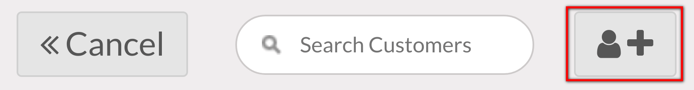
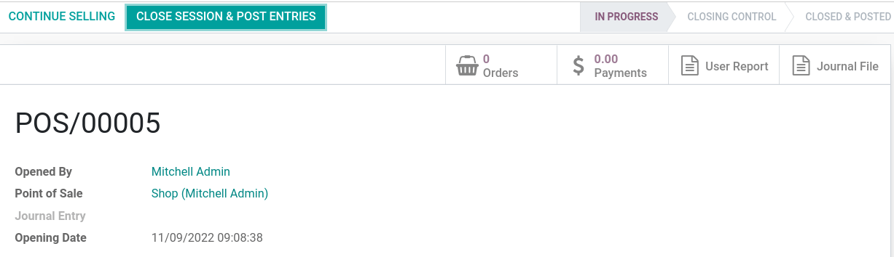

:show-content:
:show-toc:

=============
Point of Sale
=============

With **Odoo Point of Sale**, run your shops and restaurants easily. The app works on any device with
a web browser, even if you are temporarily offline. Product moves are automatically registered in
your stock, you get real-time statistics, and your data is consolidated across all shops.

.. seealso::
   - `Odoo Tutorials: Point of Sale Tutorials <https://www.odoo.com/slides/point-of-sale-28>`_
   - :doc:`IoT Boxes Documentations </applications/productivity/iot>`

.. _pos/session-start:

Start a session
===============

From the **POS dashboard**, click :guilabel:`New Session` to start a POS session, or
:guilabel:`Resume` if the session was already open.

.. note::
   Multiple users can be connected to the same session at the same time. However, the session can
   only be open once on the same browser.

.. _pos/sell:

Sell products
=============

Click on products to add them to the cart. To change the **quantity**, click :guilabel:`Qty` and
enter the number of products using the keypad. To add a **discount** or modify the product
**price**, click respectively :guilabel:`Disc` or :guilabel:`Price` and enter the amounts.

Once an order is completed, proceed to checkout by clicking :guilabel:`Payment`. Select the
**payment method**, enter the received amount, and click :guilabel:`Validate`. Click
:guilabel:`New Order` to move on to the next customer.

.. image:: point_of_sale/pos-interface.png
   :align: center
   :alt: POS session interface.

.. tip::
   - You can use both `,` and `.` on your keyboard as decimal separators.
   - **Cash** is selected by default if you enter the amount without choosing a payment method.

.. _pos/customers:

Register customers
==================

Registering your customers gives you the ability to grant them various privileges such as discounts,
loyalty program, specific communication. It is also required if they want an invoice and registering
them makes any future interaction with them faster.

From your session interface, use the customer button.

.. image:: point_of_sale/customer-button.png

Create a new one by using this button.

You will be invited to fill out the customer form with their
information.

.. image:: point_of_sale/customer-form.png

Use the save button when you are done. You can then select that customer
in any future transactions.

.. _pos/refund:

Return and refund products
==========================

To return a product and make a refund,

#. from the **POS dashboard**, **open a session** and select the returned product;
#. click :guilabel:`Qty` and :guilabel:`+/-` to enter the quantity of returned products;
#. once the order is completed, click :guilabel:`Payment` to proceed to the refund;
#. click :guilabel:`Validate` and :guilabel:`New Order` to move on to the next customer.

.. _pos/session-close:

Close the POS session
=====================

To close your session,

#. go back to the POS dashboard by clicking :guilabel:`Close` and :guilabel:`Confirm` in the upper
   right corner of your screen;
#. then, click :guilabel:`Close` and proceed to the **closing control**;
#. click the :guilabel:`Payments` smart button to know what amount of cash should be in your cash
   drawer;
#. once the control is done, click :guilabel:`Close session & post entries`;
#. the status goes automatically from :guilabel:`In Progress` to :guilabel:`Closed & Posted`.

.. tip::
   - It is strongly advised to close your POS session at the end of each day.
   - To look at all your previous sessions, go to :menuselection:`Point of Sale --> Orders -->
     Sessions`.

.. toctree::
   :titlesonly:

   point_of_sale/employee_login
   point_of_sale/receipts_invoices
   point_of_sale/configuration
   point_of_sale/shop
   point_of_sale/restaurant
   point_of_sale/payment_methods
   point_of_sale/pricing
   point_of_sale/reporting
