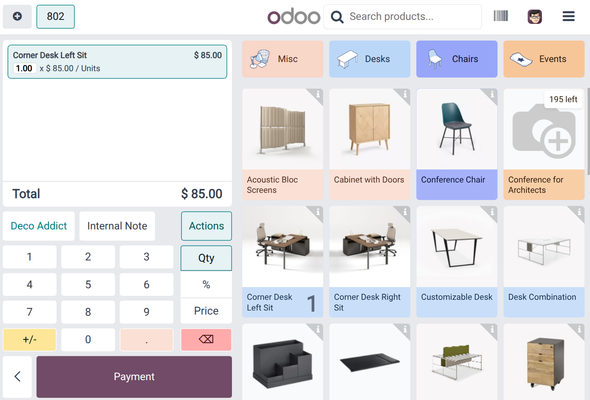
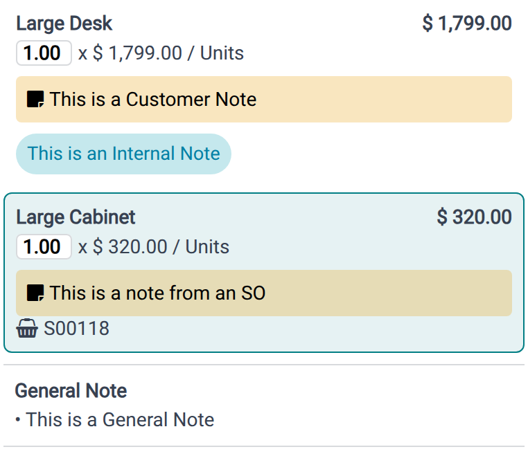
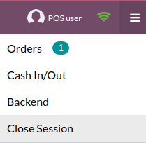
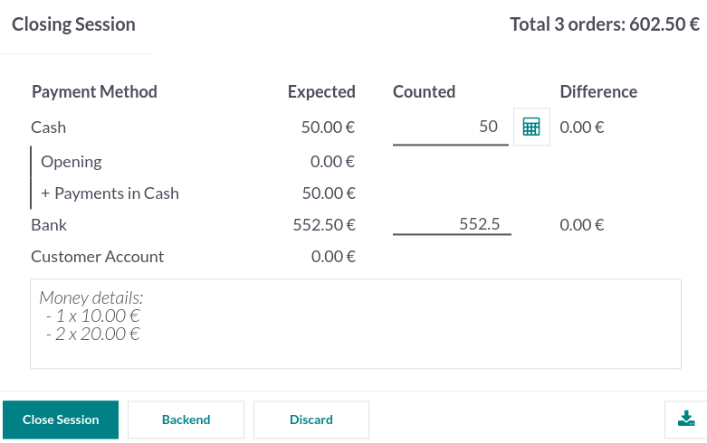

:show-content:
:show-toc:

=============
Point of Sale
=============

With **Odoo Point of Sale**, run your shops and restaurants easily. The app works on any device with
a web browser, even if you are temporarily offline. Product moves are automatically registered in
your stock, you get real-time statistics, and your data is consolidated across all shops.

.. seealso::
   - `Odoo Tutorials: Point of Sale Tutorials <https://www.odoo.com/slides/point-of-sale-28>`_
   - :doc:`IoT Boxes Documentations </applications/productivity/iot>`

.. _pos/session-start:

Start a session
===============

From the **POS dashboard**, click :guilabel:`New Session`, and at the :guilabel:`Opening Cash
Control` screen, click :guilabel:`Open Session` to start a POS session, or click :guilabel:`Continue
Selling` if the session is already opened.

.. note::
   :doc:`Multiple users <point_of_sale/employee_login>` can be logged into the same session at the
   same time. However, the session can only be opened once on the same browser.

.. _pos/sell:

Sell products
=============

Click on products to add them to the cart. To change the **quantity**, click :guilabel:`Qty` and
enter the number of products using the keypad. To add a **discount** or modify the product
**price**, click respectively :guilabel:`% Disc` or :guilabel:`Price` and enter the amounts.

Once an order is completed, proceed to checkout by clicking :guilabel:`Payment`. Select the
**payment method**, enter the received amount, and click :guilabel:`Validate`. Click
:guilabel:`New Order` to move on to the next customer.

.. tip::
   - You can use both `,` and `.` on your keyboard as decimal separators.
   - **Cash** is selected by default if you enter the amount without choosing a payment method.

.. note::
   The system can only load a limited number of products for effective opening. Click
   :guilabel:`Search more` if the desired product is not loaded automatically.

.. _pos/customers:

Set customers
=============

Registering your customer is necessary to :doc:`collect their loyalty points and grant them rewards
<point_of_sale/pricing/loyalty>`, automatically apply the :doc:`attributed pricelist
<point_of_sale/pricing/pricelists>`, or :ref:`generate and print an invoice
<receipts-invoices/invoices>`.

You can create customers from an :ref:`open POS session <pos/session-start>` by clicking
:menuselection:`Customer --> Create`, and filling in the contact information. You can also create
customers from the backend by going to :menuselection:`Point of Sale --> Orders --> Customers` and
clicking :guilabel:`New`. Then, fill in the information and save.

To set a customer during an order, access the list of customers by clicking :guilabel:`Customer` on
the POS interface. You can also set a customer at the payment screen by clicking
:guilabel:`Customer`.

.. _pos/customer-notes:

Customer notes
==============

You can add **customer notes** about specific products directly from an open :ref:`POS session
<pos/session-start>`. For instance, to provide cleaning and maintenance tips. They can also be used
to track a customer's particular request, such as not wanting the product to be assembled for them.

To do so, select a product and click :guilabel:`Customer Note` on the pad. Doing so opens a pop-up
window in which you can add or modify content for the note.

.. note::
   Product notes from an :doc:`imported SO <point_of_sale/shop/sales_order>` are displayed
   identically in the cart.

Customer notes appear on customers' receipts and invoices similarly to how they appear in the cart,
under the related product.

.. image:: point_of_sale/notes-receipt.png
   :alt: Customer receipt with notes from an SO and from the customer note feature

.. _pos/refund:

Return and refund products
==========================

To return and refund a product,

#. :ref:`start a session <pos/session-start>` from the **POS dashboard**;
#. click :guilabel:`Refund` and select the corresponding order;
#. select the product and the quantity to refund using the keypad;
#. click :guilabel:`Refund` to go back to the previous screen;
#. once the order is completed, click :guilabel:`Payment` to proceed to the refund;
#. click :guilabel:`Validate` and :guilabel:`New Order` to move on to the next customer.

.. image:: point_of_sale/refund.png
   :alt: refund view from a POS

.. note::
   - You can filter the **orders list** by :guilabel:`Receipt Number`, :guilabel:`Date` or
     :guilabel:`Customer` using the search bar.
   - You can also refund a product by selecting the returned product from an open session, and
     setting a negative quantity that equals the number of returned products. To do so, click
     :guilabel:`Qty` and :guilabel:`+/-`, followed by the quantity of returned products.

.. _pos/cash-register:

Manage the cash register
========================

To add or take out cash from the register, click the **menu icon** in the upper right corner of your
screen and :guilabel:`Cash In/Out`.

         orders

Doing so opens a pop-up window on which you can select :guilabel:`Cash In` or :guilabel:`Cash Out`,
enter the amount and the reason, and click :guilabel:`Confirm`.

.. _pos/session-close:

Close the POS session
=====================

To close your session, click the **menu icon** in the upper right corner of your screen and
:guilabel:`Close Session`.

Doing so opens the :guilabel:`Closing Control` pop-up screen. From this screen, you can retrieve
various information:

- the number of orders made and the total amount made during the session;
- the expected amounts grouped by payment method.

Before closing this window, count your cash using the calculator icon. Doing so opens a pop-up
window that computes the total amount in the cash drawer depending on the coins and bills counted
and added manually. Then, click :guilabel:`Confirm` or :guilabel:`Discard` to close the window. The
computed amount is set in the :guilabel:`Counted` column, and the :guilabel:`Money Details` are
specified in the **Notes** section.

Once you are done controlling the amounts, click :guilabel:`Close Session` to close and go back to
the **POS dashboard**.

.. note::
   - To reach the backend without closing the session, click :guilabel:`Backend` on the dropdown
     menu.
   - To abort, click :guilabel:`Discard` on the pop-up window.
   - Depending on your setup, you might only be allowed to close a session if the expected cash
     revenue equals the counted cash. To close it anyway, click :guilabel:`Ok` on the
     :guilabel:`Payments Difference` screen.

.. tip::
   - It is strongly advised to close your POS session at the end of each day.
   - To look at all your previous sessions, go to :menuselection:`Point of Sale --> Orders -->
     Sessions`.

.. toctree::
   :titlesonly:

   point_of_sale/employee_login
   point_of_sale/receipts_invoices
   point_of_sale/combos
   point_of_sale/configuration
   point_of_sale/shop
   point_of_sale/restaurant
   point_of_sale/pricing
   point_of_sale/payment_methods
   point_of_sale/reporting
