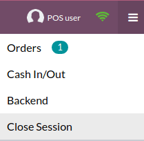
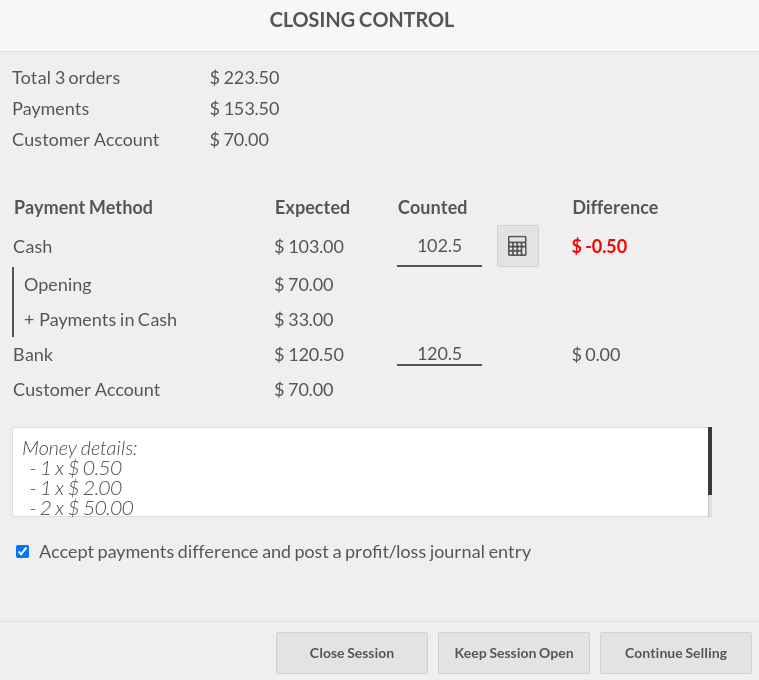

:show-content:
:show-toc:

=============
Point of Sale
=============

With **Odoo Point of Sale**, run your shops and restaurants easily. The app operates on any device
with a web browser, and keeps running even in the event of temporary network disconnection.

Point-of-sale systems are commonly used in :doc:`stores <point_of_sale/shop>` or :doc:`restaurants
<point_of_sale/restaurant>`. Odoo POS can also be set up for :doc:`self-ordering
<point_of_sale/self_order>`, allowing customers to order using their own mobile or a self-ordering
kiosks.

Like all Odoo applications, :abbr:`POS (Point of Sale)` is fully integrated with the entire Odoo
ecosystem. For instance, product movements are automatically registered in
:doc:`Inventory <../inventory_and_mrp/inventory>` and all POS transactions are recorded in
:doc:`Accounting <../finance/accounting>`.

Odoo POS integrates with all essential point-of-sale hardware, including :doc:`payment terminals
<point_of_sale/payment_methods/terminals>`, cash drawers, weighing scales, :doc:`barcode scanners
<point_of_sale/shop/barcode>`, :doc:`customer displays <point_of_sale/shop/customer_display>`,
:doc:`preparation displays <point_of_sale/preparation>`, and :doc:`electronic shelf labels
<point_of_sale/pricing/electronic_labels>`. This hardware can be connected directly or through an
:doc:`IoT system <../general/iot>`, ensuring a comprehensive and connected retail environment.

.. seealso::
   `Odoo Tutorials: Point of Sale tutorials <https://www.odoo.com/slides/point-of-sale-28>`_

.. _pos/session-start:

Start a session
===============

Once the POS is fully :doc:`configured <point_of_sale/configuration>`, start a session from
:menuselection:`Point of Sale --> Dashboard`:

#. Click :guilabel:`Open Register`.
#. At the :guilabel:`Opening Control` screen, ensure the :guilabel:`Opening cash` amount is correct.
#. Click :guilabel:`Open Register` again.

.. note::
   - Once the session is open, :guilabel:`Open Register` is replaced by :guilabel:`Continue
     Selling`.
   - :doc:`Multiple users <point_of_sale/employee_login>` can be logged into the same session at the
     same time. However, the session can only be opened once on the same browser.

.. _pos/sell:

Sell products
=============

The POS :abbr:`UI (user interface)` can be divided in three distinctive sections: the cart, a pad
to adjust cart items, apply discounts, set customers, etc., and the list of products. To make sales:

#. Click on products to add them to the cart.

   #. To change the **quantity**, click :guilabel:`Qty` and enter the number of products using the
      keypad.
   #. To add a **discount** or modify the product **price**, click respectively :guilabel:`% Disc`
      or :guilabel:`Price` and enter the amounts.
#. Once an order is completed, proceed to checkout by clicking :guilabel:`Payment`.

   #. Select the **payment method**.
   #. Enter the received amount.
   #. Click :guilabel:`Validate`.
#. Finally, click :guilabel:`New Order` to move on to the next customer.

.. image:: point_of_sale/pos-interface.png
   :alt: POS session interface.
   :scale: 45 %

.. tip::
   - Use both `,` and `.` on the keyboard as decimal separators.
   - **Cash** is selected by default if no payment method is manually selected.

.. note::
   Click the :icon:`fa-plus-circle` :guilabel:`(plus)` icon to put an order aside and start a new
   one.

.. _pos/customers:

Set customers
=============

Registering customers is necessary to :doc:`collect their loyalty points and grant them rewards
<point_of_sale/pricing/loyalty>`, automatically apply an :doc:`attributed pricelist
<point_of_sale/pricing/pricelists>`, or :ref:`generate and print invoices
<receipts-invoices/invoices>`.

To create customers from an :ref:`open POS session <pos/session-start>`:

#. Click :guilabel:`Customer`.
#. Click :guilabel:`Create`.
#. Then, complete the contact information.

To create customers from the backend:

#. Go to :menuselection:`Point of Sale --> Orders --> Customers`.
#. Click :guilabel:`New`.
#. Then, fill in the information and save.

To assign a customer to an order, click :guilabel:`Customer` to access the customer list on the POS
interface or at the payment screen, and select the desired customer.

.. _pos/customer-notes:

Notes
=====

Customer and general notes
--------------------------

Notes for customers appear on receipts and invoices. These notes come in two forms: customer notes
for specific products and general notes for the entire order. To add a **customer note** during an
:ref:`open POS session <pos/session-start>`:

#. Select a product from the cart.
#. Click :guilabel:`Actions`.
#. Select :guilabel:`Customer Note`, which opens a modal window in which to add or modify content
   for the note.

To add a **general note** for the complete order:

#. Click :guilabel:`Actions` and
#. Click :guilabel:`General Note`, which opens a modal window in which to add or modify content
   for the note.

   - Manually type in the note content.
   - Click the configured note model.

To configure note models, go to :menuselection:`

.. note::
   - Product notes from an :doc:`imported SO <point_of_sale/shop/sales_order>` are displayed
     identically in the cart.
   - Save time by creating note models.

.. image:: point_of_sale/customer-notes.png
   :alt: Customer note button and notes (SO and POS session) on products in the cart
   :scale: 50 %

Internal notes
--------------

In parallel, Internal Notes attach to items similarly but are destined to other users. For
example, an additional information about an order for a cook, such as no tomato. That information,
while useful, shouldn't be printed on the customer receipt. To add an **internal note**:

#. Select an item from the cart
#. Click :guilabel:`Internal Note` to add a note about that specific item.

.. _pos/refund:

Return and refund products
==========================

To refund a returned product, follow these steps:

#. :ref:`Start a session <pos/session-start>` from the **POS dashboard**.
#. Click :guilabel:`Actions`, then :icon:`fa-undo` :guilabel:`Refund`, and select the corresponding
   order.
#. Select items and use the keypad to set the quantity to refund, then click :guilabel:`Refund`.
#. Click :guilabel:`Payment` and select the appropriate refund payment method.
#. Click :guilabel:`Validate` and print the receipt if needed.
#. Click :guilabel:`New Order` to proceed to the next customer.

.. tip::
   - To filter the **orders list** by :guilabel:`Order number`, :guilabel:`Receipt Number`,
     :guilabel:`Date`, or :guilabel:`Customer`, enter a value in the search bar and choose the
     relevant filter from the dropdown menu.
   - When the total amount is negative, adding a gift card to the cart automatically adjusts the
     gift card balance to match that amount.

.. note::
   Alternatively, a refund can be processed by selecting the returned product(s) from an open
   session and setting a negative quantity equal to the number of returned items. To do so, click
   :guilabel:`Qty` and :guilabel:`+/-`, and update the quantity accordingly.

Once the return payment is validated, Odoo generates the required credit note, referencing the
original receipt or invoice and partially or fully canceling the document.

.. _pos/cash-register:

Manage the cash register
========================

To add or take out cash from the register, click the **menu icon** in the upper right corner of your
screen and :guilabel:`Cash In/Out`.

         orders

Doing so opens a pop-up window on which you can select :guilabel:`Cash In` or :guilabel:`Cash Out`,
enter the amount and the reason, and click :guilabel:`Confirm`.

.. _pos/session-close:

Close the POS session
=====================

To close your session, click the **menu icon** in the upper right corner of your screen and
:guilabel:`Close Session`.

Doing so opens the :guilabel:`Closing Control` pop-up screen. From this screen, you can retrieve
various information:

- the number of orders made and the total amount made during the session;
- the expected amounts grouped by payment method.

Before closing this window, count your cash using the calculator icon. Doing so opens a pop-up
window that computes the total amount in the cash drawer depending on the coins and bills counted
and added manually. Then, click :guilabel:`Confirm` or :guilabel:`Discard` to close the window. The
computed amount is set in the :guilabel:`Counted` column, and the :guilabel:`Money Details` are
specified in the **Notes** section.

Once you are done controlling the amounts, click :guilabel:`Close Session` to close and go back to
the **POS dashboard**.

.. note::
   - To reach the backend without closing the session, click :guilabel:`Backend` on the dropdown
     menu.
   - To abort, click :guilabel:`Discard` on the pop-up window.
   - Depending on your setup, you might only be allowed to close a session if the expected cash
     revenue equals the counted cash. To close it anyway, click :guilabel:`Ok` on the
     :guilabel:`Payments Difference` screen.

.. tip::
   - It is strongly advised to close your POS session at the end of each day.
   - To look at all your previous sessions, go to :menuselection:`Point of Sale --> Orders -->
     Sessions`.

.. toctree::
   :titlesonly:

   point_of_sale/configuration
   point_of_sale/employee_login
   point_of_sale/receipts_invoices
   point_of_sale/preparation
   point_of_sale/self_order
   point_of_sale/combos
   point_of_sale/shop
   point_of_sale/restaurant
   point_of_sale/pricing
   point_of_sale/payment_methods
   point_of_sale/pos_based_marketing
   point_of_sale/online_food_delivery
   point_of_sale/reporting
