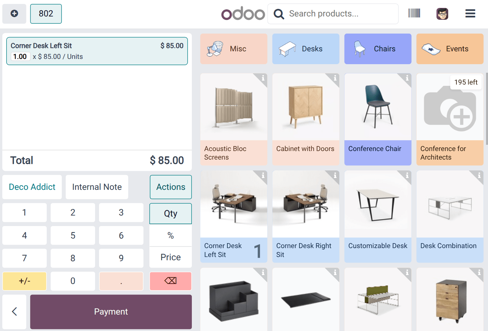
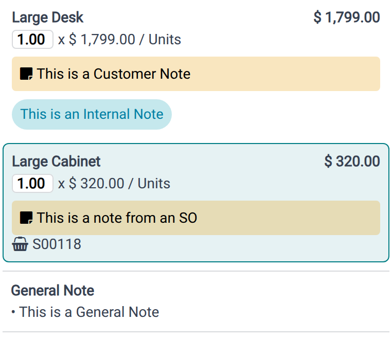

:show-content:
:show-toc:

=============
Point of Sale
=============

Odoo **Point of Sale** is designed for managing shops and restaurants. It is web-browser-based,
allowing it to run on any device, and is built to maintain functionality even during temporary
network outages.

Beyond traditional :doc:`stores <point_of_sale/shop>` and :doc:`restaurants
<point_of_sale/restaurant>` settings, Odoo :abbr:`POS (Point of Sale)` also supports a
:doc:`self-ordering <point_of_sale/self_order>` feature, enabling customers to place orders and make
payments using a dedicated kiosk or their own mobile devices.

As with all Odoo applications, Odoo Point of Sale is fully integrated with the entire Odoo
ecosystem. This integration primarily ensures that:

- Product movements are automatically tracked and registered in the :doc:`Inventory
  <../inventory_and_mrp/inventory>` application.
- All POS transactions are recorded in the :doc:`Invoicing <../finance/accounting>` or, if
  installed, :doc:`Accounting <../finance/accounting>` application.
- :doc:`Sales orders <point_of_sale/shop/sales_order>` created from the :doc:`Sales <sales>` or
  :doc:`Website <../websites>` application can be retrieved and settled in Point of Sale.

Odoo :abbr:`POS (Point of Sale)` integrates with all essential point-of-sale hardware, including:

- :doc:`Payment terminals <point_of_sale/payment_methods/terminals>`;
- Cash drawers;
- :doc:`Cash machines <point_of_sale/payment_methods/cash_machines>`;
- :ref:`Weighing scales <pos/hardware/scale>`;
- :doc:`Barcode scanners <point_of_sale/shop/barcode>`;
- :ref:`Customer displays <pos/hardware/display>`;
- :doc:`Preparation displays <point_of_sale/preparation>`;
- :doc:`Electronic shelf labels <point_of_sale/pricing/electronic_labels>`.

This hardware can be connected directly or through an :doc:`IoT system <../general/iot>`, ensuring a
comprehensive and connected retail environment.

.. seealso::
   `Odoo Tutorials: Point of Sale tutorials <https://www.odoo.com/slides/point-of-sale-28>`_

.. _pos/open-register:

Use
===

Once the POS is fully :doc:`configured <point_of_sale/configuration>`, access the POS interface by
opening the register. Navigate to :menuselection:`Point of Sale --> Dashboard` and:

#. On a POS card, click :guilabel:`Open Register`.
#. At the :guilabel:`Opening Control` screen, ensure the :guilabel:`Opening cash` amount is correct.
#. Click :guilabel:`Open Register` again.

.. note::
   - Once the register is open, :guilabel:`Open Register` is replaced by :guilabel:`Continue
     Selling` on the POS card.
   - :doc:`Multiple users <point_of_sale/employee_login>` can be logged into the same register at
     the same time. However, the register can only be opened once on the same browser.

From the top header of the POS interface:

- Click :guilabel:`Register` to access the register for daily POS actions such as :ref:`sales
  <pos/sell>`, :ref:`refunds <pos/refund>`, etc.
- Click :guilabel:`Orders` to access the POS :ref:`orders <pos/orders>` overview screen to retrieve
  past or ongoing orders.
- Click the :icon:`fa-plus-circle` :guilabel:`(plus)` icon to put the current order aside and start
  a new one.
- Click the order numbers to jump between ongoing orders.
- Search for products using the search bar.
- Click the :icon:`fa-barcode` (:guilabel:`barcode`) icon to use a webcam as a barcode scanner.
- Click the user's avatar to :ref:`switch between employees <pos/employee_login/use>`.
- Click the :icon:`fa-bars` (:guilabel:`hamburger menu`) icon to access more advanced options, such
  as :ref:`closing the register <pos/register-close>`.

.. _pos/orders:

Orders overview
---------------

The :guilabel:`Orders` overview allows for viewing, searching, and retrieving orders from the POS
interface. Access this view by clicking :guilabel:`Orders` on the interface top header.

Then, search for orders in the search bar using their:

- :guilabel:`Reference`
- :guilabel:`Receipt Number`
- :guilabel:`Date`
- :guilabel:`Customer`
- :guilabel:`Delivery Channel`
- :guilabel:`Delivery Order Status`

To filter orders based on their status, click the :guilabel:`Active` dropdown menu and select one of
the following options:

- :guilabel:`Active`: Orders in progress, either marked as :guilabel:`Ongoing`, in the
  :guilabel:`Payment` stage or the :guilabel:`Receipt` stage, meaning orders for which the receipt
  has been emailed to the customer.
- :guilabel:`Paid`: Paid orders.

To navigate between pages, click the :icon:`fa-caret-left` or :icon:`fa-caret-right`
(:guilabel:`caret`) icon.

To access an order in the register, click it, then click :guilabel:`Load Order`.

.. note::
   Paid orders can be :ref:`refunded <pos/refund>`.

.. tip::
  - To define the number of orders visible on a page, click `1-x / x`. Enter a number lower than
    the total number of pages, and click :guilabel:`Ok`.
  - Click the :icon:`fa-trash` (:guilabel:`trash`) icon next to an :guilabel:`Active` order to
    delete it.
  - If using :ref:`presets <pos/restaurant/orders/preset>`, click one to view to view the related
    orders. Click it again to return to the main overview.

.. _pos/sell:

Sell products
-------------

The POS register can be divided in three distinctive sections: the cart, a numpad to adjust cart
items, apply discounts, set customers, etc., and the list of products. To make sales:

#. Click on products to add them to the cart.

   #. To change the **quantity**, click :guilabel:`Qty` and enter the number of products using the
      keypad.
   #. To add a **discount**, click :guilabel:`% Disc` and enter the discount value using the keypad.
   #. To modify the product **price**, click :guilabel:`Price` and enter new product price using the
      keypad.
#. Once an order is completed, proceed to checkout by clicking :guilabel:`Payment`.

   #. Select the **payment method**.
   #. Enter the received amount.
   #. Click :guilabel:`Validate`.
#. Finally, click :guilabel:`New Order` to move on to the next customer.

.. tip::
   - Use both `,` and `.` on the keyboard as decimal separators.
   - **Cash** is selected by default if no payment method is manually selected.

.. _pos/customers:

Set customers
-------------

Registering customers is necessary to :doc:`collect their loyalty points and grant them rewards
<point_of_sale/pricing/loyalty>`, automatically apply an :doc:`attributed pricelist
<point_of_sale/pricing/pricelists>`, or :ref:`generate and print invoices
<pos_invoices/invoices>`.

To create customers from an :ref:`the POS register <pos/open-register>`:

#. Click :guilabel:`Customer`.
#. Click :guilabel:`Create`.
#. Then, complete the contact information.

To create customers from the backend:

#. Go to :menuselection:`Point of Sale --> Orders --> Customers`.
#. Click :guilabel:`New`.
#. Then, fill in the information and save.

To assign a customer to an order, click :guilabel:`Customer` to access the customer list on the POS
register or at the payment screen, and select the desired customer.

.. note::
   Creating a new customer assign them automatically to the order upon saving.

.. _pos/refund:

Return and refund products
--------------------------

To refund a returned product, follow these steps:

#. :ref:`Open the register <pos/open-register>` from the **POS dashboard**.
#. Click :guilabel:`Actions`, then :icon:`fa-undo` :guilabel:`Refund`, and select the corresponding
   order.
#. Select items and use the keypad to set the quantity to refund, then click :guilabel:`Refund`.
#. Click :guilabel:`Payment` and select the appropriate refund payment method.
#. Click :guilabel:`Validate` and print the receipt if needed.
#. Click :guilabel:`New Order` to proceed to the next customer.

.. tip::
   - To filter the **orders list** by :guilabel:`Order number`, :guilabel:`Receipt Number`,
     :guilabel:`Date`, or :guilabel:`Customer`, enter a value in the search bar and choose the
     relevant filter from the dropdown menu.
   - When the total amount is negative, adding a gift card to the cart automatically adjusts the
     gift card balance to match that amount.

.. note::
   Alternatively, a refund can be processed by selecting the returned product(s) from the POS
   register and setting a negative quantity equal to the number of returned items. To do so, click
   :guilabel:`Qty` and :guilabel:`+/-`, and update the quantity accordingly.

Once the return payment is validated, Odoo generates the required credit note, referencing the
original receipt or invoice and partially or fully canceling the entry.

.. _pos/customer-notes:

Notes
-----

Customer and general notes
~~~~~~~~~~~~~~~~~~~~~~~~~~

Notes for customers appear on :ref:`receipts <pos/configuration/receipts>` and invoices. These notes
come in two forms: customer notes for specific products and general notes for the entire order. To
add a **customer note** from the :ref:`POS register <pos/open-register>`:

#. Select a product from the cart.
#. Click :guilabel:`Actions`.
#. Select :guilabel:`Customer Note`, which opens a pop-up window to add or modify the note's
   content.

.. note::
   Product notes from an :doc:`imported SO <point_of_sale/shop/sales_order>` are displayed
   identically in the cart.

To add a **general note** for the complete order:

#. Click :guilabel:`Actions`, and
#. :guilabel:`General Note`, which opens a pop-up window. To add or modify the note's content:

   - Type the note directly into the window, or
   - Use a configured note model to save time if the same content is frequently used. Click on the
     desired note model to insert its text.

To set up note models:

#. Navigate to :menuselection:`Configuration --> Note Models`.
#. Click :guilabel:`New` and enter the desired text for your note model. Then, save it.

Internal notes
~~~~~~~~~~~~~~

In parallel, **internal notes** attach to items similarly but are destined to other users. For
example, an additional information about an order for a cook, such as `no tomato`. That information,
while useful, shouldn't be printed on the customer receipt. To add an **internal note**:

#. Select an item from the cart.
#. Click :guilabel:`Internal Note`, which opens a pop-up window to add or modify the note's content.

.. _pos/cash-register:

Manage the cash register
------------------------

Odoo POS allows you to determine which coins and bills are accepted. To set up the allowed coins and
bills:

#. Navigate to :menuselection:`Configuration --> Coins/Bills`.
#. Click :guilabel:`New` to add a new value.
#. Select the POS where this value is available in the :guilabel:`Point of Sale` column.

To record a cash in or cash out transaction not associated with a sale:

#. Click :icon:`fa-bars` (:guilabel:`hamburger menu`) on the POS interface.
#. Click :guilabel:`Cash In/Out`, which opens a pop-up window.
#. Select :guilabel:`Cash In` or :guilabel:`Cash Out`.
#. Enter the amount.
#. Specify the reason for this addition or removal of cash, and :guilabel:`Confirm`.

.. note::
   Some users might not be allowed to do cash in or out actions depending on their :doc:`POS access
   rights <point_of_sale/employee_login>`.

.. _pos/register-close:

Close the POS register
----------------------

To close the POS register, click :icon:`fa-bars` (:guilabel:`hamburger menu`) and :guilabel:`Close
Register`.

Doing so opens the :guilabel:`Closing Register` pop-up screen. From this screen, you can retrieve:

- The number of orders and the total amount made during the session.
- The expected amounts grouped by payment method.

#. Click :icon:`fa-money` (:guilabel:`money`) to specify the number of each coin and bill.
#. Click :guilabel:`Confirm` to return to the previous pop-up window. The computed amount is set in
   the :guilabel:`Cash Count` field, and the :guilabel:`Closing Details` are specified in the
   :guilabel:`Closing Note` section.
#. Click :guilabel:`Close Register` to close the register and post accounting entries.

.. tip::
   Click :icon:`fa-clone` (:guilabel:`clone`) to automatically fill in the field with the expected
   cash amount.

.. note::
   - To abort, click :guilabel:`Discard` on the pop-up window.
   - When the money counted does **not** match the expected amount, a :guilabel:`Payments
     Difference` window automatically pops up. Click :guilabel:`Proceed Anyway` to log the
     difference for the books.
   - In restaurant, closing the register when orders are still in draft is not allowed and opens a
     pop-up window. Proceed with the remaining orders by clicking :guilabel:`Review Orders` or click
     :guilabel:`Cancel Orders` to cancel all of them.
   - It is strongly advised to close your POS register at the end of each day.

.. toctree::
   :titlesonly:

   point_of_sale/configuration
   point_of_sale/pos_hardware
   point_of_sale/employee_login
   point_of_sale/pos_invoices
   point_of_sale/preparation
   point_of_sale/self_order
   point_of_sale/combos
   point_of_sale/shop
   point_of_sale/restaurant
   point_of_sale/pricing
   point_of_sale/payment_methods
   point_of_sale/online_food_delivery
   point_of_sale/reporting
