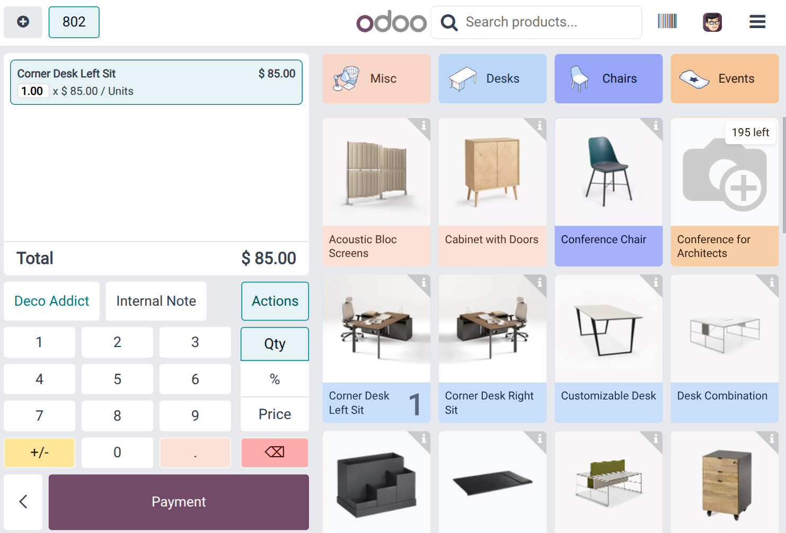

:show-content:
:show-toc:

=============
Point of Sale
=============

With **Odoo Point of Sale**, run your shops and restaurants easily. The app operates on any device
with a web browser, and keeps running even in the event of temporary network disconnection.

Point-of-sale systems are commonly used in :doc:`stores <point_of_sale/shop>` or :doc:`restaurants
<point_of_sale/restaurant>`. Odoo POS can also be set up for :doc:`self-ordering
<point_of_sale/self_order>`, allowing customers to order using their own mobile or a self-ordering
kiosks.

Like all Odoo applications, :abbr:`POS (Point of Sale)` is fully integrated with the entire Odoo
ecosystem. For instance, product movements are automatically registered in
:doc:`Inventory <../inventory_and_mrp/inventory>` and all POS transactions are recorded in
:doc:`Accounting <../finance/accounting>`.

Odoo POS integrates with all essential point-of-sale hardware, including :doc:`payment terminals
<point_of_sale/payment_methods/terminals>`, cash drawers, weighing scales, :doc:`barcode scanners
<point_of_sale/shop/barcode>`, :doc:`customer displays <point_of_sale/shop/customer_display>`,
:doc:`preparation displays <point_of_sale/preparation>`, and :doc:`electronic shelf labels
<point_of_sale/pricing/electronic_labels>`. This hardware can be connected directly or through an
:doc:`IoT system <../general/iot>`, ensuring a comprehensive and connected retail environment.

.. seealso::
   `Odoo Tutorials: Point of Sale tutorials <https://www.odoo.com/slides/point-of-sale-28>`_

.. _pos/session-start:

Start a session
===============

Once the POS is fully :doc:`configured <point_of_sale/configuration>`, start a session from
:menuselection:`Point of Sale --> Dashboard`:

#. Click :guilabel:`Open Register`.
#. At the :guilabel:`Opening Control` screen, ensure the :guilabel:`Opening cash` amount is correct.
#. Click :guilabel:`Open Register` again.

.. note::
   - Once the session is open, :guilabel:`Open Register` is replaced by :guilabel:`Continue
     Selling`.
   - :doc:`Multiple users <point_of_sale/employee_login>` can be logged into the same session at the
     same time. However, the session can only be opened once on the same browser.

.. _pos/sell:

Sell products
=============

The POS :abbr:`UI (user interface)` can be divided in three distinctive sections: the cart, a pad
to adjust cart items, apply discounts, set customers, etc., and the list of products. To make sales:

#. Click on products to add them to the cart.

   #. To change the **quantity**, click :guilabel:`Qty` and enter the number of products using the
      keypad.
   #. To add a **discount**, click :guilabel:`% Disc` and enter the discount value using the keypad.
   #. To modify the product **price**, click :guilabel:`Price` and enter new product price using the
      keypad.
#. Once an order is completed, proceed to checkout by clicking :guilabel:`Payment`.

   #. Select the **payment method**.
   #. Enter the received amount.
   #. Click :guilabel:`Validate`.
#. Finally, click :guilabel:`New Order` to move on to the next customer.

.. tip::
   - Use both `,` and `.` on the keyboard as decimal separators.
   - **Cash** is selected by default if no payment method is manually selected.

.. note::
   Click the :icon:`fa-plus-circle` :guilabel:`(plus)` icon to put an order aside and start a new
   one.

.. _pos/customers:

Set customers
=============

Registering customers is necessary to :doc:`collect their loyalty points and grant them rewards
<point_of_sale/pricing/loyalty>`, automatically apply an :doc:`attributed pricelist
<point_of_sale/pricing/pricelists>`, or :ref:`generate and print invoices
<receipts-invoices/invoices>`.

To create customers from an :ref:`open POS session <pos/session-start>`:

#. Click :guilabel:`Customer`.
#. Click :guilabel:`Create`.
#. Then, complete the contact information.

To create customers from the backend:

#. Go to :menuselection:`Point of Sale --> Orders --> Customers`.
#. Click :guilabel:`New`.
#. Then, fill in the information and save.

To assign a customer to an order, click :guilabel:`Customer` to access the customer list on the POS
interface or at the payment screen, and select the desired customer.

.. _pos/customer-notes:

Notes
=====

Customer and general notes
--------------------------

Notes for customers appear on receipts and invoices. These notes come in two forms: customer notes
for specific products and general notes for the entire order. To add a **customer note** during an
:ref:`open POS session <pos/session-start>`:

#. Select a product from the cart.
#. Click :guilabel:`Actions`.
#. Select :guilabel:`Customer Note`, which opens a modal window to add or modify the note's content.

.. note::
   Product notes from an :doc:`imported SO <point_of_sale/shop/sales_order>` are displayed
   identically in the cart.

To add a **general note** for the complete order:

#. Click :guilabel:`Actions` and
#. Click :guilabel:`General Note`, which opens a modal window to add or modify the note's content.

   - Type the note directly into the window, or
   - Use a configured note model to save time if the same content is frequently used. Click on the
     desired note model to insert its text.

To set up note models:

#. Navigate to :menuselection:`Configuration --> Note Models`.
#. Click :guilabel:`New`.
#. Enter the desired text for your note model and save it.

Internal notes
--------------

In parallel, Internal Notes attach to items similarly but are destined to other users. For
example, an additional information about an order for a cook, such as `no tomato`. That information,
while useful, shouldn't be printed on the customer receipt. To add an **internal note**:

#. Select an item from the cart.
#. Click :guilabel:`Internal Note`, which opens a modal window to add or modify the note's content.

.. image:: point_of_sale/customer-notes.png
   :alt: Customer note button and notes (SO and POS session) on products in the cart
   :scale: 50 %

.. _pos/refund:

Return and refund products
==========================

To refund a returned product, follow these steps:

#. :ref:`Start a session <pos/session-start>` from the **POS dashboard**.
#. Click :guilabel:`Actions`, then :icon:`fa-undo` :guilabel:`Refund`, and select the corresponding
   order.
#. Select items and use the keypad to set the quantity to refund, then click :guilabel:`Refund`.
#. Click :guilabel:`Payment` and select the appropriate refund payment method.
#. Click :guilabel:`Validate` and print the receipt if needed.
#. Click :guilabel:`New Order` to proceed to the next customer.

.. tip::
   - To filter the **orders list** by :guilabel:`Order number`, :guilabel:`Receipt Number`,
     :guilabel:`Date`, or :guilabel:`Customer`, enter a value in the search bar and choose the
     relevant filter from the dropdown menu.
   - When the total amount is negative, adding a gift card to the cart automatically adjusts the
     gift card balance to match that amount.

.. note::
   Alternatively, a refund can be processed by selecting the returned product(s) from an open
   session and setting a negative quantity equal to the number of returned items. To do so, click
   :guilabel:`Qty` and :guilabel:`+/-`, and update the quantity accordingly.

Once the return payment is validated, Odoo generates the required credit note, referencing the
original receipt or invoice and partially or fully canceling the document.

.. _pos/cash-register:

Manage the cash register
========================

Odoo POS allows you to determine which coins and bills are allowed into a cash drawer. For example,
bills over a specific amount could go directly into a safe; in this case, they couldn't be counted.
To set up the allowed coins and bills:

#. Navigate to :menuselection:`Configuration --> Coins/Bills`.
#. Click :guilabel:`New` to add a new value.
#. Select the POS where this value is available in the :guilabel:`Point of Sale` column.

To add or take out cash from the register:

#. From an open session, click :icon:`fa-bars` (:guilabel:`hamburger menu`).
#. Click :guilabel:`Cash In/Out`, which opens a modal window.
#. Select :guilabel:`Cash In` or :guilabel:`Cash Out`.
#. Enter the amount.
#. Specify the reason for this addition or removal of cash.
#. Finally, click :guilabel:`Confirm`.

.. note::
   Some users might not be allowed to do cash in or out actions depending on their :doc:`POS access
   rights <point_of_sale/employee_login>`.

.. _pos/session-close:

Close the POS session
=====================

To close a session, click :icon:`fa-bars` (:guilabel:`hamburger menu`) and :guilabel:`Close
Register`.

Doing so opens the :guilabel:`Closing Register` modal screen. From this screen, you can retrieve:

- The number of orders and the total amount made during the session.
- The expected amounts grouped by payment method.

#. Click :icon:`fa-money` (:guilabel:`money`) to specify the number of each coin and bill.
#. Click :guilabel:`Confirm` to return to the previous modal window. The computed amount is set in
   the :guilabel:`Cash Count` field, and the :guilabel:`Closing Details` are specified in the
   :guilabel:`Closing Note` section.
#. Click :guilabel:`Close Register` to close the register and post accounting entries.

.. tip::
   Click :icon:`fa-clone` (:guilabel:`clone`) to automatically fill in the field with the expected
   amount.

.. note::
   - To abort, click :guilabel:`Discard` on the modal window.
   - When the money counted does **not** match the expected amount, a :guilabel:`Payments
     Difference` modal window automatically opens. Click :guilabel:`Proceed Anyway` to log the
     difference for the books.
   - In restaurant, closing the register when orders are still in draft is not allowed and opens a
     modal window. Proceed with the remaining orders by clicking :guilabel:`Review Orders` or click
     :guilabel:`Cancel Orders` to cancel all of them.
   - It is strongly advised to close your POS session at the end of each day.

.. toctree::
   :titlesonly:

   point_of_sale/configuration
   point_of_sale/employee_login
   point_of_sale/receipts_invoices
   point_of_sale/preparation
   point_of_sale/self_order
   point_of_sale/combos
   point_of_sale/shop
   point_of_sale/restaurant
   point_of_sale/pricing
   point_of_sale/payment_methods
   point_of_sale/pos_based_marketing
   point_of_sale/online_food_delivery
   point_of_sale/reporting
