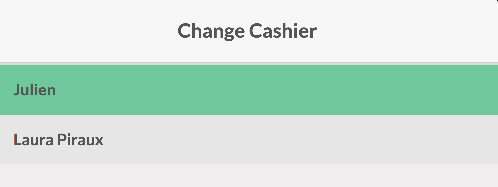
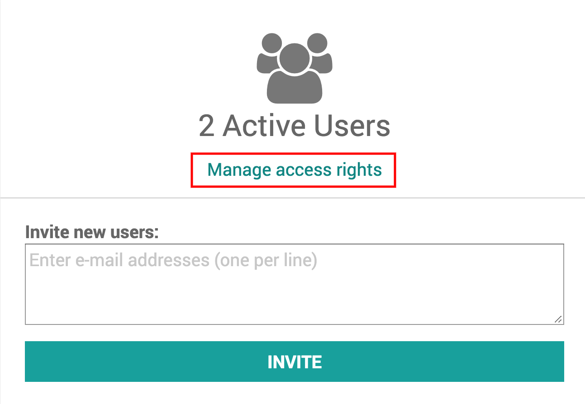
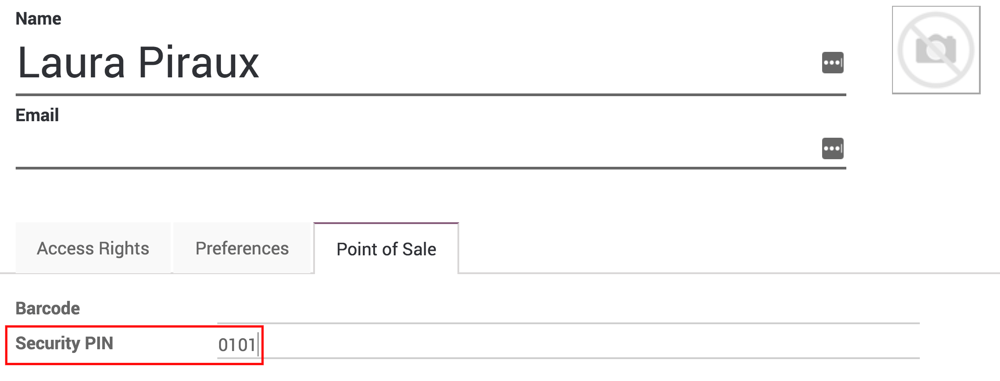
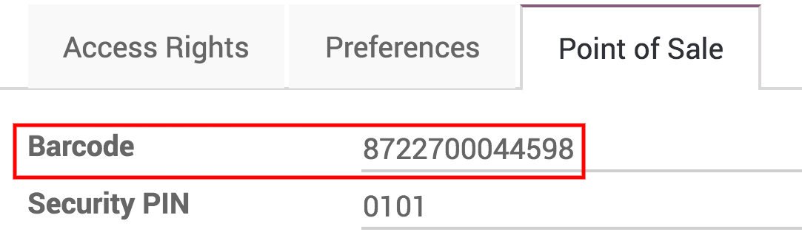

========================
Manage multiple cashiers
========================

With Odoo Point of Sale, you can easily manage multiple cashiers. This
allows you to keep track on who is working in the Point of Sale and
when.

There are three different ways of switching between cashiers in Odoo.
They are all explained below.

.. note::
    To manage multiple cashiers, you need to have several users (at
    least two).

Switch without pin codes
========================

The easiest way to switch cashiers is without a code. Simply press on
the name of the current cashier in your PoS interface.

You will then be able to change between different users.

And the cashier will be changed.

Switch cashiers with pin codes
==============================

You can also set a pin code on each user. To do so, go to
:menuselection:`Settings --> Manage Access rights` and select the user.

On the user page, under the *Point of Sale* tab you can add a Security
PIN.

Now when you switch users you will be asked to input a PIN password.

.. image:: media/multi_cashiers05.png
    :align: center

Switch cashiers with barcodes
=============================

You can also ask your cashiers to log themselves in with their badges.

Back where you put a security PIN code, you could also put a barcode.

When they scan their barcode, the cashier will be switched to that user.

.. seealso:: Barcode nomenclature link later on
