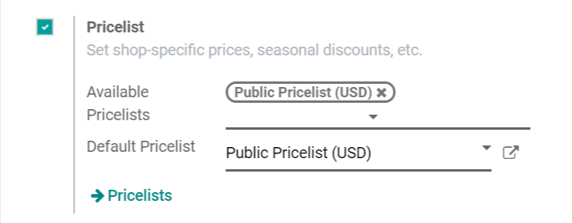

=================================
Using Pricelists in Point of Sale
=================================

You probably know the concept of happy hour: during a certain period of
time, the barman gives a discount on some drinks (usually 50% off or a
buy one get one free). When the period is over, prices go back to
normal. But how does that relate with Odoo?

In Odoo, you can set up happy hours. It’s one of the many possible uses
of *Pricelists*. Those *Pricelists* allow the creation of
multiple prices for the same product: a regular one and a special one
for happy hours. Available in the *PoS* app, those are really
convenient.

Set up Pricelists
=================

To set up a *Pricelist*, go to :menuselection:`Point of Sale --> Configuration --> Configuration`
and enable the *Pricelist* feature. Then, go to :menuselection:`Point of Sale --> Configuration
--> Point of Sale` and enable *Pricelist* for the *PoS*.

Now, you can create *Pricelists* by clicking on the *Pricelists* link.
Then, set it up by choosing the product category you want to include in your happy hour
and the discount.

.. image:: pricelists/pricelists_02.png
   :align: center

Go back to your *PoS* settings and add the Happy Hour pricelist to the
list. You can even choose a default pricelist if needed.

.. image:: pricelists/pricelists_03.png
   :align: center

From now on, on the *PoS* interface, a new button is available, allowing you to choose
among the different *pricelists* you added before.

.. image:: pricelists/pricelists_04.png
   :align: center

.. seealso::
   * :doc:`../../sales/products_prices/prices/pricing`
