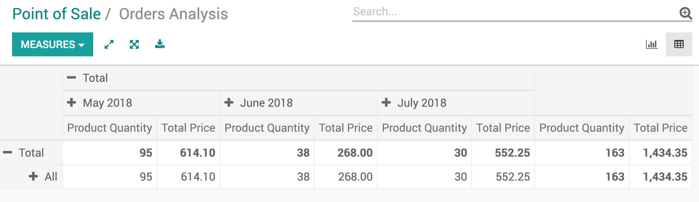
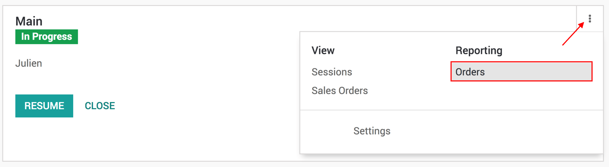

==================================
View your Point of Sale statistics
==================================

Keeping track of your sales is key for any business. That's why Odoo
provides you a practical view to analyze your sales and get meaningful
statistics.

View your statistics
====================

To access your statistics go to :menuselection:`Point of Sale -->
Reporting --> Orders`

You can then see your various statistics in graph or pivot form.

.. note::
    You can also access the stats views by clicking here

