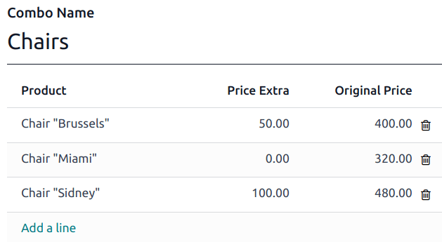
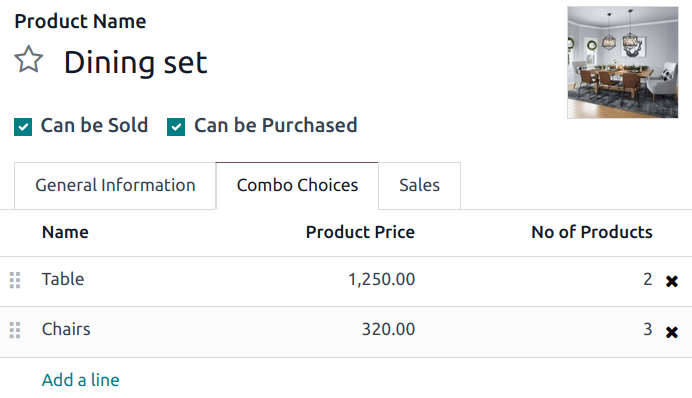
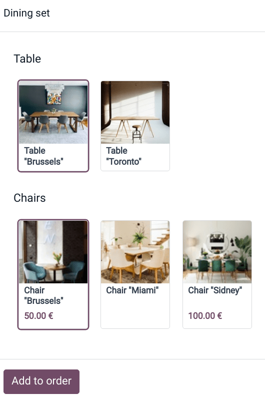

==============
Product combos
==============

The **Product Combos** feature allows users to define and manage combination options for a single
product.

In the context of a restaurant, the feature enables users to create multiple-choice menus. For
example, a user can define a main dish and specify various options for sides, drinks, or desserts
that customers can combine with the main dish.

In retail, this feature allows you to create a product set with multiple products to choose from and
combine.

Configuration
=============

First, you need to create combination choices. To do so:

#. Go to :menuselection:`Point of Sale --> Products --> Product Combos` and click :guilabel:`New`.
#. Name your combo and add the products you want customers to choose from by clicking :guilabel:`Add
   a line`. You can also include an extra price for each option in the :guilabel:`Extra Price`
   column.

.. note::
   As a reference, the selected product's original price is displayed in the :guilabel:`Original
   Price` column.

Second, you need to create a specific product to gather combo choices. To do this:

#. Go to :menuselection:`Point of Sale --> Products --> Products` and click :guilabel:`New`.
#. Set the :guilabel:`Product Type` to :guilabel:`Combo` and fill in the  :guilabel:`General
   Information` tab.

   .. note::
      The sales price of the combo product is fixed and does not vary based on the individual prices
      of included items or the quantity of items in the combo. The combo product price is only
      affected by the extra price optionally defined at the combo choice creation or if a variant of
      one of the items has a specified extra price.
#. Go to the :guilabel:`Combo Choices` tab, click :guilabel:`Add a line`, and select the
   combinations to add. You can also create a new combination at this step by clicking
   :guilabel:`New` on the popup window.

Once you have created and added the combo choices into a product, you can sell combos in your retail
store or restaurant.

Practical application
=====================

:ref:`Open a POS session <pos/session-start>` and select the combo product. Choose the options and
click :guilabel:`Add to order`. As a reminder, the extra price appears under the related choices.

