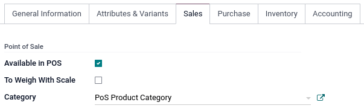

:show-content:
:show-toc:

=============
Configuration
=============

.. _configuration/settings:

Access POS settings
===================

To access the general POS settings, go to :menuselection:`Point of Sale --> Configuration -->
Settings`. Then, open the dropdown menu in the :guilabel:`Point of Sale` field and select the POS to
configure.

.. image:: configuration/select-pos-dropdown.png
   :alt: Dropdown menu to select the POS in the app settings

.. note::
   These settings are available to users with the :doc:`access rights
   </applications/general/users/manage_users>` :guilabel:`Administration` set as
   :guilabel:`Settings`.

You can also configure some settings from the dashboard by clicking the vertical ellipsis button
(:guilabel:`⋮`) on a POS card. Doing so opens a popup window, from which you can:

- :doc:`Enable multiple employees to log in. <employee_login>`
- :doc:`Connect and set up an IoT box. <../../productivity/iot/config/pos>`
- :doc:`Connect and set up an ePOS printer. <configuration/epos_ssc>`

.. image:: configuration/toggle-settings.png
   :alt: popup window to access quick settings in POS

.. note::
   These settings are available to users with the :doc:`access rights
   </applications/general/users/manage_users>` :guilabel:`Point of Sale` set as
   :guilabel:`Administrator`.

Make products available
=======================

To make products available for sale, go to :menuselection:`Point of Sale --> Products --> Products`,
and select a product to open the product form. In the :guilabel:`Sales` tab, enable
:guilabel:`Available in POS`.

.. toctree::
   :titlesonly:

   configuration/https
   configuration/epos_ssc
