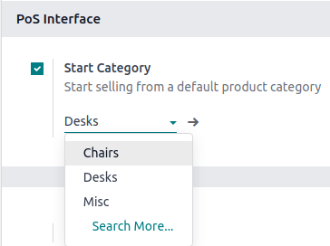
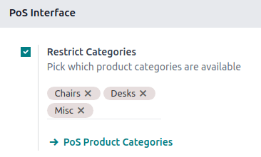

:show-content:
:show-toc:

=============
Configuration
=============

.. _configuration/settings:

Access the POS settings
=======================

To access the general POS settings, go to :menuselection:`Point of Sale --> Configuration -->
Settings`. Then, open the dropdown menu in the :guilabel:`Point of Sale` field and select the POS to
configure.

.. image:: configuration/select-pos-dropdown.png
   :alt: Dropdown menu to select the POS in the app settings

.. note::
   These settings are available to users with the :doc:`access rights </applications/general/users>`
   :guilabel:`Administration` set as :guilabel:`Settings`.

You can also configure some settings from the dashboard by clicking the vertical ellipsis button
(:guilabel:`⋮`) on a POS card. Doing so opens a popup window, from which you can:

- :doc:`Enable multiple employees to log in. <employee_login>`
- :doc:`Connect and set up an IoT sytem. <configuration/pos_iot>`
- :doc:`Connect and set up an ePOS printer. <configuration/epos_ssc>`

.. image:: configuration/toggle-settings.png
   :alt: popup window to access quick settings in POS

.. note::
   These settings are available to users with the :doc:`access rights </applications/general/users>`
   :guilabel:`Point of Sale` set as :guilabel:`Administrator`.

Make products available
=======================

To make products available for sale, go to :menuselection:`Point of Sale --> Products --> Products`,
and select a product to open the product form. In the :guilabel:`Sales` tab, enable
:guilabel:`Available in POS`.

.. image:: configuration/pos-available.png
   :alt: Making a product available in your POS.

PoS product categories
======================

Configuration
-------------

POS product categories allow users to categorize products and get a more structured and clean
POS interface.

To manage PoS categories, go to :menuselection:`Point of Sale --> Configuration --> PoS Product
Categories`. To add a new category, click :guilabel:`Create`. Then, name it in the
:guilabel:`Category Name` field.

To associate a category with a parent category, fill in the :guilabel:`Parent Category` field. A
parent category groups one or more child categories.

.. example::
   .. image:: configuration/parent-categories.png
      :alt: The PoS product categories grouped by parent categories

Assign PoS product categories
-----------------------------

Go to :menuselection:`Point of Sale --> Products --> Products` and open a product form. Then, go to
the :guilabel:`Sales` tab and fill in the :guilabel:`Category` field under the :guilabel:`Point of
Sale` section.

Adapt the POS interface
-----------------------

Start category
~~~~~~~~~~~~~~

You can select one product category to display when :ref:`opening a POS session
<pos/session-start>`. To configure it, go to your :ref:`POS settings <configuration/settings>` and
select a PoS category from the dropdown menu of the :guilabel:`Start Category` field within the
:guilabel:`Product & PoS categories` section.

Restrict categories
~~~~~~~~~~~~~~~~~~~

You can also limit the categories displayed on your POS interface. To achieve this, go to your
:ref:`POS settings <configuration/settings>` and choose the specific categories to display in the
:guilabel:`Restrict Categories` field within the :guilabel:`Product & PoS categories` section.

.. toctree::
   :titlesonly:

   configuration/pos_iot
   configuration/epos_printers
   configuration/https
   configuration/epos_ssc
