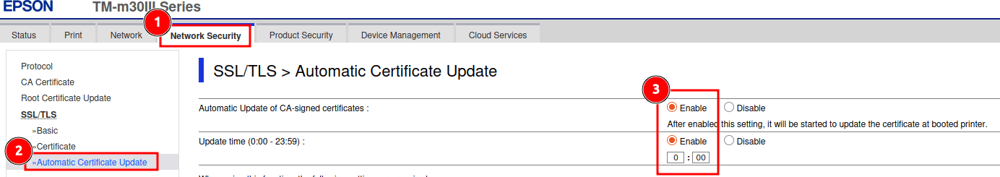
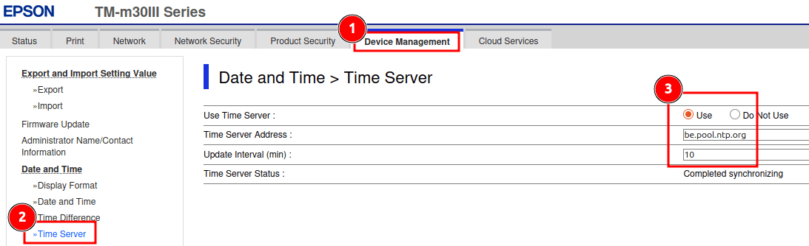
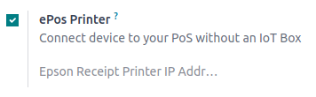

=============
ePOS printers
=============

ePOS printers are designed to work seamlessly with Point of Sale systems. Once connected, these
devices automatically share information, allowing for direct printing of tickets from the POS system
to the ePOS printer.

Printer configuration
=====================

To use an ePos printer in Point of Sale, first set it up to get a certified domain that allows
printing from a browser.

1. Access the printer homepage by entering its IP address in a web browser.
2. Click the :guilabel:`Advanced Settings` menu.
3. Click :guilabel:`Administrator Login` in the top-right corner to log in.
4. Click the :guilabel:`Network Security` tab, then go to :menuselection:`SSL/TLS --> Automatic Certificate Update`.
5. Enable the :guilabel:`Automatic Update of CA-signed certificates` and :guilabel:`Update time`
   options, set a time if needed, then click :guilabel:`Next` to let the printer restart.

6. Once the printer has restarted, click the :guilabel:`Device Management` tab,
   then go to :menuselection:`Date and Time --> Time Server`.
7. Select :guilabel:`Use` in the :guilabel:`Use Time Server` field, set the
   :guilabel:`Time Server Address` field to `be.pool.ntp.org` (or any valid time server),
   and set the :guilabel:`Update Interval (min)` field to `10`.

8. Click on :guilabel:`Ok` to let the printer apply the configuration.

Odoo configuration
==================

Once the printer is set up and ready, configure it in Odoo. Go to the :ref:`POS settings
<configuration/settings>`, scroll down to the :guilabel:`Connected Devices` section,
and enable the :guilabel:`ePos Printer` setting.
Enter the printer's :guilabel:`ePos serial number` in the :guilabel:`Epson Receipt Printer
IP Address` field. Odoo automatically computes the certified domain URL when saving the
configuration.

.. note::
   - When the printer connects to a network, it automatically prints a ticket with its IP
     address.
   - Set a time server on the printer to ensure the validity of the certificate.
   - Find the :guilabel:`Administrator password` and the :guilabel:`Serial number` on the
     label at the back of the printer.

Directly supported ePOS printers
================================

The following ePOS printers are directly compatible with Odoo without needing an :doc:`IoT system
</applications/general/iot/devices/printer>`.

- Epson TM-m30 i/ii/iii (Wi-Fi/Ethernet models only; Recommended)
- Epson TM-H6000IV-DT (Receipt printer only)
- Epson TM-T70II-DT
- Epson TM-T88V-DT
- Epson TM-L90-i
- Epson TM-T70-i
- Epson TM-T82II-i
- Epson TM-T83II-i
- Epson TM-U220-i
- Epson TM-m10
- Epson TM-P20 (Wi-Fi® model)
- Epson TM-P60II (Receipt: Wi-Fi® model)
- Epson TM-P60II (Peeler: Wi-Fi® model)
- Epson TM-P80 (Wi-Fi® model)

ePOS printers with IoT system integration
=========================================

The following printers require an :doc:`IoT system </applications/general/iot/devices/printer>` to
be compatible with Odoo:

- Epson TM-T20 family (incompatible ePOS software)
- Epson TM-T88 family (incompatible ePOS software)
- Epson TM-U220 family (incompatible ePOS software)

.. important::
   - Epson printers using Wi-Fi/Ethernet connections and following the `EPOS SDK Javascript protocol
     <https://download4.epson.biz/sec_pubs/pos/reference_en/technology/epson_epos_sdk.html>`_ are
     compatible with Odoo **without** needing an :doc:`IoT system
     </applications/general/iot/devices/printer>`.
   - Thermal printers using ESC/POS are compatible **with** an :doc:`IoT system
     </applications/general/iot/devices/printer>`.
   - Epson printers using only USB connections are compatible **with** an :doc:`IoT system
     </applications/general/iot/devices/printer>`.
   - Epson printers that connect via Bluetooth are **not compatible**.

.. seealso::
   - :doc:`https`
   - :doc:`epos_ssc`
