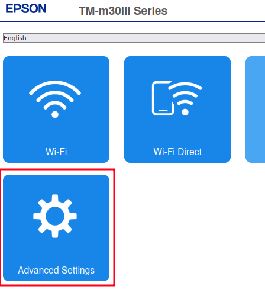
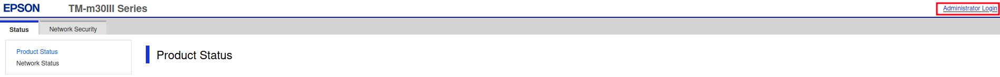
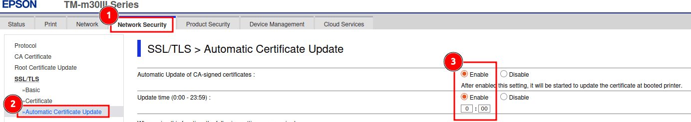
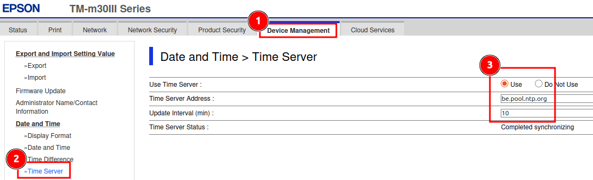

=============
ePOS printers
=============

ePOS printers are designed to work seamlessly with Point of Sale systems. Once connected, these
devices automatically share information, allowing for direct printing of tickets from the POS system
to the ePOS printer.

Configuration
=============

To use an ePos printer in a Point of Sale, you need to set your printer up first, in order to get a
certified domain that will allow printing from your browser.

1. Access the printer homepage by entering its IP address in a web browser.

.. note::
   When the printer connects to a network, it automatically prints a ticket with its IP address.

2. Go to the :guilabel:`Advanced Settings` menu.

3. Login using the :guilabel:`Administrator Login` button.

4. Go to the :guilabel:`Network Security` tab.
5. Under :guilabel:`SSL/TLS`, click on :guilabel:`Automatic Certificate Update`.
6. Finally, enable :guilabel:`Automatic Update of CA-signed certificates` and :guilabel:`Update time`
   (you may also set a time that's not within your business hours).

7. Click on :guilabel:`Next`, your printer will restart.

You will now set et a time server on your printer: this will ensure that the certificate is always valid.

8. Go to the :guilabel:`Device Management` tab.
9. Under :guilabel:`Date and Time`, click on :guilabel:`Time Server`.
10. Select :guilabel:`Use` for :guilabel:`Use Time Server`, set `be.pool.ntp.org` (or any valid time server)
    as :guilabel:`Time Server Address`, and set :guilabel:`Update Interval (min)` to `10`.

11. Click on :guilabel:`Ok`, the printer will apply the configuration.

Now, go back to Odoo Point of Sale:

12. :ref:`Access the POS settings <configuration/settings>`.
13. Activate the :guilabel:`ePos Printer` feature.
14. Fill in the field with your ePos serial number. When clicking outside of the field, Odoo will
    automatically copmute the certified domain url.

.. image:: epos_printers/setting.png
   :alt: setting to enable the ePos printer feature

.. note::
   You can find the :guilabel:`administrator password` and the :guilabel:`serial number` on the
   label at the back of your printer.

Directly supported ePOS printers
================================

The following ePOS printers are directly compatible with Odoo without needing an :doc:`IoT system
</applications/general/iot/devices/printer>`.

- Epson TM-m30 i/ii/iii (Wi-Fi/Ethernet models only; Recommended)
- Epson TM-H6000IV-DT (Receipt printer only)
- Epson TM-T70II-DT
- Epson TM-T88V-DT
- Epson TM-L90-i
- Epson TM-T70-i
- Epson TM-T82II-i
- Epson TM-T83II-i
- Epson TM-U220-i
- Epson TM-m10
- Epson TM-P20 (Wi-Fi® model)
- Epson TM-P60II (Receipt: Wi-Fi® model)
- Epson TM-P60II (Peeler: Wi-Fi® model)
- Epson TM-P80 (Wi-Fi® model)

ePOS printers with IoT system integration
=========================================

The following printers require an :doc:`IoT system </applications/general/iot/devices/printer>` to
be compatible with Odoo:

- Epson TM-T20 family (incompatible ePOS software)
- Epson TM-T88 family (incompatible ePOS software)
- Epson TM-U220 family (incompatible ePOS software)

.. important::
   - Epson printers using Wi-Fi/Ethernet connections and following the `EPOS SDK Javascript protocol
     <https://download4.epson.biz/sec_pubs/pos/reference_en/technology/epson_epos_sdk.html>`_ are
     compatible with Odoo **without** needing an :doc:`IoT system
     </applications/general/iot/devices/printer>`.
   - Thermal printers using ESC/POS are compatible **with** an :doc:`IoT system
     </applications/general/iot/devices/printer>`.
   - Epson printers using only USB connections are compatible **with** an :doc:`IoT system
     </applications/general/iot/devices/printer>`.
   - Epson printers that connect via Bluetooth are **not compatible**.

.. seealso::
   - :doc:`https`
   - :doc:`epos_ssc`
