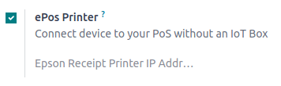

=============
ePOS printers
=============

ePOS printers are designed to work seamlessly with Point of Sale systems. Once connected, these
devices automatically share information, allowing for direct printing of tickets from the POS system
to the ePOS printer.

Configuration
=============

To use an ePos printer in Point of Sale:

#. :ref:`Access the POS settings <configuration/settings>`.
#. Activate the :guilabel:`ePos Printer` feature.
#. Fill in the field with your ePos IP address.

.. note::
   When the printer connects to a network, it automatically prints a ticket with its IP address.

Directly supported ePOS printers
================================

The following ePOS printers are directly compatible with Odoo without needing an :doc:`IoT system
</applications/general/iot/devices/printer>`.

- Epson TM-m30 i/ii/iii (Wi-Fi/Ethernet models only; Recommended)
- Epson TM-m10/ m50/ m50ii/ m55
- Epson TM-H6000IV-DT (Receipt printer only)
- Epson TM-T70II-DT
- Epson TM-T88V-DT/ T88VI/ T88VII 
- Epson TM-L90-i
- Epson TM-T20III or later
- Epson TM-T70-i
- Epson TM-T82II-i
- Epson TM-T83II-i
- Epson TM-U220-i
- Epson TM-m10
- Epson TM-P20 (Wi-Fi® model only)
- Epson TM-P60II (Receipt: Wi-Fi® model only)
- Epson TM-P60II (Peeler: Wi-Fi® model only)
- Epson TM-P80/ P80II (Wi-Fi® model only)

The following ePOS printers require a supported Epson network interfaces (such as UB-E04 / UB-R04)
along with the model's latest firmware.

- Epson TM-T70/T70II
- Epson TM-T88V
- Epson TM-T90
- Epson TM-L90
- Epson TM-H6000IV or later

ePOS printers with IoT system integration
=========================================

The following printers require an :doc:`IoT system </applications/general/iot/devices/printer>` to
be compatible with Odoo:

- Non-Epson-TM products
- Epson TM-T88IV or older generation
- Epson TM-P60 family
- Epson TM-T20 family (incompatible ePOS software)
- Epson TM-T88 family (incompatible ePOS software)
- Epson TM-U220/ U330 family (incompatible ePOS software)
- Epson TM-L100 family
- Epson TM-T20X/ T82X, etc: most model number with an 'X' that comes after, or any Epson model in a
serial/ parallel/ USB-only configuration.

.. important::
   - Epson printers using Wi-Fi/Ethernet connections and following the `EPOS SDK Javascript protocol
     <https://download4.epson.biz/sec_pubs/pos/reference_en/technology/epson_epos_sdk.html>`_ are
     compatible with Odoo **without** needing an :doc:`IoT system
     </applications/general/iot/devices/printer>`.
   - Thermal printers using ESC/POS are compatible **with** an :doc:`IoT system
     </applications/general/iot/devices/printer>`.
   - Epson printers using only USB connections are compatible **with** an :doc:`IoT system
     </applications/general/iot/devices/printer>`.
   - Epson printers that connect via Bluetooth are **not compatible**.

.. seealso::
   - :doc:`https`
   - :doc:`epos_ssc`
